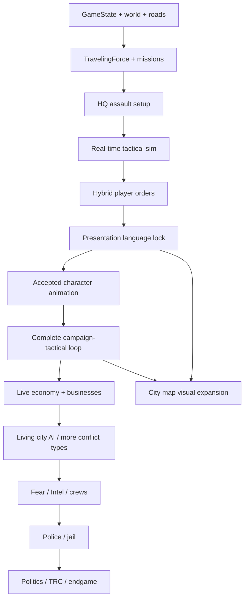

## 2034 fleet proportions and expansion - 2026-09-12

**Built and validated; new art awaits product review. 60 models, 1,248 directional/door sprites and 60 icons.** Twelve Two-Wheelers, nineteen Passenger Cars, thirteen Utility Vehicles and sixteen Heavy Transports. The 2034 setting now guides contemporary silhouettes: lower cabins, fuller hood/deck proportions, raked glazing, sculpted bodywork and visible wheel openings. The TRC and NBPD retain branded options in every class. Intentional heritage/scavenged vehicles preserve faction character.

Fourteen additions include electric road/trail transport, a copper roadster, a shooting brake, rally hatch, hypercar, electric pickup, desert pickup, performance SUV, TRC communications van and luxury shuttle. Two dedicated Raiders of the Sand heavy models complete the request: Lastlight Prison Bus (12 units/12 cargo slots) and Dustchapel RV (8/8). All are unlocked in the sandbox, with individual prices, upkeep and campaign movement. Only Heavy Transports carry campaign resources; seats include drivers.

Windows Godot 4.7.2 passed 3,730 model/gameplay checks, 43 mixed-convoy checks, script and selector checks, and six native D3D12/Forward+ scenarios. All eight vehicle facings, representative door phases, sprite bounds, the 22-page guide and twelve phone sheets were reviewed. See `tools/vehicle_fleet/README.md` for reproducible steps and limits.

This remains battle-sandbox work. Two-wheeler riding/pedaling animations, full campaign vehicle interfaces, fuel/charging/repair and specialists remain pending. Vehicle visuals add no unit armor or outfit changes. Applied changes were guarded against the prior `db92794` checkpoint, preserving unrelated work. Git history and remote confirmation record the new checkpoint.


## Vehicle fleet expansion and visual revision — 2026-09-12

**46 models; 944 directional/door sprites; 46 icons.** Ten Two-Wheelers, fourteen Passenger Cars, ten Utility Vehicles and twelve Heavy Transports. Motorcycle wheels are exposed and exhausts shortened; two low-bar sportbikes and two V-twin cruiser/tourer silhouettes are distinct. Scarlet, lime, azure, plum/ivory, champagne/burgundy and pearl/black finishes expand the sports/luxury range, with beveled fenders and sculpted body shapes.

TRC and NBPD each have dedicated branded models in every class. New models: Outrider TRC, Marshal Police, Veloce Rosso, Vigil TRC, Aegis Armored TRC and Bulwark SWAT. Watchdog is now a black armored utility truck. All models remain unlocked and faction recommendations impose no restrictions. Only Heavy Transports carry resources; seats still include the driver.

Windows Godot 4.7.2 passed 2876 model/gameplay checks and 43 mixed-convoy checks, plus selector and script-load tests. Four native D3D12/Forward+ scenarios passed: TRC armored, NBPD SWAT, mixed exotics and authority motorcycles. Representative captures were visually inspected. All revised facings and the 19-page guide were reviewed. Three phone-friendly sheets cover motorcycles, sports/luxury cars and authority class coverage.

This is an artwork/catalog expansion within the battle-sandbox milestone. Two-wheelers still use parked arrivals; riding/pedaling animations remain pending. No turret, vehicle damage, hidden armor bonus or unit-outfit changes were added. Sources were applied to the authorized development folder with baseline guards; unrelated work was preserved. Git history records commit/push status.

## Vehicle fleet installed and validated - 2026-09-12

**40 models installed on the development PC and validated on Windows Godot 4.7.2.** Four classes: eight Two-Wheelers (1–2 seats), twelve Passenger Cars (1–4), ten Utility Vehicles (1–7), and ten Heavy Transports (1–12). Only Heavy Transports carry campaign resources. Seats include the driver; every moving vehicle reserves one actual unit. Six suggested models for each of the 23 factions are recommendations, not restrictions. Every model is available in the battle sandbox fleet selector.

Includes prices, upkeep, movement, seats, cargo limits, purchase/cargo/save services, campaign icons, model footprints, mixed-convoy assignment, arrival placement, door cover and disembark paths. Artwork comprises 832 directional/door sprites and 40 icons, with a 17-page illustrated guide. The 2,528 model/gameplay checks and 43 mixed-convoy checks passed on Linux and Windows. Selector and script-load checks passed. A native D3D12/Forward+ run passed four visual scenarios; representative TRC transport, NBPD patrol, Raider bus and bicycle screenshots were inspected. Two-wheelers use parked arrivals; riding and pedaling animations remain necessary work.

The user specifically approved writing to `C:\Users\brand\OneDrive\Documents\dead-street`; the earlier transfer block is resolved. Changes were applied with baseline hash guards and unrelated work preserved. Existing GitHub push authorization remains valid. See `tools/vehicle_fleet/README.md` and `docs/vehicle_fleet/Fleet_Specifications.md`. Git history and remote confirmation are authoritative for synchronization status.

The active milestone remains the completed battle sandbox. Full campaign purchasing/loading screens, fuel/repair systems and later specialists remain separate work. This vehicle milestone does not declare the whole sandbox finished.

## Full regular roster and independent unit tiers - 2026-09-12

**Built and validated; ready for owner sandbox playtest.** The accepted 23-faction, 115-outfit regular roster is connected to runtime animations. Every faction can use all six existing models in each of its five weapon classes: 690 combinations, each with all 17 regular clips in eight directions. Existing Mercer and regular Orlov atlases are retained; 636 additional animation sets complete the roster. Approved body proportions and wardrobes are preserved.

The Faction Units Guide weapon pairings are presentation suggestions only. The sandbox unlocks every faction, weapon and training tier. Both sides select a faction plus one weapon and tier per class, then launch all five classes in a 5v5 battle. Use `tools/arsenal_production/Open-Arsenal.ps1`. Campaign unlocks, recruitment progression and special-unit expansion remain separate work.

Unit tiers are independent of weapon tiers: **1 Regular, 2 Experienced, 3 Veteran**, displayed as one, two or three small gold HUD stars. Initial balance gives higher tiers modest improvements to accuracy, acquisition, reload and recoil handling. Health, damage per hit, critical chance, range, movement, magazine size and firing cadence are unchanged. Soldier tiers persist in saves and transfer into battles; older saves default to tier one. Exact trial values and reproduction commands are in `tools/faction_roster/README.md`.

Validation covers all 2,070 faction/model/tier assignments, all 690 runtime animation sets, 636 production anatomy/edge reports, PNG integrity and wound/muzzle anchors, cache retention beyond twelve active variants, raw PNG loading from a game pack, and rendered mixed-tier 5v5 battles. The existing Mercer dual-pistol specialist also passes both-hand battle regression checks. Large elapsed-time values never end a living battle. Technical checks and visual inspection do not replace owner approval of the new live experience.

Older entries below that list regular-faction runtime integration as pending are superseded by this milestone. New faction specialists, armor design, the vehicle catalog, bridge battle and Whittaker Estate remain future roadmap work. The user's standing commit/push authorization remains valid; the earlier automatic push-approval block has not been resolved.

# Dead Street — Project Control

## Blacktop Apostles regular outfit review - 2026-09-12

Five regular leather outfits and shared hooded-skeleton/cracked-halo patches built. Full 1,080-frame geometry/render review passed; front/back, shoulders, facings and motion samples visually inspected. See BLACKTOP_UNIT_DESIGN.md. Final faction in the regular outfit design sequence; user review pending. Gameplay atlas integration and special units remain pending. Next proposed milestone: consolidated roster/integration audit. Local checkpoint only.

## Ashford-Crane regular outfit review - 2026-09-12

Five regular outfits with distinct ivory theatrical masks completed on the accepted rig. Full 1,080-frame geometry/render checks passed; standing shoulders, facings and motion samples visually inspected. See ASHFORD_CRANE_UNIT_DESIGN.md. Gameplay atlas integration and special units remain pending. Next: Blacktop Apostles MC. Local checkpoint only.

## Kurgan regular outfit review ? 2026-09-12

Five regular outfits implemented on the accepted rig; full 1,080-frame geometry/render review and visual inspection. See KURGAN_UNIT_DESIGN.md. Review assets only; gameplay atlas binding and special units remain pending. Next: Ashford-Crane Collective, then Blacktop Apostles MC. Local checkpoint; no push claimed.

## Al-Saffar regular outfits - 2026-09-11

Five regular outfit profiles and motion review assets completed; all 1,080 geometry/render checks passed, with standing shoulders, eight-direction aiming and motion samples visually inspected. See SAFFAR_UNIT_DESIGN.md and tools/faction_design/saffar/. Gameplay atlas integration remains pending; special units remain deferred. Next outfit faction: The Kurgan Group.


## Raiders of the Sand regular outfits - 2026-09-11

Five regular outfits and motion review assets complete; final 1,080 geometry/render checks passed, with shoulders, facings and motion samples visually reviewed. See SAND_RAIDERS_UNIT_DESIGN.md and tools/faction_design/sand_raiders/. Gameplay atlas integration remains pending. Brute, Coyote, specials and melee behavior remain separate later work. Next outfit faction: Majmu’at al-Saffar.


## Lombardia regular outfits - 2026-09-11

Five regular outfit profiles completed; 1,080 geometry/render checks passed and standing shoulders, eight-direction aiming and motion samples visually inspected. See LOMBARDIA_UNIT_DESIGN.md and tools/faction_design/lombardia/. Gameplay atlas integration remains pending; special units remain deferred. Next faction for outfit direction: Raiders of the Sand.


## Union del Sur regular outfits - 2026-09-11

Five approved regular outfits implemented in the existing review rig. Full 1,080-frame geometry/render review passed; standing shoulders, eight-direction aiming, and motion samples visually inspected. See UNION_SUR_UNIT_DESIGN.md and tools/faction_design/union_sur/. Live gameplay atlas integration remains pending; special units remain deferred. Next outfit faction: L'Ordine di Lombardia.


## W&M replacement wardrobe - 2026-09-11

Owner superseded the reused-outfit roster with five original W&M outfits retaining the two family styles. See WM_CORP_UNIT_DESIGN.md for current specifications. Dedicated profile and all review outputs replaced; original parent factions preserved. Full 1,080-frame validation passed, shoulders/directions/motion reviewed. Local checkpoint; live integration pending.

## W&M Corporation regular outfit review - 2026-09-11

Original McAllister pistol/rifle and Whittaker SMG/shotgun/sniper wardrobes combined by role. All 1,080 frame checks passed; direction and motion sheets visually reviewed. See WM_CORP_UNIT_DESIGN.md. Local checkpoint; existing automatic push block and pending live gameplay integration remain. La Union del Sur follows.

## Mercer 44s regular outfit review - 2026-09-11

Five regular outfits built and visually reviewed; 1,080 frame checks passed. See MERCER44_UNIT_DESIGN.md. Local checkpoint, previous push block unchanged. Live gameplay integration pending. Whittaker-McAllister Corporation follows.

## NBPD regular outfit review ? 2026-09-11

Five NBPD regular outfits built on the accepted rig; shared green/gold striped trousers, police duty belts, white uniforms and green bomber jackets. Full 1,080-frame validation passed and standing/aiming directions plus motion samples visually reviewed. See NBPD_UNIT_DESIGN.md. Review assets only; live gameplay atlas integration remains pending. Local checkpoint; previous automatic push rejection remains unresolved. Both authority regular rosters are now built for review; Mercer 44s follows in sheet order.


## TRC headwear and trouser revision (2026-09-11)

Owner changed sniper pants to black and rifle headwear to exactly match the shotgun black helmet and ski mask. See TRC_UNIT_DESIGN.md.

## TRC regular outfit review (2026-09-11)

Five owner-specified TRC outfits are built for review with shared black/forest-green clothing, distinct helmets and masks, modest armor, shell loops, pouches and small star-and-eye patches. Full 1,080-frame geometry/render-bound checks passed. Standing left shoulders, both joins, eight idle/aim facings and SE motion samples were visually inspected. See [TRC_UNIT_DESIGN.md](TRC_UNIT_DESIGN.md).

Owner acceptance and full runtime atlas/faction binding remain subsequent work. NBPD is next; new specials remain deferred. This checkpoint is local while the earlier automatic push-approval blockage remains unresolved.

## McAllister regular outfit review (2026-09-11)

All five owner-specified white McAllister units are built for review with the estate/sporting wardrobe. Full 1,080-frame geometry/render-bound checks passed after correcting a preview adapter palette-binding mismatch. Standing left shoulders, both joins, eight idle/aim facings and SE motion samples were visually inspected. See [MCALLISTER_UNIT_DESIGN.md](MCALLISTER_UNIT_DESIGN.md).

Owner visual acceptance and full runtime atlas/faction binding remain subsequent work. Major-gang regular outfit reviews are now built; Texas Recovery Coalition is next. New specials remain deferred. This checkpoint is local while the earlier automatic push-approval blockage remains unresolved.

## Sierra Roja mask revision (2026-09-11)

Owner replaced pistol head/face styling with an olive-green ski mask and the shotgun cowboy hat/face styling with a black ski mask. Other outfits and proportions remain unchanged. See SIERRA_ROJA_UNIT_DESIGN.md.

## Sierra Roja regular outfit review (2026-09-11)

All five owner-specified Mexican Sierra Roja outfits are built for review, including the cream chain-print shirt, high crossbody bag, cowboy hat, fitted tactical vest and woodland boonie/shoulder strips. The full 1,080-frame geometry/render-bound check passed. Standing left shoulders, both joins, eight idle/aim facings and SE motion samples were visually inspected. See [SIERRA_ROJA_UNIT_DESIGN.md](SIERRA_ROJA_UNIT_DESIGN.md).

Owner visual acceptance and full runtime atlas/faction binding remain subsequent work. Whittaker was completed early, making McAllister Holdings next. New specials remain deferred. This checkpoint is local while the earlier automatic push-approval blockage remains unresolved.

## Stateline Raiders MC regular outfit review (2026-09-11)

All five owner-specified Stateline outfits are built for review with club back/chest patches, distinctive hair and beards, denim/leather layers and normal anatomy. Final 1,080-frame geometry/render-bound checks passed. Standing left shoulders, both joins, eight idle/aim facings, back patches and SE motion were visually reviewed; final sleeve plaid and upper-arm tattoos were rechecked. See [STATELINE_RAIDERS_UNIT_DESIGN.md](STATELINE_RAIDERS_UNIT_DESIGN.md).

Owner visual acceptance and full runtime atlas/faction binding remain subsequent work. Cartel de Sierra Roja is next; new specials remain deferred. This checkpoint is local while the earlier automatic push-approval blockage remains unresolved.

## Bìtiān regular outfit review (2026-09-11)

All five owner-specified Chinese Bìtiān outfits are built for review. The full 1,080-frame geometry/render-bound review passed. Standing left shoulders, both joins, eight idle/aim facings and SE motion samples were visually inspected. Normal anatomy and weapon scale are preserved. See [BITIAN_UNIT_DESIGN.md](BITIAN_UNIT_DESIGN.md).

Owner visual acceptance and full runtime atlas/faction binding remain subsequent work. Stateline Raiders MC is next; new specials remain deferred. This checkpoint is local while the earlier automatic push-approval blockage remains unresolved.

## Zangyaku regular outfit review (2026-09-11)

All five owner-specified Japanese Zangyaku outfits are built for review. The corrected final 1,080-frame geometry/bounds pass succeeds. Standing left shoulders, both joins, direction sheets and SE motion samples were visually reviewed. Normal body and leg proportions are preserved. See [ZANGYAKU_UNIT_DESIGN.md](ZANGYAKU_UNIT_DESIGN.md).

Owner visual acceptance and full runtime atlas/faction binding remain subsequent work. Bìtiān is next; new specials remain deferred.


## Orlov sniper outfit review (2026-09-11)

The owner clarified that Orlov's pistol, SMG, shotgun and rifle outfits already exist and must be kept. Only its sniper required new design. The supplied ushanka, snug black face covering, zipped heavy black jacket, dark green trousers/gloves and black boots are built for review. All 216 sniper-class frames pass geometry/bounds checks. Standing left shoulder, both joins, eight idle/aim facings, motion samples and all six rifle fits were visually inspected. See [ORLOV_SNIPER_DESIGN.md](ORLOV_SNIPER_DESIGN.md).

Owner visual review and full runtime atlas/faction binding remain subsequent work. Existing Orlov regular outfits are preserved. Zangyaku is next; new specials remain deferred.


## Ravicci regular outfit review (2026-09-11)

All five owner-specified Italian-American Ravicci outfits are built for review on the existing normal rig: layered tailoring, three eyewear treatments, an open camel coat and buttoned black sniper coat. The final 1,080-frame geometry/bounds review passed. Standing left shoulders, eight standing/aiming facings and SE motion samples were visually inspected. See [RAVICCI_UNIT_DESIGN.md](RAVICCI_UNIT_DESIGN.md).

Full runtime atlas production and faction binding remain subsequent work; visual acceptance belongs to the owner. Orlov Bratva is next in the regular faction order. New specials remain deferred.


## Ventresca regular outfit review (2026-09-11)

All five owner-specified Italian-American Ventresca regular outfits are built on the accepted rig, including the pistol wristwatch, layered tailoring and sniper's mid-thigh wool coat. The full 1,080-frame review passed geometry and clipping checks. Technical visual inspection covered every standing left shoulder and both shoulder joins, eight standing/aiming facings, SE motion samples and all 30 weapons in SE aiming. Body proportions are unchanged. The sniper inherits the Calle Ocho SE/SW stock-fit refinement. See [VENTRESCA_UNIT_DESIGN.md](VENTRESCA_UNIT_DESIGN.md).

These are outfit review candidates; owner visual acceptance, full runtime atlas production and faction binding remain subsequent work. Ravicci Family is next. New faction-specific specials remain deferred. Standing authorization covers routine commits and pushes to the established build branch.


## Calle Ocho regular outfit review and sniper stock fit (2026-09-11)

The owner approved the Whittaker outfit review and supplied all five Calle Ocho designs, with Mexican-American units throughout. Calle Ocho's regular pistol, SMG, shotgun, rifle and sniper outfits are built on the accepted rig. The full 1,080-frame review passed geometry and clipping checks. Technical visual inspection covered standing shoulder joins, eight standing/aiming facings, SE action samples and all 30 weapons in SE aiming. See [CALLE_OCHO_UNIT_DESIGN.md](CALLE_OCHO_UNIT_DESIGN.md).

A conservative Calle Ocho sniper carry-position adjustment seats the stock closer to the shoulder in SE/SW without resizing the body or rifle. All six sniper models improved in the focused aiming comparison; 96 pose pairs preserved body geometry and weapon scale/anchors/angles. The other six facings are byte-identical. Existing faction atlases have not been rebuilt with this review adjustment.

Calle Ocho is ready for outfit review; full runtime production and binding remain subsequent work. Ventresca Family is next in the regular-unit sheet order. Specials remain deferred. Whittaker 17bd646 and Calle Ocho 22994c3 are pushed and verified on the existing GitHub build branch. The owner renewed standing project-wide push authorization in perpetuity; see [PROJECT_WORKFLOW_AUTHORIZATION.md](PROJECT_WORKFLOW_AUTHORIZATION.md).

## Whittaker regular outfit review (2026-09-11)

The owner approved Eastex's outfits, then authorized a one-time jump to Whittaker. All five regular Whittaker outfits are built to the exact owner directions, with white units throughout, using the existing anatomy and standard motion clips. The final 1,080-frame review passes geometry and frame-bound checks. Technical visual inspection covered standing shoulder joins, all eight standing/aiming facings, SE action samples and all 30 weapons in SE aiming; the SMG side-hair correction was rechecked afterward. See [WHITTAKER_UNIT_DESIGN.md](WHITTAKER_UNIT_DESIGN.md) for specifications, review outputs and reproduction.

The owner approved Whittaker clothing; full runtime atlas production and faction binding remain subsequent work. Return to Calle Ocho after this one-time exception, then continue the canonical sheet order. New faction-specific specials remain deferred.

The shared faction runner batches generation, rendering, checks and review sheets, supports targeted outfit revisions, and records full versus partial scope explicitly. Its regression build reproduced all six accepted Eastex PNG sheets and the motion GIF byte-for-byte. Full final checks and human visual inspection remain required.

## Eastex outfit acceptance (2026-09-11)

The owner approved the five regular Eastex 44's outfit designs after the pushed review at 3ace811. See [EASTEX_44S_UNIT_DESIGN.md](EASTEX_44S_UNIT_DESIGN.md) for the exact wardrobe and 1,080-frame review evidence. Full runtime atlas production and faction binding remain subsequent work.

## Current roadmap decisions (2026-09-11)

The owner has split faction production into two passes: **regular units for every faction first; new faction-specific special units afterward**. Eastex follows Mercer in the official sheet order. Preserve the completed Mercer sniper and dual-pistol specialist; regular sniper outfits remain part of the regular roster pass. See §12 and [FACTION_WORK_ORDER.md](FACTION_WORK_ORDER.md).

**Vehicle roster development is now an explicit roadmap workstream:** variety comparable to the gun armory, faction vehicle differences, distinct models/designs, campaign movement range and unit carrying capacity. See §11 for scope and open decisions. This is a roadmap update; detailed vehicle design and implementation are still to come.

Current Mercer animation/gameplay checkpoint: `6d1aaee`, committed and pushed on `build/arsenal-checkpoint-20260911`; see [MERCER_ANIMATION_GAMEPLAY.md](MERCER_ANIMATION_GAMEPLAY.md). The older factory snapshots and restrictions below are historical; the latest approved drawn-unit architecture and current plan govern ongoing production.

## Current unit art correction and push authorization (2026-09-11)

The owner rejected both the oversized specialist shirt and the later shrunken torso. Clothing instructions never authorize changes to the established anatomy. Use folds or omit bagginess. Every new unit requires an explicit visual check of its standing left shoulder and consistent weapon/body proportions across facings and stances. See [UNIT_ART_STANDARD.md](UNIT_ART_STANDARD.md).

Owner authorization: "You have my explicit authorization to push what you need to for this entire project." This is standing authorization for ongoing Dead Street project commits and pushes to the established LeadLasso-LL/DEADSTREET repository. The current checkpoint branch is build/arsenal-checkpoint-20260911. A pushed review candidate is not automatically product-accepted art.

The revised Mercer preview restores the existing pistol unit's exact torso geometry and placement, verified together with the unchanged lower body in six poses. Both new outfits receive connected shoulder/sleeve joins. The sniper front/rear rifle projection is corrected without replacing its weapon drawing or changing body proportions. Eighteen frames include the existing unit for a fixed-scale comparison; rendering and geometry checks pass. Standing left shoulders and front rifle proportions were visually inspected by the technical lead. The previews were followed by completed eight-direction animation and specialist combat integration in `6d1aaee`; see [MERCER_ANIMATION_GAMEPLAY.md](MERCER_ANIMATION_GAMEPLAY.md).

## Mercer Saints outfit and specialist design record

The owner approved preserving the existing four Mercer outfits, a black hooded sniper with a lower-face bandana, black pants/boots and one red pocket rag, and a dual-Glock pistol specialist with a baggier red long-sleeve shirt, black pants, white shoes and a black ski mask. Specialist starting stats are approved for playtesting; faction-wide caps are required but their values remain open. See [MERCER_SAINTS_UNIT_DESIGN.md](MERCER_SAINTS_UNIT_DESIGN.md).

The isolated standing/aiming previews under `tools/faction_design/` are visual review candidates built from the native rig. Full animation production and specialist gameplay integration are now implemented in `6d1aaee`; the earlier isolated previews remain the design record. Existing combat regression status remains documented below. Faction clothing uses believable cultural/workwear identities and selective color accents.

## Current checkpoint and attacker tactics (2026-09-11 UTC)

The recovered arsenal is committed and pushed as `d18c486` on `build/arsenal-checkpoint-20260911`. Automatic approval review rejected direct publication to `main`; the audited checkpoint branch was used instead. The owner authorized further editing after review.

The attacker tactics follow-up is implemented and verified: advancing units select usable targets, retain protective firing positions, and break mutual tucked-cover peek deadlocks. Matched-loadout attackers improved from 0/3 wins to 2/3 on the same seeds. All 11 final comparison battles resolved naturally; the previously stalled pair resolved in 51.15 seconds. Time never determines a battle result. The diagnostic explicitly labels observation cutoffs and checks that elapsed time alone cannot resolve combat.

Focused checks pass: 12 tactics and 290 arsenal assertions. Full CORE VALIDATION remains at the identical 166 failed assertions of the arsenal checkpoint, with no failures added by this follow-up. The arsenal's earlier increase from 120 to 166 remains open. See [ATTACKER_TACTICS_2026-09-11.md](ATTACKER_TACTICS_2026-09-11.md) for behavior, reproducible evidence and limits. Visual/feel review and broader balance tuning remain available from this checkpoint.

## Historical recovery record: arsenal production pass (2026-09-11 UTC)

The following records the state at initial recovery, before the completed checkpoint and tactics work above. Recovered directly from the laptop after the active build conversation was interrupted. At that point the pass was on disk and uncommitted, with HEAD at `ee3694a` (approved weapon roster checkpoint). Thirty equipment models, 78 new animated faction/model variants (143,520 frames), 90 shot sounds, model-specific tuning, sniper behavior, and the isolated arsenal review scene are built. Dedicated sniper outfits remain deferred. See [ARSENAL_PRODUCTION_REPORT.md](ARSENAL_PRODUCTION_REPORT.md) and [ARSENAL_MODEL_REFERENCE.md](ARSENAL_MODEL_REFERENCE.md).

Recovery re-ran the current arsenal gameplay and presentation validators: 290 gameplay checks and 12,800 presentation checks passed, no reported failures. Final frame-clearance production completed. The saved 12-battle comparison has 11 defender wins and one non-sniper matchup (pair 2, seed 4202) still active at 120 seconds; all six sniper matchups resolved. The saved report incorrectly said all 12 resolved; this was corrected during recovery. A prior rendered sniper battle completed with 54 shots, median 49 FPS and sampled low 34 FPS. No new full CORE VALIDATION or live graphics run was performed during recovery.

Remaining: investigate the unresolved comparison seed, assess balance and owner visual/feel review, then complete a scoped git checkpoint. `tools/arsenal_production/stage_tmp.py` was prepared before interruption but its `stage_manifest.json` is absent; do not claim the pass was staged, committed or pushed. Existing unrelated dirty work remains. The current user request was recovery and a factual follow-up; no new gameplay or art behavior was changed in recovery.

## Prior implementation: Harold 4v4 recording (2026-09-10)

See [BATTLE_SHOWCASE_2026-09-10.md](BATTLE_SHOWCASE_2026-09-10.md) for the faction wardrobe specification, live four-card HUD, recovered whole-force controls, backward deaths, validation and reproducible recording setup. The prior approved Harold map baseline remains in force; new character/HUD visuals are ready for product-owner review.


> **2026-09-10 approved map baseline — latest:** Brandon visually accepted the complete Harold Ave. street pass and final arrival-car correction through `139d10c`, and directed that it become the reusable standard for future maps. The accepted drawn/pixel-art map and units supersede the older DAZ/source-style gates below as the active visual baseline. Read [MAP_BUILDING_STANDARD.md](MAP_BUILDING_STANDARD.md) for consolidated art/cover rules, workflow and versioned reference captures, and [HAROLD_AVE_IMPLEMENTATION.md](HAROLD_AVE_IMPLEMENTATION.md) for technical evidence. The street is visually accepted; deployment/arrival/HUD and broader combat work retain their separate status. Await Brandon's next requested scope. Earlier tracker entries are historical and do not revoke this acceptance.

> **2026-09-08 owner style clarification and grip correction (latest):** Owner explicitly identifies the primary gap as DRAWN/ILLUSTRATED versus reduced/rendered realism. Clothing/proportion changes alone do not solve it and must not displace the static illustration gate. Direct enlarged inspection confirms G test support hand is crowded against the firing hand near the receiver, with awkward wrist/finger arrangement; small solver residuals did not validate a plausible grip. Earlier "no more grip refinement" statement is superseded. Make one bounded support-grip correction, verify source close-up and small-size read, then freeze it for the illustration test. Reference analysis is appended to the source-correction report. No new asset purchase, camera canonization, runtime bind or animation implied.


> **2026-09-08 source correction (latest, supersedes older next-gate text):** Direct reference comparison exposed composition and lighting faults. Both legacy light colors read back black; environment settings had targeted the wrong object; 96/20 intensity requests both clamped to 2. Isolated composition_04 now verifies scene-only environment, ground off and corrected white photometric lights, producing real cast shadows. Front yaw 0 / elevation 40 / 320 mm and G test pose are REVIEW CANDIDATES ONLY. Graphic G/H/I/J processing is repeatable; J soft-contour result remains unaccepted. Compact proportions, garment structure and integrated style still fall short of the reference. Legacy default render path has NOT been migrated; use the explicitly verified experimental path. Static style remains the gate; no direction production/animation/bind. See [source correction evidence](CHARACTER_FACTORY_V14_SOURCE_CORRECTION.md). HEAD unchanged; experiments uncommitted.

> **2026-09-08 latest checkpoint (supersedes earlier next-gate text):** Owner saw and approved G_NEUTRAL_FORWARD50 for temporary testing only. The first V1.4 reconstruction matrix is complete and independently repeatable; no style accepted. D improves rifle contrast but lifts clothing too much and remains too flat. Static style remains the gate. Material-label guidance and E/F reconstruction are now implemented and independently repeatable; about 11% of solid pixels remain unclassified and retain source RGB. E/F improve material distinction, but no style is accepted. Next preflight: source composition and broad body forms against the reference, before further filter tuning. Pose/camera changes require review as candidates. See reconstruction evidence for exact runs. No more grip refinement is required for this test. Catalog unbound, HEAD 5a7d3bd, experiments uncommitted. See [reconstruction evidence](CHARACTER_FACTORY_V14_RECONSTRUCTION.md). Use inline images plus direct open links for review.

> **2026-09-08 current-state correction (supersedes the older next-gate text below):** V1.3 post-processing is insufficient; no static style accepted. SOURCE_2 alpha16 preview bounds are contaminated and 96/80/64 labels are not gameplay screen heights. Integrity diagnostics proved the carbine is present but occluded in HYBRID_B. Direct remote arm probes now demonstrate rifle visibility at the same camera, but fail support-hand placement. Follow-up weapon-local contact solving produced `G_NEUTRAL_FORWARD50`: a readable across-body carry with repeatable joints/camera and support-hand target residuals about 1.9/2.3 DAZ units. This is an unaccepted posture candidate, not collision-free production proof. The owner authorized G_NEUTRAL_FORWARD50 as a temporary test pose without seeing the comparison (image delivery failed). This is authorization to continue testing, NOT visual acceptance of the pose or style. Next: bounded grip refinement and V1.4 graphic reconstruction; ensure review images are actually accessible before asking for visual judgment. Camera and HYBRID_B remain provisional; catalog remains unbound. HEAD is still `5a7d3bd`; integrity/probe tooling and reports are uncommitted. See [arm probe evidence](CHARACTER_FACTORY_V14_ARM_PROBE.md).

**Canonical living development tracker.**  
Last audit: **2026-09-07**.  
Last product-state correction: **2026-09-07** — Human Generator trial insufficient; DAZ Studio / Genesis 9 is the capability-vetted source pipeline.  
Last implementation milestone: **2026-09-07** — Character Factory V1.3 style-conversion 3×3 generated on the V1.2 baseline (56° + HYBRID_B). **No style accepted.** Look remains **not** accepted.
Cleanup checkpoint: **product owner accepted M7F cleanup without an additional manual F5 baseline test.** That is **not** visual acceptance of any new character art.

This file is not a game design document, not a player encyclopedia, and not a vision rewrite.

| Document | Question it answers |
|---|---|
| Game Design / Encyclopedia (currently **outside this repo**) | What is Dead Street? |
| **This file** | How are we building it, where are we now, and what comes next? |
| The Git repository | What **exists** in code and assets |
| Product owner F5 / play acceptance | What is **accepted** |

A class existing does not mean a feature is production-ready.  
A CORE VALIDATION PASS does not mean the game looks or feels right.

---

## Status legend

| Symbol | Meaning |
|---|---|
| ✅ | COMPLETE / ACCEPTED — product-accepted, not just coded |
| 🟢 | BUILT + VALIDATED — implemented and covered by CORE VALIDATION; product look/feel may still be open |
| 🟡 | PARTIAL / EXPERIMENTAL / NEEDS REVIEW |
| 🔵 | CURRENT — active initiative |
| ⚪ | PLANNED — belongs on the roadmap, not now |
| ⛔ | BLOCKED |
| ❌ | REJECTED / SUPERSEDED — do not casually resurrect |
| ❓ | PRODUCT DECISION REQUIRED — technical lead must not invent the answer |
| 🧱 | TECH DEBT / ARCHITECTURAL RISK |

---

## 1. Document purpose

This file is the single authoritative project-management document for building Dead Street.

It must always be able to answer:

1. What exactly has been built?
2. What is actually working and validated?
3. What is currently being worked on?
4. What is blocked, broken, experimental, or unfinished?
5. What should be built next?
6. Why is that the correct next thing?
7. What depends on what?
8. Where do future ideas live without derailing the current build?
9. Which product decisions are still unresolved?
10. Which approaches are already rejected?
11. What validation must pass before the next milestone?
12. How current work connects to the full Dead Street vision?

Update it after every meaningful milestone. Do not replace it with chat history.

---

## 2. Source-of-truth hierarchy

Precedence, highest first:

1. **Explicit latest product decision from the user**
2. **Accepted current design documentation** (encyclopedia / GDD — currently a large PDF **outside this git repo**; no in-repo encyclopedia `.md` exists)
3. **Actual current repository behavior / architecture**
4. **Validated milestone records** (this file + git checkpoints)
5. **Older design concepts**
6. **Future speculation / backlog ideas**

Rules:

- Later product corrections override older documents.
- The repository tells us what **exists**. It does not automatically tell us what is **accepted**.
- If design docs conflict with a later product correction, **use the later correction** and record it in the Decision Log.
- The technical lead must not silently fill a ❓ gap.

**Known conflict to preserve:** older “whole-force commands only” language is superseded by current **hybrid control** (autonomous soldiers + player MOVE / TARGET / COVER). Whole-force Push / Hold / Focus / Fall Back remain part of the design; they are no longer the only player authority.

---

## 3. Historical project snapshot — 2026-09-07

| Field | State (2026-09-07, Character Factory V1.3 style-conversion experiment) |
|---|---|
| Engine / project | Godot 4.7, Forward Plus, Jolt; main scene `res://gameplay/gameplay_runtime.tscn` |
| Branch | `main` tracking `origin/main` |
| HEAD | Checkpoint *Calibrate DAZ rifleman silhouette* (`5a7d3bd`) |
| Working tree | V1.3 factory tooling + this tracker (uncommitted). Generated PNGs stay **outside** the repo (`%LOCALAPPDATA%\DeadStreetCharacterFactory\`). |
| Tags | none |
| CORE VALIDATION | **PASS** (2026-09-07 after V1.3 style-conversion run) — technical only |
| Last clearly accepted checkpoint | `530dbed` — M7F cleanup accepted **without an additional manual F5 baseline test**. Not visual acceptance of new character art. |
| Current active initiative | 🔵 Tactical **character visual language / source pipeline** |
| Current experiment | 🔵 **DAZ Studio / Genesis 9 Character Factory** — V1.3 3×3 style matrix generated; **no style accepted**; look **not** accepted |
| Superseded experiments | ❌ MPFB `look_calib_01` (retired) · ❌ Human Generator trial (insufficient; no longer active) |
| Immediate next validation gate | Product-owner review of V1.3 style-conversion boards. No style accepted. |
| Current known blockers | No accepted character look; camera remains provisional; no style profile accepted; proof remains unbound |
| Current ❓ decisions | Permanent character source pipeline; camera/pitch/render must be recalibrated on the next accepted source (do **not** inherit M7F 48°/2.05, and do **not** treat 56° as canon); casualty persistence; HQ garrison fate; vitality HUD vs “hidden” trauma |
| Next recommended milestone | Product-owner review of V1.3 boards. Do **not** assume 8-direction or movement is next. |
| Do not start yet | 8-direction production, walk-cycle proof, Godot movement integration, full animation libraries, multiple characters, politics, police, city-map polish, extra factions, Russian units, binding factory PNGs |

**One-line status:** Persistent proving-ground campaign + real-time HQ assault is playable. Procedural fallback remains the runtime unit baseline. Character Factory V1.3 generated a 3 source × 3 post style matrix on the provisional 56° + HYBRID_B baseline. **No style is accepted.** Camera remains provisional. Next = product-owner review of the boards.

---

## 4. Historical active initiative — 2026-09-07

### OBJECTIVE

Produce **one genuinely convincing Dead Street gang-member character** from a coherent rigged 3D source, rendered into the existing lightweight 2D tactical presentation architecture.

The target remains: a small, dimensional, pre-rendered street-gang person from an elevated oblique tactical camera — not a mannequin, not a token, not a generic soldier.

### WHY NOW

Tactical simulation, player orders, HQ proving-ground geometry, and asset-backed environment/vehicles are far enough along that **unreadably wrong units** still make the slice feel fake. M7F proved the machinery again and **failed the look**. Do not mass-produce animation until a new source passes product F5.

### WHAT HAS ALREADY BEEN PROVEN (architecture — KEEP)

These are reusable / accepted unless later repo evidence says otherwise. Product rejection of `look_calib_01` does **not** throw them away:

- Presentation / simulation separation
- `TacticalActorPresenter` retained-actor path
- `TacticalUnitAnimationCatalog` (generic clip/direction bind concept)
- Tactical identity foundation (`TacticalIdentityFactory` / `GangArchetypeCatalog` / `TacticalIdentitySnapshot`)
- Directional / facing support
- Procedural soldier fallback
- Simulation-authoritative hit-testing (`SOLDIER_SELECTION_RADIUS` around presentation origin, not sprite bounds)
- Offline rigged-3D-source → rendered-2D-runtime concept
- `AnimatedSprite2D` / retained presenter approach where applicable
- `TacticalBattleView` must not own `.png` / `Sprite2D` / `Texture2D`
- Character Factory V0 can launch installed DAZ Studio unattended, assemble free Genesis 9 Starter Essentials (Matt + base shirt/shorts + standing pose), write eight directional PNGs outside the repo, and downsample/validate them with Godot
- Character Factory V1 can assemble paid Classic Tank Top Outfit + Multi-Caliber Weapon System carbine + already-installed Worker Uniform Boots, render eight unbound directions, and write three non-canon Godot style boards
- Character Factory V1.1 tested 48° / 56° / 64° elevations and three pose families (SE only); **56°** is the provisional continuation camera, **not canon**
- Character Factory V1.2 tested three hybrid rifle-silhouette variants; **HYBRID_B** is the provisional continuation pose, **not accepted art**
- Character Factory V1.3 generated a 3 source × 3 post style matrix on that baseline; **no style is accepted**
- CORE VALIDATION can stay green while art is experimental

### WHAT HAS NOT BEEN PROVEN

- Any character source that **belongs** in Dead Street beside the canonical tactical look
- DAZ / Genesis 9 as a **visually accepted** Dead Street unit
- Human Generator as a viable or permanent production pipeline (trial insufficient; **no longer the active experiment**)
- A locked canonical camera/pitch/scale (M7F 48° / ortho 2.05 is **not** inherited; 56° / `PROVISIONAL_TACTICAL_56` is **continuation only**, not canon)
- Walk / cover / fire / reload / death as one continuous accepted person
- Binding factory smoke renders — or any generated art — into `TacticalUnitAnimationCatalog`

### SUPERSEDED EXPERIMENT (retired from active tree)

**MPFB `look_calib_01`**

| Field | State |
|---|---|
| TECHNICAL | PASS (CORE VALIDATION 2026-09-07, pre-cleanup) |
| PRODUCT / VISUAL | ❌ REJECTED |
| STATUS | SUPERSEDED EXPERIMENT — **physically retired 2026-09-07** |
| Why | Technically coherent, but visually failed the Dead Street unit target |
| MPFB as technology | **Not permanently forbidden.** This specific path/result did not reach the target. |
| Cleanup | `look_calib_01` stills, look board, player_soldier calib bind, MPFB builder, MHCLO masks, local pack zips removed. Generic catalog/presenter/spec/render script **kept**. |

### CURRENT EXPERIMENT

🔵 **DAZ Studio / Genesis 9 Character Factory**

| Field | State |
|---|---|
| Classification | CURRENT CAPABILITY-VETTED SOURCE PIPELINE |
| Status | V0–V1.2 factory work plus V1.3 style-conversion 3×3 **generated 2026-09-07**. Static visual style **UNACCEPTED**. Product review pending. |
| Acceptance | **NOT EARNED.** Proof is unbound. No style profile is accepted. Camera remains provisional. |
| In repo | Factory launcher/script/recipes/Godot image tool + `provisional_baseline.json` only. No DAZ DUF/textures/renders. |
| DAZ | Studio 6.25.2026.14722 General Release Pro; discovered at runtime, not hardcoded |
| Proof recipe | `local_street_gang_rifleman_proof_01` — Matt, Classic Tank Top Black, Classic Trousers Dark Green, Worker Uniform Boots Black, Mavick Hair Black, PMWS Carbine RH G9M |
| Products used | dForce Classic Tank Top Outfit for Genesis 9 (SKU 102224-1); Multi-Caliber Weapon System (SKU 103057-1); footwear from already-installed Worker Uniform (tank-top product includes no footwear) |
| Runtime | Procedural fallback still active; catalog still unbound (`bound_variant_ids()` empty) |
| Camera / light | **Provisional continuation:** `PROVISIONAL_TACTICAL_56` / 56°. **Not canon.** V1.1 also tested 48° and 64° (history retained). V0 `PROVISIONAL_SMOKE_ONLY` remains the smoke profile. Do not write this into `TacticalUnitPipelineSpec`. |
| Pose | **Provisional continuation:** `HYBRID_B`. **Not accepted.** V1.2 HYBRID_A / HYBRID_C retained as history. |
| Style profiles | V1 comparison `clean_downsample` / `grounded_grit` / `digitized_grit` and V1.3 `POST_0`/`POST_1`/`POST_2` on `SOURCE_0`/`SOURCE_1`/`SOURCE_2` — **NON-CANON**. None accepted. |
| Blender | **Not required** for the core source pipeline. Reserve only for future custom asset work if necessary. |
| Permanent production pipeline? | No — ❓ until a street-clothing + weapon source-character proof **passes product F5** |

### SUCCESS CRITERIA (unchanged product look target)

At normal F5 tactical view, without zooming:

1. Upright human with readable torso / arms / legs / stance / facing.
2. Elevated tactical 3/4 camera, not full overhead, not a horizon shot.
3. Reads as a dangerous local street-gang member, not a soldier / operator / mannequin / toy.
4. Same person across the minimal directional stills.
5. Scale belongs next to sedan / sidewalk / door / porch / cover.
6. Uses the **existing** 2D presenter architecture; does not invent a parallel runtime.
7. Rig remains animation-viable.

If it would not sit in the same game as canonical Dead Street tactical art: **reject**. Do not generate hundreds of frames.

### FAILURE CRITERIA

- Shipping `look_calib_01` or the Quaternius mannequin as final body art
- Independent AI-generated frames
- Treating CORE VALIDATION PASS as look acceptance
- Throwing away presenter / catalog / identity / hit-test architecture because the MPFB *result* failed
- Inheriting M7F camera numbers without recalibrating on the new source
- Full animation libraries or extra characters before the first character passes

### NEXT ACTION

1. Documentation correction — **done**
2. Surgical M7F rejection cleanup — **done 2026-09-07**
3. Character Factory V0 DAZ handshake + free Genesis 9 smoke — **done 2026-09-07** (unattended; CORE VALIDATION PASS; **not** visual acceptance)
4. Character Factory V1 paid-asset rifleman proof — **done 2026-09-07** (unbound; **not** visual acceptance)
5. Character Factory V1.1 camera/pose calibration (48°/56°/64° × three poses, SE) — **done 2026-09-07**; 56° chosen as **provisional continuation only**
6. Character Factory V1.2 hybrid rifle silhouette (HYBRID_A/B/C at 56°, SE) — **done 2026-09-07**; HYBRID_B chosen as **provisional continuation pose only**
7. Character Factory V1.3 style-conversion 3×3 (SE, 56°, HYBRID_B) — **generated 2026-09-07**; **no style accepted**
8. **Next:** Product-owner review of V1.3 boards. Do **not** start 8-direction production, walk-cycle, or Godot movement until a static style is selected.

### WHAT MUST NOT BE BUILT YET

- Full directional animation libraries
- Multiple characters / portraits / HUD redesign
- Politics, police, jail, TRC, endgame
- Full New Briarport map art
- Defender mouse deployment
- Campaign casualty write-back (needs ❓ first)

---

## 5. System status matrix

Implementation state describes the **repository**. Acceptance is separate.

### 5.1 Core / infrastructure

| System | Product intent | Implementation | Validation | Acceptance | Dependencies | Next required work | Priority |
|---|---|---|---|---|---|---|---|
| `GameState` | Single persistent campaign authority | 🟢 Registries: factions, regions, neighborhoods, road graph, locations, vehicles, soldiers, traveling forces, missions, relationships; turn clock | 🟢 Heavy CORE VALIDATION | 🟢 As proving-ground core | None | Keep as the only campaign authority | Now-protect |
| Serialization | Save/load a campaign | 🟡 `to_dict` / `from_dict` on GameState + leaf models; **no disk save service**, no schema version | 🟢 Round-trip tests | 🟡 API only | GameState | Disk save **later** | Later |
| IDs / repositories | Stable string IDs | 🟢 Dictionaries on GameState | 🟢 | 🟢 for current scale | GameState | No extra repository layer unless scale demands it | Later |
| Validation system | Regression gate for every milestone | 🟢 `CoreValidation.run()` via `validation/core_validation_runner.tscn`; dirty tree includes `vispass_m7b`–`m7f` | 🟢 PASS 2026-09-07 | 🟢 as **technical** gate only | Entire codebase | Keep; do not treat as product acceptance | Now-protect |
| `GameFlowController` / `GameplayRuntime` | Bootable play shell | 🟢 Campaign map ↔ tactical session; debug keys | 🟢 | 🟡 Debug proving-ground shell, not final UX | Starter world, session | Replace debug keys with real campaign UI later | Later |

**Live debug keys (proving ground, not product UX):** `T` advance turn, `H`/`R` HQ assault, `B` enter pending battle, `C` deployment commit, `Space` request tactical active, `Esc` tactical escape.

### 5.2 World

| System | Product intent | Implementation | Validation | Acceptance | Dependencies | Next required work | Priority |
|---|---|---|---|---|---|---|---|
| Map locations / buildings | Persistent geographic places | 🟢 `MapLocation` → `Building` → `Stronghold` / `NeighborhoodHQ` / `Business` | 🟢 | 🟢 data model | GameState | Author a real city later | Later |
| Neighborhoods | Territory + local power | 🟢 Ownership field; capture flips owner | 🟢 | 🟡 No memory/Fear/Intel | Locations | Do not expand until loop is real | Later |
| Neighborhood HQ | Local seat + garrison + assault target | 🟢 `garrison_capacity` default 4; assign APIs | 🟢 | 🟡 Capture does **not** rewrite garrison fate | Soldiers | ❓ garrison-on-capture | Next loop |
| Strongholds | Home station for people/vehicles | 🟢 soldier_ids / vehicle_ids / upkeep | 🟢 | 🟡 Deploy does **not** unassign from keep lists | Soldiers, vehicles | ❓ capacity / exclusivity | Next loop |
| Road graph | Real roads, not a node-board teleport | 🟢 `RoadGraph` Dijkstra on open segments | 🟢 | 🟢 model; 🟡 content is 2 nodes | Locations | Expand graph after visual/loop proof | Later |
| Persistent forces / travel | Forces occupy roads; travel time matters | 🟢 `TravelingForce` + `ForceMovementService`; convoy speed = **min** vehicle movement | 🟢 | 🟢 outbound; 🟡 return unused | Roads, vehicles, soldiers | Automatic `traveling_return` writer | Next loop |
| Retargeting | Re-route a force that is idle at a node | 🟡 Service exists; **no play UI** | 🟢 | 🟡 | Travel | UI later; no mid-segment retarget | Later |
| Road exposure / police stops | Travel is dangerous | ⛔ Missing (`PoliceRegion` is a name shell; TurnManager comments `[future police disruption]`) | — | — | Police systems | After living travel loop | Far |

**Starter world content (`StarterWorldService.create`):** 2 major gangs, 1 neighborhood, 1 stronghold, 1 rival HQ, **2 road nodes + 1 segment** distance 12, 1 car, 3 player soldiers, 3 HQ garrison soldiers, war declared, **zero businesses**. This is a proving graph, not New Briarport.

### 5.3 People

| System | Product intent | Implementation | Validation | Acceptance | Dependencies | Next required work | Priority |
|---|---|---|---|---|---|---|---|
| Factions | Major gangs now; later police, crews, TRC | 🟢 `Faction` / `MajorGang` + `ResourceStore`; restore only `major_gang` | 🟢 | 🟡 MajorGang-only | GameState | Do not add faction types until needed | Later |
| Soldiers | Persistent people with weapons/homes | 🟢 id, faction, home stronghold, garrison HQ, `weapon_type_id`, strategic_strength, upkeep | 🟢 | 🟡 No names/traits; naming deferred in `TacticalIdentitySnapshot` | Strongholds / HQs | Identity presentation after look lock | After look |
| `SoldierGroup` | Force membership | 🟢 ID list + strategic strength sum | 🟢 | 🟢 | Soldiers | — | Protect |
| Recruitment / stationing UI | Build and place crews | ⛔ Stationing APIs exist; **no recruitment service**, no UI | Partial APIs | — | Soldiers | After loop + economy | Later |
| Persistent tactical identity | Gang looks, not generic NATO soldiers | 🟢 `TacticalIdentityFactory` / `GangArchetypeCatalog` / `TacticalIdentitySnapshot` — **keep**; combat role remains `weapon_type` | 🟢 identity vispass | 🟢 architecture accepted; 🟡 no accepted painted body yet | Presentation pipeline | Bind a **future accepted** source to archetypes | 🔵 |

**Operatives:** no specialist combat class exists. Weapon type is the combat role. Do not silently invent operative gunner rules.

### 5.4 Vehicles

| System | Product intent | Implementation | Validation | Acceptance | Dependencies | Next required work | Priority |
|---|---|---|---|---|---|---|---|
| Campaign vehicles | Persistent cars that carry forces | 🟢 `Vehicle` / `VehicleGroup`; capacity + `movement_per_turn` | 🟢 | 🟢 as travel tools | Strongholds | Acquisition/damage later | Later |
| Convoy speed | Slowest vehicle gates the force | 🟢 min movement used at deploy | 🟢 | 🟢 | Vehicles | — | Protect |
| Tactical physical vehicles | Arrived vehicles become objects + cover | 🟢 Oriented footprint, body cover slots, movement blocking | 🟢 | 🟡 **LOS is not blocked** by vehicle body (explicitly validated) | Battle geometry | ❓ whether vehicle LOS should stay open | Open |
| Vehicle presentation | Readable street cars | 🟢 Catalog PNGs + `TacticalActorPresenter` sprites; view has procedural fallback | 🟢 vispasses | 🟡 Product look not separately locked | Visual catalog | Keep while units are the bottleneck | Protect |

### 5.5 Missions

| System | Product intent | Implementation | Validation | Acceptance | Dependencies | Next required work | Priority |
|---|---|---|---|---|---|---|---|
| Mission lifecycle | Travel → arrive → resolve; no teleport home | 🟢 states `traveling_outbound` → `awaiting_resolution` → success/failure; **no production writer for `traveling_return` or `complete`** | 🟢 | 🟡 Stay-at-destination is correct vs teleport; return trip missing | Travel | Return / disband after resolve | Next loop |
| HQ attacks | War + territory-gated assault | 🟢 `NeighborhoodHQAttackService` + debug runtime path | 🟢 | 🟢 as proving loop | Diplomacy, HQ, forces | Real campaign UI | After look |
| Arrivals | Turn sync when force reaches target | 🟢 `MissionService.sync_all_arrivals` | 🟢 | 🟢 | TurnManager | — | Protect |
| Outcome bridge | Tactical result writes campaign | 🟡 `BattleCampaignOutcomeBridgeService` applies HQ capture/fail **only**; **no soldier casualty write-back**; draws unsupported | 🟢 isolation tests | 🟡 Intentional isolation until ❓ | Victory, missions | ❓ then implement | Next loop |
| Business raids | Raid as a conflict source | 🟡 `BusinessRaidResolver` (loot, level-1, close) — **no live launcher** | 🟢 library tests | 🟡 | Economy, missions | After HQ loop is complete | Later |

`BattleSetupService.create_neighborhood_hq_battle` composes **attacker TravelingForce soldiers+vehicles** and **defender HQ garrison only**. Visiting/defending traveling forces are **not** composed.

`NeighborhoodHQCaptureResolver` flips neighborhood + HQ owner and **unclaims** defender businesses (`owner_faction_id = ""`). It does **not** transfer businesses to the attacker and does **not** rewrite garrison lists.

### 5.6 Tactical

| System | Product intent | Implementation | Validation | Acceptance | Dependencies | Next required work | Priority |
|---|---|---|---|---|---|---|---|
| Battle state / sides / participants / forces | Real-time fight objects | 🟢 `BattleState`, `BattleSide`, `BattleParticipant`, `BattleTacticalForce` | 🟢 | 🟢 | Setup | Protect from presentation coupling | Protect |
| Real-time runtime | Continuous combat, **not** turns | 🟢 `BattleRuntimeService.advance(delta)`; turn lifecycle **removed** (`ccfc81b`) | 🟢 no AP / turn order | ✅ Real-time is accepted product | Geometry, combat | Never reintroduce tactical turns | Protect |
| Deployment (attacker) | HUD-first mouse place + commit | 🟢 `TacticalDeploymentController` | 🟢 | 🟢 proving UX | Geometry | Polish later | Protect |
| Deployment (defender) | Legitimate composition then maybe mouse | 🟢 AI place+commit after attacker commit | 🟢 | 🟡 AI-only; HUD: “defender deployment not available” | Garrison composition | Do **not** build defender mouse deploy until composition is real | Later |
| Movement / nav / collision | Honest navigation | 🟢 path plan + follow; obstacles + vehicle bodies block movement | 🟢 | 🟢 | Geometry | Elevation later | Protect |
| Targeting | Autonomous acquire + player override | 🟢 nearest-hostile provisional; player priority target | 🟢 | 🟡 Tuning open | Weapons | Tune after look, not before | Later |
| Weapons | Pistol / shotgun / SMG / rifle / sniper identity via behavior | 🟢 All five in `BattleWeaponCatalog`; shotgun falloff; sniper aim extras; role cover bands | 🟢 | 🟡 Balance provisional | Combat | Tune later | Later |
| Fire control | Mag / reload / cadence | 🟢 `BattleFireControlService` | 🟢 | 🟢 as v1 | Weapons | — | Protect |
| Hidden vitality / trauma | Readable wounds without RPG HP micromanagement | 🟢 Trauma accumulator; healthy / wounded / dead thresholds on baseline 1.5; **HUD still paints vitality % bars** | 🟢 | ❓ HUD vs “hidden” | Combat | ❓ presentation of wound state | Open |
| Wounds / death | Wounded seek cover, shoot worse; dead leave fight | 🟢 | 🟢 | 🟢 tactical-local | Vitality | Campaign persistence is separate | Next loop |
| Victory | Fight ends when a side is eliminated | 🟢 `BattleVictoryService`; draw possible; HQ bridge rejects draws | 🟢 | 🟡 No flee/withdraw from the map | Runtime | ❓ retreat consequences | Open |
| LOS | Hard geometry stays honest | 🟢 Obstacle LOS | 🟢 | 🟢 obstacles; 🟡 vehicles do not block LOS | Geometry | Do not “fix” AI by weakening walls | Protect |
| Directional cover | Cover useful vs threat, not merely nearby | 🟢 Slot facing · to_attacker; rank by protection_factor | 🟢 | 🟢 v1 | Geometry, threats | Protect sticky player cover | Protect |
| Wounded cover | Survival-first | 🟢 Local retreat-to-cover; clears player intent | 🟢 | 🟢 | Cover, vitality | — | Protect |
| Whole-force intent | Push / Hold / Focus L/R / Fall Back | 🟢 Sim: `BattleForceCommandCatalog` / `BattleForceCommandService`; attacker opens on **Push** | 🟢 sim | 🟡 **No gameplay UI issuer** found | Behavior | HUD later — after look, not instead of look | Near |
| Player MOVE | Authoritative relocate | 🟢 `TacticalOrdersController`; clears cover ownership | 🟢 | 🟢 | Nav | — | Protect |
| Player TARGET | Authoritative priority | 🟢 Stays in occupied cover; traveling-to-cover releases | 🟢 | 🟢 | Targeting | — | Protect |
| Player COVER | Sticky until released / replaced / invalidated / wound / death | 🟢 Healthy player COVER **blocks** autonomous reposition (`_player_cover_no_autonomous_reposition_ok`) | 🟢 | 🟢 as current intent | Cover | Do not let AI wander off it | Protect |
| HUD | Readable roles, selection, orders | 🟢 `TacticalUnitHudQuery` + view paint; role labels; empty name stubs | 🟢 | 🟡 Provisional tints; vitality % | Orders | Visual polish after units look right | Later |
| Retreat / flee | Leave the battlefield | 🟡 Local `MOVE_RETREAT` + command Fall Back; **no campaign flee/withdraw** (validated absent) | 🟢 absence | ❓ | Victory, campaign | Do not fake it | Open |
| Casualty campaign persistence | Dead/wounded people stay dead/wounded on the map | ❌ Not wired; isolation is tested | 🟢 isolation | ❓ | Bridge, soldiers | Decision then implement | Next loop |
| Battlefield = strategic event | HQ assault looks like HQ assault; ambush looks like that road | 🟡 Live session always `hq_frontage_assault_v1` proving ground | 🟢 | 🟡 Only HQ frontage exists | Geometry catalog | Ambush layout **after** character language | After look |

### 5.7 Presentation

| System | Product intent | Implementation | Validation | Acceptance | Dependencies | Next required work | Priority |
|---|---|---|---|---|---|---|---|
| `TacticalBattleView` | Read sim; draw overlay; no asset ownership | 🟢 ~4245-line Node2D: camera, procedural fallbacks, HUD, hit-tests | 🟢 no sprites in view | 🟡 Works; 🧱 monolithic | Session | Split later; do not dump more duties into it | Debt |
| Environment geometry | Coherent HQ street | 🟢 Authored proving ground: HQ north/south blocks, alley, road surface, pockets, soft cover | 🟢 vispass m5/m6/m6b | 🟡 Technically committed; not a named product art lock | Catalog | Stop expanding city tiles until units lock | After look |
| Procedural presentation | Fallback so sim is always visible | 🟢 View `_draw_soldier_*` / vehicle chrome when unclaimed | 🟢 | ❌ **Not** the final unit language | View | Keep as fallback only | Protect |
| Visual catalog / bindings | Data-driven textures | 🟢 `TacticalVisualCatalog`, `BattleVisualBinding` | 🟢 | 🟡 Some pipeline-test building IDs; `building_hq_01.png` / `surface_road_01.png` **missing on disk** while block composites exist | Assets | Clean dangling catalog entries | Soon |
| Environment presenter | Retained static sprites | 🟢 `TacticalEnvironmentPresenter` | 🟢 | 🟡 | Catalog | — | Protect |
| Actor presenter | Retained vehicles + units | 🟢 `TacticalActorPresenter` — **kept**; no painted unit claimed | 🟢 vispasses | 🟢 architecture accepted | Catalog, animation catalog | Bind a future accepted set | 🔵 |
| Unit art | Gang members / criminals / survivors | ❌ `look_calib_01` retired; HEAD/runtime procedural fallback; factory rifleman proof unbound; 56° + HYBRID_B provisional continuation only | 🟢 technical | ❌ no accepted look | Pipeline | Style-conversion V1.3 on the provisional baseline | 🔵 |
| Animation catalog / facing | Directional clips into runtime 2D | 🟢 `TacticalUnitAnimationCatalog` generic contract; `bound_variant_ids()` empty | 🟢 schema | 🟢 architecture; no bound art | Identity, presenter | Register accepted variant later | Protect |
| Animation libraries | Coherent skeletal clips on an accepted body | 🟡 Spec lists clips; no accepted frames | 🟢 schema | ❌ No accepted body | Look lock on **new** source | After source-character F5 accept | After look |
| Character production pipeline | Reuse skeleton/camera/lights; vary people | 🟢 Character Factory V1–V1.2 (unbound proof + camera/pose/silhouette calibration) + retained generic 2D presenter | 🟢 factory technical | ❌ look unaccepted; 56° not canon; no style profile accepted | DAZ G9 | Style-conversion V1.3; then 8-dir proof of selected style; walk/Godot bind later | 🔵 |
| Campaign map presentation | Large readable city, not mobile-strategy gloss | 🟡 `CampaignMapView` — **developer visualization**, provisional tints, hardcoded keep/HQ labels | 🟢 | ❌ Not Dead Street art direction (file says so) | GameState | After character + loop, not before | Later |

### 5.8 Strategic systems (beyond the proving loop)

| System | Product intent | Implementation | Validation | Acceptance | Next |
|---|---|---|---|---|---|
| Businesses / economy / resources | City worth controlling; cash + goods + upkeep | 🟡 `EconomyService` + catalog classes; **starter world has no businesses**; `GameplayRuntime` advances turns **without** a catalog so economy is **skipped in live play** | 🟢 service tests | 🟡 | Wire catalog + seed businesses **after** HQ loop completeness |
| Industry | Distinct industries | ⛔ type-id strings only | — | — | Later |
| Neighborhood memory / Fear / Intelligence | Local social power | ⛔ no classes/fields | — | — | After living city AI |
| Small crews | Absorb / fight local crews | ⛔ | — | — | After neighborhood layer |
| Diplomacy | War, peace, deals | 🟡 `declare_war` / `are_at_war` only | 🟢 | 🟡 Gates HQ attacks | Later |
| Police / bribery / arrests / jail | Institutional pressure | ⛔ `PoliceRegion` shell only | — | — | After exposure design |
| Politics / election / TRC | City Hall path to power | ⛔ | — | — | Far — after police/economy |
| Endgame / post-victory sandbox | Dominate then play on | ⛔ | — | — | Last |

---

## 6. Completed / validated milestones

Grouped from 87 commits on `main`. A commit is a checkpoint, not automatic product acceptance.

| Milestone | Purpose | What was added | Validation | Product result | Checkpoint | Status |
|---|---|---|---|---|---|---|
| A0 Bootstrap | Godot project + campaign data | Factions, resources, GameState | Core state tests | Foundation | `70bef61`–`8309114` | 🟢 |
| A1 Persistent world | Geography exists | Locations, buildings, neighborhoods, regions | 🟢 | Model accepted as core | `21e9a24`–`e390829` | 🟢 |
| B1 Roads & travel | Forces move on roads | Road graph, `TravelingForce` | 🟢 | Teleport-home rejected by architecture | `b960f8f`–`099d49f` | 🟢 |
| B2 People & vehicles | Persistent roster + convoy | Soldiers, vehicles, Stronghold deploy | 🟢 | Dual listing while deployed remains interim | `69088f6`–`bdd902b` | 🟢 |
| B3 Missions & turns | Lifecycle + clock | Missions, arrivals, `TurnManager`, economy service | 🟢 | Economy not live-wired | `5e70945`–`e577ec2` | 🟢 |
| B4 War / HQ resolution | Assault is a campaign action | Capture/fail resolvers, battle outcome resolver | 🟢 | Garrison fate deferred in code comments | `491a784`–`ba9db49` | 🟢 |
| C0 Tactical setup | Compose a fight from a mission | Battle setup, deployment assignments, readiness | 🟢 | HQ assault type | `21b5ea9`–`35b435a` | 🟢 |
| C1 Turn combat (superseded) | Actor turns / turn order | Turn lifecycle | then removed | ❌ Rejected | `29498d1`–`561c3c4` | ❌ |
| C2 Real-time combat | Continuous firefight | Remove turns; runtime tick; movement; geometry; nav; LOS; fire; attack; AI | 🟢 | ✅ Real-time accepted | `ccfc81b`–`7dd2701` | ✅ |
| D1 Cover & wounds | Survival-first directional cover | Cover, wounded seek, penalties, protection, mitigation | 🟢 | Directional cover accepted v1 | `0fb6e54`–`97e084a` | 🟢 |
| D2 Force commands | Whole-force intent | Hold / Push / Focus L/R / Fall Back | 🟢 sim | 🟡 No live HUD issuer | `64d7993`–`2740ea3` | 🟡 |
| D3 Pressure / victory / bridge | Fight ends; campaign hears HQ result | Pressure, victory, session, outcome bridge | 🟢 | Casualties isolated on purpose | `9508547`–`e7179cd` | 🟢 |
| D4 Play shell | Boot the loop | Game flow, gameplay runtime, **provisional** campaign map | 🟢 | Map is debug viz | `8313741`–`938ebee` | 🟡 |
| D5 Attacker deployment | Place then fight | Viz, mouse deploy, roster hit fix, commit | 🟢 | Attacker-only interactive | `40b0ede`–`ad19c3a` | 🟢 |
| D6 Defenders & cars | HQ garrison + physical vehicles | Garrison compose, defender AI, tactical vehicles | 🟢 | Visiting forces not composed; vehicle LOS open | `66066a1`–`8d40fa4` | 🟡 |
| D7 Live proving ground | F5-able 3v3 HQ street | Live battles, vitality/weapons, feedback, HQ assault field | 🟢 | Playable slice | `132162b`–`0c0e8ed` | 🟢 |
| D8 Hybrid player control | Individual MOVE / TARGET / COVER + HUD | Orders, unit HUD, HUD-first deploy, sticky cover slots | 🟢 | ✅ Hybrid control is current intent | `f908bb4`–`73d2278` | 🟢 |
| E1 Environment art | Asset-backed street, not only canvas shapes | Vehicles/props, composition, HQ frontage blocks, south projection | 🟢 vispasses | 🟡 Technical yes; not a character-look lock | `81b17a0`–`32602c1` | 🟡 |
| E2 / M7A Identity recover | Keep presentation identity; kill failed unit art | Identity factory, presenter scaffolding, visuals **off** | 🟢 `vispass_m7_*` | ✅ Rejection of failed unit art | `c355e5f` | ✅ |
| E3 / M7B–E Mannequin pipeline | Prove Blender directional sprites | UAL mannequin, 8-dir idle/walk machinery | 🟢 technical | ❌ Look failed F5; mannequin body not final; **generic pipeline concept kept** | This cleanup checkpoint / superseded as art | ❌ as art |
| E4 / M7F Look calibration | One MPFB street-gang person, 3 stills | MPFB `look_calib_01`, S/SE/E idle, catalog bind, look board | 🟢 TECHNICAL PASS 2026-09-07 | ❌ PRODUCT / VISUAL REJECTED | Retired from active tree 2026-09-07 | ❌ SUPERSEDED / RETIRED |

---

## 7. Rejected / superseded approaches

Do not casually reintroduce these.

| Approach | Why rejected | Evidence |
|---|---|---|
| Tactical turn-based combat / AP / initiative / current-actor turns | Product is continuous real-time firefights | Built then removed (`ccfc81b`); validation forbids leftover turn AP |
| Whole-force commands as the **only** player control | Design evolved to hybrid: autonomy + individual MOVE / TARGET / COVER | `TacticalOrdersController`; sticky cover tests |
| Player COVER immediately abandoned because AI wants to push | Makes player authority fake | Healthy player COVER blocks autonomous reposition |
| Nearest-cover without threat direction | Hiding behind the wrong side of an object is not cover | Protection uses facing · to_attacker |
| Weakening hard LOS / making walls stop blocking to “fix” AI | Honesty of the street matters more than convenient shooting | LOS is obstacle-based; do not punch holes for AI |
| Independent wound/kill lottery or “second wound = death” as the core model | Replaced by hidden battle-local trauma → wound → death | `BattleCombatConsequenceService` |
| Programmer-drawn shapes / procedural humans as **final** unit art | Unreadable at tactical scale; not Dead Street | M7A recovered identity and turned painted units off |
| Low-quality pure-overhead character tokens | Failed the dimensional / elevated target | Product F5 of early M7 |
| Independent AI-generated stills per direction | Identity breaks; not one person | Hard-rejected M7B/C (uncommitted) |
| Quaternius **mannequin body** as final character | Proved the pipeline; failed look | M7E F5; UAL kept as animation source only; generic 3D→2D architecture **retained** |
| MPFB `look_calib_01` as the Dead Street unit visual | Technically coherent (CORE VALIDATION PASS) but **visually failed** the product target; movement/presentation did not approach the intended reference. Technical validation ≠ product acceptance. MPFB is **not** permanently forbidden as a technology; this result is ❌ superseded as the current active experiment. | Product-owner manual F5 after M7F; candidate retired from the active tree 2026-09-07 |
| Inheriting M7F camera (48° / ortho 2.05) as canonical | Camera must be recalibrated against the **next** accepted source, not locked because a rejected candidate used it | Product correction 2026-09-07 |
| MB-Lab as character generator | AGPL contamination risk | Rejected during M7F source search |
| Treating CORE VALIDATION PASS as visual/product acceptance | A green suite can still be ugly or tactically stupid | Explicit milestone rule |
| Generic arenas disconnected from the campaign event | HQ assault must feel like HQ assault | Live path is `hq_frontage_assault_v1` only — expand by event type, not by random map pack |
| Teleporting forces home after missions | Geography and travel time would stop mattering | Resolve does not warp home; return trip is simply unimplemented |
| Territory-painting board game | Dead Street is a coherent city; territory is only one power | World model is geographic; content is still a proving graph |
| Russian organized-crime units as the calibration character | Wrong archetype for the look lock | M7F scope |

---

## 8. Known problems / technical debt

| Issue | Type | Severity | Area | User-visible effect | Root cause | Blocks | Handling | When |
|---|---|---|---|---|---|---|---|---|
| Character look not product-accepted | PRESENTATION | High | Units | Fight still reads as prototype | No accepted body; factory smoke unbound | Animation library, city polish | Street clothing + weapon source-character proof → F5 | Now |
| Generic architecture checkpointed without an accepted body | TECH DEBT | Low | Git | Presenter/catalog/spec are in tree but unbound | Cleanup preserved reusable M7 machinery | Future accepted-source bind | Bind only after a product-accepted source | Next milestone |
| `TacticalBattleView` is monolithic (~4245 lines) | TECH DEBT | Medium | Presentation | Hard to change HUD/camera/draw without collisions | View accumulated duties | Future presentation work | Split only with a dedicated milestone | Later |
| `core_validation.gd` is enormous (~75k lines) | TECH DEBT | Medium | Validation | Slow (~72s), brittle, hard to navigate | In-process vispasses boot live scenes | Future velocity | Do not add huge suites for look quality | Ongoing |
| Economy skipped in live turns | DESIGN / WIRING | Medium | Campaign | No income/upkeep while playing F5 | `advance_campaign_turn` passes no catalog; starter has 0 businesses | Strategic layer | Wire after loop completeness | Next loop |
| Forces never auto-return | DESIGN GAP | Medium | Travel | After battle, force sits at destination forever unless retargeted | No `traveling_return` writer | Logistics | Implement after casualty ❓ | Next loop |
| Deployed units still listed on Stronghold | TECH DEBT | Low | Stationing | Dual membership | Deploy does not unassign | Future stationing rules | ❓ then fix | Later |
| Capture does not handle garrison fate | PRODUCT / DESIGN | Medium | HQ | Defenders may remain as data orphans | Explicit comment | Occupation | ❓ | Next loop |
| Visiting forces not in defender roster | DESIGN GAP | Medium | Setup | Extra defenders on site do not fight | v1 BattleSetupService | Honest battles | After garrison ❓ | Next loop |
| Vehicle bodies do not block LOS | DESIGN TENSION | Medium | Tactical | Shots through cars | Vehicle ≠ obstacle | Cover honesty | ❓ keep or change | Open |
| HUD shows vitality % while sim calls vitality hidden | PRODUCT TENSION | Medium | HUD | Looks like HP bars | Provisional HUD | “Hidden trauma” intent | ❓ | Open |
| Force-command sim has no HUD | GAP | Low | Tactical UX | Cannot Push/Hold from play | No controller `set_command` | Hybrid force layer | After look | Near |
| Campaign map is debug shapes | PRESENTATION | Low (now) | Strategy | City does not exist visually | Intentional proving viz | Player fantasy of New Briarport | After character + loop | Later |
| No disk save | GAP | Low (now) | Core | Restart loses campaign | No I/O service | Long campaigns | After loop | Later |
| Catalog entries for missing `building_hq_01.png` / `surface_road_01.png` | TECH DEBT | Low | Assets | Pipeline-test IDs | Leftover catalog | Confusion | Clean when touching catalog | Soon |

No `TODO` / `FIXME` comments were found in `.gd` files. Status lives in architecture comments and this document.

---

## 9. Product decisions still open

Technical lead: **DO NOT CHOOSE**. Record the verdict here when the product owner decides.

| Decision | Why it matters | Blocks | Technical options (informational) | Rule |
|---|---|---|---|---|
| Permanent character-production source pipeline | Every future person depends on this | Animation library, gang roster, portraits | DAZ Studio / Genesis 9 is the **capability-vetted current source pipeline**, not a visually accepted lock. MPFB and Human Generator trials are superseded as current path. | ❓ DO NOT CHOOSE |
| DAZ Genesis 9 street-character visual viability | Whether a Dead Street gang member (street clothing + weapon) can pass product F5 through the existing 2D presenter | All character production | Factory V1–V1.2 unbound. 56° + HYBRID_B are **provisional continuation only**. Style **not** accepted. | ❓ unresolved |
| Exact camera / pitch / render calibration | Locks future character frames | All character renders | **Must be recalibrated against an accepted source.** Do **not** inherit M7F 48° / ortho 2.05. Do **not** treat 56° as canon. | ❓ unresolved |
| Vitality HUD: bars/% vs status-only (healthy/wounded/dead) | “Hidden trauma” vs readable combat | HUD rewrite | Keep bars as provisional; or replace with state chips | ❓ |
| Campaign casualty persistence | Whether dead people stay dead on the campaign | Outcome bridge, recruitment, fear | Write deaths; wound recovery clock; jail vs death — all unchosen | ❓ |
| HQ garrison fate on capture | Who occupies the building the next turn | Occupation, defender composition | Kill / capture / flee / absorb — unchosen | ❓ |
| Visiting forces + HQ garrison composition | Honest defender numbers | Defender mouse deploy, AI deploy | Compose union vs garrison-only | ❓ |
| Defender vehicles in battle | Whether parked defender cars exist | Vehicle deploy | From HQ? From visiting force? None? | ❓ |
| Vehicle LOS blocking | Cars as cover vs as screens | Combat honesty | Keep current (move-block, LOS-open) or add body LOS | ❓ |
| Retreat / flee from the tactical map | How a lost fight ends besides elimination | Victory, force return | No flee; auto-rout at threshold; player withdraw order | ❓ |
| Stronghold capacity / deploy exclusivity | Whether keep lists are inventory or location | Stationing | Unassign on deploy vs allow dual list | ❓ |
| Business claim-on-capture | Unclaim vs transfer | Economy after HQ win | Current code unclaims | ❓ |
| Weapon balance numbers | Identity is already behavioral | Tuning | Do not retune as a stall | ❓ later |
| Exact political / TRC / crew absorption rules | Endgame path | Phases J–K | Encyclopedia will specify; not now | ❓ far |

---

## 10. Dependency map



**Why this order:**

| Temptation | Why it waits |
|---|---|
| Advanced politics before campaign core | City Hall with a 2-node proving graph is a menu, not Dead Street |
| Final tactical animation before look lock | Already wasted a mannequin library and an MPFB still set |
| Defender mouse deployment before real defender composition | You would be placing the wrong people |
| Campaign casualty recovery before casualty authority | Persistence of undefined rules creates garbage campaign state |
| Polish the whole city map before the unit pipeline | A beautiful empty city with toy soldiers fails the game |
| Police / TRC / endgame now | They need travel exposure, economy, and neighborhood memory underneath |

**Protect already-validated layers:** do not change movement speed, nav, LOS honesty, cover math, weapon stats, or hit-testing to make art easier. Do not throw away presenter / catalog / identity architecture because one source result failed.

---

## 11. Master development roadmap

Completed work is marked complete. We do not schedule it again. The current content priorities below supersede older phase descriptions where the production order differs.

### Current content priorities — owner decision, 2026-09-11

**Faction units:** Complete regular-unit designs across all factions before a separate faction-specialist pass. Follow §12 and [FACTION_WORK_ORDER.md](FACTION_WORK_ORDER.md). Completed Mercer work is retained.

**Vehicle roster development — PLANNED:** Develop vehicles with the variety and meaningful choices of the gun armory. This expands the existing movement/vehicle foundation; it is a design workstream, not a claim that a full vehicle roster already exists.

| Design area | Scope to develop |
|---|---|
| Models and appearance | Distinct vehicle types/models with their own recognizable designs |
| Faction differences | Faction vehicle preferences and roster differences; decide which models are shared or restricted |
| Campaign movement range | Per-model movement capability, expressed consistently with the campaign travel system |
| Unit carrying capacity | Per-model unit capacity and clear driver/passenger accounting |
| Meaningful choices | Movement, capacity and other approved traits should create useful alternatives, as in the gun armory |

Specific models, faction allocations and numerical specs remain open for collaborative design. Cost, upkeep, durability and tactical vehicle behavior are possible additional dimensions to decide, not approved rules. Plan model/spec definitions, faction rosters and visual designs together, then integrate approved options with campaign travel and the battle-testing vehicle selector. The bridge blockade and Whittaker Estate maps will need these vehicle choices; map-specific compositions remain open.

### PHASE A — Foundation / persistent world core — ✅ / 🟢 DONE

**Objective:** One `GameState` owns a geographic campaign.  
**Delivered:** IDs, factions (MajorGang), locations, neighborhoods, regions, serialization API, CORE VALIDATION.  
**Deferred:** Disk save, calendar month/year tick, non-gang faction types.

### PHASE B — Campaign movement / forces / vehicles — 🟢 MOSTLY DONE (proving scale)

**Objective:** Forces occupy roads; travel time and convoy speed matter.  
**Delivered:** Road graph, `TravelingForce`, soldiers, vehicles, Stronghold deploy, mission lifecycle, turn advance.  
**Still open:** Return trips, live economy, city-sized graph, exposure.  
**Content:** Still 2 nodes.

### PHASE C — Tactical battle foundation — ✅ DONE (real-time)

**Objective:** Continuous firefight from an HQ mission.  
**Delivered:** Setup, geometry, nav, LOS, weapons, fire, attack, AI, vitality, victory.  
**Rejected:** Tactical turns.

### PHASE D — Tactical intelligence / player control — 🟢 MOSTLY DONE

**Objective:** Hybrid control.  
**Delivered:** Directional cover, wounded behavior, MOVE / TARGET / COVER, sticky player cover, unit HUD, attacker deploy.  
**Partial:** Force-command HUD; defender mouse deploy (correctly waiting).  
**Deferred:** Flee/withdraw.

### PHASE E — Tactical presentation vertical slice — 🔵 CURRENT

**Objective:** The proving-ground street and its people look like Dead Street.  
**Delivered (keep):** Asset-backed environment blocks, vehicles/props, identity foundation, `TacticalActorPresenter`, catalog/facing contract, sim/presentation split, procedural fallback, simulation-authoritative hit-testing.  
**Rejected as current character result:** MPFB `look_calib_01` — technical PASS, product-visual REJECTED, **retired from the active tree 2026-09-07**. Generic presenter/catalog/identity/fallback **kept**.  
**Current source experiment:** DAZ Studio / Genesis 9 Character Factory — capability-vetted; V1–V1.2 unbound rifleman proof + camera/pose/silhouette calibration; **56° + HYBRID_B provisional continuation only**; **look not accepted**. Human Generator trial is no longer active.  
**Runtime baseline:** procedural soldier fallback (temporary safe state, not the final visual strategy).  
**Success:** One convincing gang-member vertical slice through the **existing** 2D architecture + product-accepted look + camera recalibrated on that source.  
**Explicitly deferred:** Walk-cycle proof and Godot movement integration until a static style is selected and proven across 8 directions. Full animation set, extra characters, campaign map art, binding factory PNGs, treating 56° as canon. Blender is not required for the core source pipeline.

### PHASE F — Complete campaign ↔ tactical loop — 🟡 NEXT AFTER LOOK

**Objective:** The fight changes the city, and the city still has those people and cars on the road.  
**Prerequisites:** Look language locked enough that we are not rebuilding the battlefield every week.  
**Deliverables (after ❓ decisions):** casualty write-back policy implemented; garrison fate; visiting-force composition; force return or disband; no teleport; maybe defender vehicles.  
**Validation:** CORE VALIDATION + a manual campaign loop (launch → travel turns → deploy → fight → see campaign result).  
**Deferred:** New mission types beyond HQ/raid library.

### PHASE G — Strategic economy / businesses / resources — ⚪ AFTER F

**Objective:** Money, goods, upkeep, and businesses exist in **live** turns.  
**Prerequisites:** Loop F so capturing a hood has economic meaning.  
**Deliverables:** Seed businesses, pass catalog into `TurnManager`, claim/transfer ❓, production/upkeep visible.  
**Deferred:** Deep industry web.

### PHASE H — Living city AI / gang behavior — ⚪ AFTER G

**Objective:** Rivals act on the same map (raids, retaliation, movement) without being scripted debug keys.  
**Prerequisites:** Forces, missions, economy.  
**Deferred:** Full New Briarport population.

### PHASE I — Neighborhood / Fear / Intelligence / crews — ⚪ AFTER H

**Objective:** Territory is not the only power.  
**Prerequisites:** Persistent people and local events that can be remembered.

### PHASE J — Police / arrest / jail / escalation — ⚪ AFTER I

**Objective:** Road exposure and institutional pressure.  
**Prerequisites:** Travel that matters; Fear/Intel hooks.  
**Do not** start from the empty `PoliceRegion` shell alone.

### PHASE K — Politics / elections / TRC — ⚪ AFTER J

**Objective:** City Hall as a path to dominance.  
**Prerequisites:** A city worth capturing politically, not a 2-node graph with a politics menu.

### PHASE L — Content / city expansion / visual polish — ⚪ PARALLEL AFTER E, HEAVY AFTER F

**Objective:** New Briarport as a large continuous readable city.  
**Prerequisites:** Locked character camera/language; working loop.  
**Includes:** Ambush battlefields that match the road; more HQ variants; campaign map that is not debug tint.

### PHASE M — Endgame / balance / full campaign — ⚪ LAST

**Objective:** Long-term dominance and post-victory sandbox.  
**Prerequisites:** K + L. Weapon/economy tuning belongs here more than in Phase E.

---

## 12. Near-term execution plan

The current unit pass covers **regular units for every faction first**, following [FACTION_WORK_ORDER.md](FACTION_WORK_ORDER.md). Eastex 44's is next after Mercer. Regular class outfits, including snipers, stay in this pass; faction-unique special units have their own later pass.

1. Work through each faction's regular roster in the official sheet's left-to-right row order. Reuse the established anatomy, weapon rig and standard animation clips after outfit review.
2. Move to the next faction's regular roster without waiting for custom special-unit design, animations or gameplay. Record special-unit ideas as they arise.
3. After every faction's regular units have been designed, return to faction-specific special units as a separate pass, including their unique specs, animations, balance and faction-wide caps. Exact caps remain undecided.
4. Develop the vehicle roster as a dedicated roadmap workstream described in §11. Its detailed scheduling and model/stat choices remain open; this entry records scope and does not start production.

Preserve the completed Mercer sniper and dual-pistol specialist in checkpoint `6d1aaee`; the new order changes future work. Existing shoulder-join and consistent body/weapon-proportion review requirements still apply.

### Historical execution plan — 2026-09-07 (superseded)

The following factory plan is retained as history. Its old production restrictions do not set the current faction build order.

The next meaningful milestones. Unrelated exciting features do not jump the queue.

**A–E factory work through V1.3 is generated.** Static visual style remains **UNACCEPTED**. Camera remains **provisional**. Paid-asset proof remains **unbound**. Next is product-owner style review, not 8-direction production or movement.

| Order | Milestone | Why now | Prerequisites | Definition of Done | Automated validation | Manual validation | Explicitly DO NOT add |
|---|---|---|---|---|---|---|---|
| A | **Documentation correction** | Product F5 of M7F already happened; tracker was stale | Product-owner rejection + HG pivot | This file records M7F as visually rejected | n/a | Product-state review | Implementation, file deletion, commit |
| B | **Surgical M7F rejection cleanup** | Rejected candidate must leave the active path | A | `look_calib_01` gone; look board gone; `player_soldier` procedural; generic architecture kept | **PASS 2026-09-07** | Product owner accepted this cleanup checkpoint **without an additional F5 baseline test**. Not visual acceptance of new art. | Deleting generic architecture; committing rejected art |
| C | **Character Factory V0 — DAZ handshake + free smoke** | Prove Cursor can drive installed DAZ / Genesis 9 unattended | B | Handshake + `smoke_matt_01` eight directions + Godot 128px + preview board; no runtime bind | Factory PASS + CORE VALIDATION PASS 2026-09-07 | Technical inspection of preview board only — **not** product look accept | Binding PNGs; street wardrobe; treating smoke camera as canon |
| D | **DAZ Genesis 9 source-character proof — street clothing + weapon** | Smoke Matt is not Dead Street | C | Unbound factory proof of one gang-member identity with approved street clothing + weapon. **Not** bound into the 2D presenter. | Factory run + CORE VALIDATION PASS 2026-09-07. **Not** visual accept | Product-owner review vs street reference | Extra characters; animation libraries; HG resurrection; treating any style profile as canon |
| D1 | **Camera / pose calibration (V1.1)** | V1 camera was provisional | D | Test 48° / 56° / 64° and three pose families, SE only | Factory + CORE VALIDATION | Product-owner comparison boards | Treating any camera as canon; 8-dir waste |
| D2 | **Hybrid rifle silhouette (V1.2)** | Black rifle disappeared on black tank | D1 | Three hybrid poses at 56°; HYBRID_B selected as **provisional continuation only** | Factory + CORE VALIDATION | Product-owner 80/64px boards | Binding; deleting A/C history; calling pose accepted |
| E | **DEAD STREET STYLE CONVERSION V1.3** | Source baseline is locked provisionally; look language is not | D2 | 3 DAZ sources × 3 Godot posts on 56° + HYBRID_B, SE only. **No style accepted.** Product review pending. | Factory PASS 2026-09-07; **CORE VALIDATION: PASS** | Judge all 9 cells at 80/64px vs the tactical-unit reference | Binding; naming a winner; 8-dir; walk; Godot bind |
| F | **Prove selected style across 8 directions** | One SE cell is not a unit | E **style selected** | Same person, same style, eight directions | Factory + CORE VALIDATION | Identity continuity across facings | Animation libraries |
| G | **Manual product-owner visual review** | Only F5 can accept look | F | Accept / reject recorded here | CORE VALIDATION PASS ≠ accept | F5 at normal tactical view | Animation library on a rejected body |
| H | **Walk / identity continuity** | Movement must be the same person | G **accepted** | Real walk on the accepted body, then Godot movement-speed sync / foot-slide evaluation | Clip schema; fallback for unbound clips | F5 walk does not break identity | Cover/fire/death libraries |
| I | **Expand production pipeline** | Many distinct people without per-person animation | H | Reuse skeleton/camera/lights; vary body/clothes/weapons | Catalog contracts | Product review of second variant | Politics, city-map art, mass faction rosters |
| J | **Force-command HUD (thin)** | Sim already has Push/Hold/Focus/Fall Back | Preferably after a passing look so HUD isn’t on toys | Player can issue whole-force intent without breaking sticky COVER | Existing command tests + UI wiring | F5 Push vs Hold | Flee, HUD art redesign |
| K | **Campaign↔tactical loop completeness (decisions first)** | Slice is a demo until consequences persist | ❓ casualty, garrison, visiting forces | Decisions recorded; then implemented; no teleport home | Bridge tests updated honestly | Full debug loop | Police, politics |
| L | **Stop-and-reassess** | Prevent scope runaway | After G at minimum | Update this file; choose more tactical depth vs Phase F loop vs economy | — | Product owner | Auto-start politics |

---

## 13. Idea / feature backlog

**The backlog is not the roadmap.**  
An idea entering this list does **not** gain priority. It waits until the near-term plan says so.

### NOW

- Regular faction-unit design pass, starting with Eastex after Mercer; see §12.
- Reuse the established rig and animations, with explicit standing-left-shoulder and consistent-proportion review.

### NEXT / SCHEDULED SEPARATELY

- Finish regular-unit designs for all factions before producing new faction-specific special units.
- Keep special-unit concepts in the backlog during the regular pass; preserve the completed Mercer specialist.
- Vehicle roster development: faction differences, models/designs, campaign movement range, unit carrying capacity and meaningful tradeoffs. See §11; exact scheduling, models and specs remain open.

### LATER

- Force-command HUD
- Campaign consequence ❓ then implementation
- Live economy seed
- Ambush / shipment / raid live missions
- Defender interactive deployment
- Disk save/load
- Soldier names / portraits
- Mid-route retarget
- Vehicle damage / acquisition
- Campaign map art beyond debug
- Additional gang appearance variants (Black / white / Latino / mixed — race is appearance only, never team ID)
- Russian organized-crime archetype (separate, later)

### FAR FUTURE

- Neighborhood memory, Fear, Intelligence
- Small crew absorption
- Police stops, bribery, arrest, jail
- Elections, City Hall, TRC
- Endgame and post-victory sandbox
- Full New Briarport continuous city

### PRODUCT DECISION REQUIRED

See §9. Do not implement from this list until a decision is logged.

---

## 14. Validation policy

Every meaningful milestone has:

1. Narrow implementation scope
2. Explicit non-goals
3. Automated validation where possible
4. Regression validation (full CORE VALIDATION)
5. Manual F5 / visual review where look or feel matters
6. Product acceptance where gameplay or visuals are subjective
7. Clean git checkpoint **after** acceptance — not before

### How to run CORE VALIDATION

Godot 4.7 headless, from the repo root:

```text
godot --headless --path <repo> --quit-after 2 res://validation/core_validation_runner.tscn
```

Must **not** replace the main scene (`gameplay_runtime.tscn`).  
Optional: `--dump-checks` or `DUMP_ALL_CHECKS` in `validation/core_validation_runner.gd`.

**Last run:** 2026-09-07 — `DEAD STREET CORE VALIDATION: PASS` after Character Factory V1.3 style-conversion 3×3. Headless prints expected `!is_inside_tree()` camera noise during nested vispasses; the suite still reports PASS.

### Non-equivalence

**AUTOMATED PASS ≠ PRODUCT ACCEPTANCE.**

A tactical scene can technically pass and still be ugly, unreadable, poorly laid out, tactically stupid, or wrong for the design. Character look is a product gate.

**Worked example:** M7F `look_calib_01` — CORE VALIDATION PASS, product-owner visual **REJECTED**.

Do not add validation that pretends to score art quality.

---

## 15. Definition of done

These are not synonyms.

| Term | Meaning |
|---|---|
| **TECHNICALLY COMPLETE** | Code exists, boots, and does the described thing in this repo |
| **VALIDATED** | CORE VALIDATION (and any milestone vispasses) PASS on that behavior |
| **PRODUCT ACCEPTED** | Product owner judged look, feel, or rules acceptable (usually F5) |
| **PRODUCTION READY** | Accepted + validated + checkpointed + not marked experimental; safe to build on |

Examples:

- Real-time combat is **production-ready** as the tactical time model.
- Sticky player COVER is **validated** and treated as **current accepted intent**.
- Generic character-presentation architecture (presenter, catalog, identity, facing, fallback, sim hit-test, 3D→2D concept) is **retained / accepted as architecture**.
- `look_calib_01` was **technically complete** and **validated**, then **product-visually REJECTED**, and is now **retired from the active tree**.
- Character Factory V0 is **technically complete** as an unattended DAZ handshake/smoke. It is **not** product-accepted art.
- Character Factory V1 rifleman proof is **technically generated** and **unbound**. Camera/style profiles remain **provisional**. It is **not** product-accepted art.
- Character Factory V1.1/V1.2 selected **56° + HYBRID_B** as a **provisional continuation baseline** for style conversion. That is **not** canonical camera and **not** accepted static art.
- Human Generator trial is **insufficient** and is **no longer the active experiment**.
- EconomyService is **technically complete** and **validated**, not **production-ready** in live play.

---

## 16. Git / checkpoint policy

Intended discipline:

1. Inspect `git status` before a milestone. Know what is already dirty.
2. Do not mix unrelated work on the same dirty tree.
3. Validate.
4. Manual F5 when look/feel/orders are in scope.
5. **Commit only after the milestone is accepted** (or after an explicit recover/reject checkpoint like M7A).
6. Push only after that accepted checkpoint.
7. Update **this file** in the same accepted checkpoint when possible.
8. Do not commit huge local caches (`mpfb_packs/`, `.blend` rebuildables, installer zips). See `tools/character_pipeline/SOURCES.md` and `.gitignore`.

**M7F cleanup checkpoint:** product owner accepted without an additional manual F5 baseline test.  
This is not visual acceptance of any new character art. Do not resurrect `look_calib_01`.

---

## 17. Change / decision log

Append-only. Seeded with verifiable decisions only.

| Date | Decision / Change | Type | Reason | Affected systems | Roadmap impact |
|---|---|---|---|---|---|
| 2026-03-era (`ccfc81b`) | Remove tactical turn lifecycle | PIVOT | Combat is continuous real-time | Battle runtime | Phase C locked; do not resurrect turns |
| 2026 (`761397a`) | Hidden vitality / weapon identity | ARCHITECTURE | Replace lottery wounds | Combat, HUD | Trauma model is current; lottery rejected |
| 2026 (`798a794`, `73d2278`) | Hybrid player orders + sticky COVER | PRODUCT | Autonomy is not the only control | Orders, cover, HUD | Whole-force-only superseded |
| 2026 (`e7179cd`) | HQ outcome bridge **without** casualty write-back | ARCHITECTURE | Isolation until campaign rules exist | Bridge, soldiers | Phase F ❓ |
| 2026 (`32602c1`) | HQ frontage environment + consistent projection | MILESTONE | Proving street must be a place | Environment presentation | Phase E env slice |
| 2026-09-06 (`c355e5f`) | Recover identity; reject failed unit art | REJECTION / MILESTONE | Validation-green art still failed F5 | Identity, presenter | Character look is the gate |
| 2026-09-06 | MPFB chosen over MB-Lab for M7F attempt | ARCHITECTURE | MB-Lab AGPL risk | Character pipeline | M7F used MPFB; later visually rejected |
| 2026-09-07 | This project-control document created | ARCHITECTURE | One living tracker | `docs/` | Process |
| 2026-09-07 | M7F MPFB `look_calib_01` **manually rejected** | PRODUCT / PIVOT / REJECTION | Technically coherent, visually failed Dead Street unit target. Validation ≠ acceptance. | Units, tools, camera spec | Source experiment pivoted to Human Generator (unproven). Generic 3D→2D architecture retained. |
| 2026-09-07 | Surgical M7F rejection cleanup | MILESTONE | Retire rejected candidate without deleting generic architecture | Units, presenter, catalog, validation, tools | `look_calib_01` / look board / MPFB builder removed. Procedural fallback restored. Next = Human Generator vertical slice. |
| 2026-09-07 | Product owner accepted M7F cleanup checkpoint | PRODUCT / MILESTONE | Accepted without an additional manual F5 baseline test | Git, docs | Checkpoint/push allowed. **Not** visual acceptance of new character art. |
| 2026-09-07 | Human Generator trial insufficient | PRODUCT / PIVOT | HG is no longer the active source experiment | Character pipeline | Source pipeline is DAZ Studio / Genesis 9 |
| 2026-09-07 | Character Factory V0 automated DAZ handshake + free Genesis 9 smoke | MILESTONE | Prove unattended DAZ control with Starter Essentials only | `tools/character_factory/` | Technical PASS. **Not** visual acceptance. Renders unbound, outside repo. Next = DAZ GENESIS 9 SOURCE-CHARACTER PROOF — STREET CLOTHING + WEAPON |
| 2026-09-07 | Character Factory V1 first paid-asset local street-gang rifleman visual proof | MILESTONE | Prove paid clothing + carbine + footwear through unattended factory | `tools/character_factory/` | Technical proof generated. Unbound. Camera/style **provisional**. **Not** visual acceptance. |
| 2026-09-07 | Character Factory V1.1 camera/pose calibration | MILESTONE | Isolate elevation + rifle pose | `tools/character_factory/` | Tested 48° / 56° / 64° and three pose families (SE). **56°** chosen as provisional continuation only. **Not** canon. |
| 2026-09-07 | Character Factory V1.2 hybrid rifle silhouette | MILESTONE | Improve rifle readability without changing assets | `tools/character_factory/` | HYBRID_A/B/C at 56°. **HYBRID_B** chosen as provisional continuation pose only. **Not** accepted art. Alternates retained. |
| 2026-09-07 | Static rifleman calibration checkpoint | PRODUCT / MILESTONE | Lock source baseline for style conversion | Factory + this file | Next = **DEAD STREET STYLE CONVERSION V1.3**. Movement/Godot bind deferred until style is selected and proven across 8 directions. |
| 2026-09-07 | Character Factory V1.3 style-conversion 3×3 | MILESTONE | Test DAZ source treatments × deterministic sprite posts on the same HYBRID_B / 56° source | `tools/character_factory/` | 3 sources × 3 posts generated. **No style accepted.** Unbound. Product review pending. |
| 2026-09-11 | Regular faction units before new faction-specialist production | PRODUCT / ROADMAP | Custom special-unit design, animations and gameplay take longer and must not slow the regular roster pass | Unit art, animation, faction rosters | Finish regular-unit designs for every faction first in official sheet order; Eastex next. Preserve completed Mercer work. Produce new faction specials in a separate later pass. |
| 2026-09-11 | Develop a varied vehicle roster comparable to the gun armory | PRODUCT / ROADMAP | Vehicle choice should have faction identity and meaningful model/spec differences | Vehicles, campaign travel, faction rosters, battle testing | Plan distinct designs/models, faction vehicle differences, movement range and carrying capacity. Specific models, numbers and detailed scheduling remain open. |

---

## 18. Risks

| Risk | Likelihood | Impact | Mitigation | Owner |
|---|---|---|---|---|
| Character pipeline never reaches the visual target | Medium | High — slice stays a prototype | F5 early; stop; change source; do not mass-produce frames | Product (verdict) + technical (source options) |
| Human Generator treated as locked production canon | Low | Wasted pipeline / wrong source | HG trial is **no longer active**. Do not resurrect it as default. | Technical |
| Binding Character Factory smoke PNGs into runtime | Medium | Canonizes Starter Essentials Matt as Dead Street | Catalog stays unbound; renders stay in `%LOCALAPPDATA%` | Technical |
| Treating 56° or HYBRID_B as canon/accepted art | Medium | Locks a continuation experiment as production look | Keep `provisional_baseline.json` explicitly not-canon; do not write into `TacticalUnitPipelineSpec` | Technical |
| Treating smoke 160mm camera as canon | Medium | Wrong projection on the next body | Recalibrate from the next accepted street-character source | Technical |
| Throwing away presenter/catalog/identity because M7F look failed | Medium | Rebuild cost; lose validated contracts | Cleanup is surgical: calib candidate out, architecture stays | Technical |
| Inheriting rejected M7F camera as canon | Medium | Wrong projection on the next body | Recalibrate from the new source vs street reference | Technical |
| `TacticalBattleView` keeps absorbing duties | Medium | High maintenance / coupling | Presenters already exist; forbid sprites in the view; split only as a named milestone | Technical |
| Tactical autonomy fights player intent | Medium | Makes orders fake | Keep sticky COVER tests; never let “smarter AI” override player COVER | Technical |
| Simulation coupled to sprite bounds | Low/Med | Gameplay changes with art | Hit-test radius around origin; vispass safety | Technical |
| Campaign systems built as menus instead of one physical city | Medium | Becomes a territory board game | No politics/police until travel+economy+places are real | Technical sequencing |
| Scope expansion outruns vertical-slice proof | High | Never locks look | Near-term plan is look → loop → economy | Both |
| Validation suite becomes slower/more brittle | High | Fear of changing anything | 72s already; add only focused checks | Technical |
| Huge city art investment before pipeline proof | Medium | Sunk cost | Phase L waits on Phase E | Technical |
| Dirty experimental art accidentally committed | Medium | Canonizes the wrong look | Do not commit `look_calib_01`; cleanup before any character checkpoint | Technical |
| Encyclopedia lives only as an outside PDF | Medium | New leads miss product canon | This file points at it; consider a future in-repo pointer, not a rewrite | Product |

---

## 19. Never forget

- Strategic campaign = **turn-based**. Tactical battles = **continuous real time**.
- Real geographic city, real roads, persistent force position. **Not a node board.**
- Forces **do not teleport home** after missions.
- Battles arise from strategic context.
- Territory is only one kind of power.
- New Briarport is a functioning, weakened Gulf Coast city — not a wasteland.
- Product owner owns what the game **is**. Technical lead owns sequencing, architecture, and regression protection.
- Soldiers stay autonomous. Player MOVE / TARGET / COVER is also current intent.
- Sticky player COVER must not be casually overridden.
- Cover is directional / threat-relative. Hard LOS stays honest.
- Visuals need product acceptance, not merely validation. M7F `look_calib_01` is the proof: TECHNICAL PASS, PRODUCT REJECTED.
- Generic prerendered-3D-to-2D architecture stays; rejected **results** do not delete the **pipeline**.
- Units are gang members, criminals, survivors — **not generic soldiers**.
- Do not silently resurrect rejected designs (`look_calib_01`, mannequin body, AI frames, tactical turns).
- Do not implement unresolved ❓ choices (including locking camera or treating factory smoke as canon).
- New ideas go to the **backlog** before they change build order.

---

## 20. How to update this document

After every meaningful milestone:

1. Update **§3 Current Project Snapshot** (date, HEAD, dirty/clean, validation, active initiative).
2. Update **§5 System Status Matrix** symbols — do not mark accepted without F5/product.
3. Move finished work in **§6**; never delete rejected rows from **§7**.
4. Rewrite **§12 Near-Term Execution Plan** if the next 5–10 steps changed.
5. Add/remove blockers in the snapshot and **§8**.
6. Append **§17 Decision Log** for PRODUCT / ARCHITECTURE / MILESTONE / REJECTION / PIVOT / BUG DISCOVERY.
7. Record the git checkpoint (hash + subject). Do not invent hashes.
8. Keep rejected ideas preserved even if someone wants to “just try them again.”
9. Reassess the next milestone from **§10 dependencies**, not from excitement.
10. If a ❓ was decided, move it out of §9 and into the log.

Keep the snapshot short enough to read on one screen. Put detail in the matrix and milestone tables.

This file should remain useful if development continues for years.

---

## Appendix A — Ownership model

| Role | Who | Authority |
|---|---|---|
| **Product / creative owner** | User | What Dead Street should be; gameplay direction; game feel; priorities; visual rightness; fun; major creative calls; final accept/reject |
| **Technical / build lead** | ChatGPT operating through Cursor | Architecture; sequencing; prerequisites; milestone shape; validation gates; anti-rewrite; risk detection; precise implementation prompts; coherence; **recommending** next work; protecting validated systems |

The technical lead must **not** silently make unresolved gameplay/product decisions. Mark ❓ instead.

---

## Appendix B — Repository map (audit)

| Path | Role |
|---|---|
| `core/` | `GameState`, `Faction` / `MajorGang`, `CoreValidation` |
| `world/` | Locations, geography, roads |
| `campaign/` | Travel, missions, turns, economy, diplomacy, soldiers, vehicles, deploy actions |
| `battle/` | Sim: core, combat, geometry, navigation, AI, vehicles, session, identity, presentation catalogs |
| `gameplay/` | Runtime shell, campaign map view, tactical view/presenters/controllers, starter world |
| `validation/` | `core_validation_runner.tscn` |
| `assets/tactical/` | Environment blocks, vehicles, props. Unit stills folder empty after M7F retirement |
| `tools/character_pipeline/` | Generic `render_tactical_sprites.py`, SOURCES, UAL (animation only). MPFB builder/stills retired |
| `docs/` | This file |

Outside repo: large Dead Street design PDF in OneDrive Documents (encyclopedia / GDD). Not copied here.

---

## Appendix C — F5 proving-ground reminder

1. F5 main scene.
2. `R` or `H` launches the debug HQ assault (restore world if needed).
3. `T` advances campaign turns until arrival (starter distance 12, vehicle movement 5 → multi-turn travel).
4. Enter battle; attacker deploys; `C` commits.
5. Inspect look at **normal** tactical zoom.

`look_calib_01` already failed inspection and has been **removed**.

Product owner accepted the M7F cleanup checkpoint **without an additional manual F5 baseline test**. That does **not** accept any new character art. Procedural fallback is the current runtime baseline, not the final visual language.


## Harold audio and cinematics checkpoint — 2026-09-10

Implemented arrival/result presentation and original audio on top of the accepted map and 4v4 HUD/outfits. See `docs/AUDIO_CINEMATICS_2026-09-10.md` for the presentation contract, original emblem provenance, sound design, validation and recording reproduction. Use the approved Mercer Saints M and Orlov Bratva eagle consistently in context, unit markers and results.

The 62.4-second `Dead_Street_Harold_Audio_Cinematics.mp4` contains covered deployment, arrival, live combat audio and terminal results. 121 new presentation checks pass. The existing medium arrival slot remains in use; the separately planned close/medium/far selector is still a future deployment milestone.


## Relative strength and reactive AI — 2026-09-10

Added the live bottom-HUD strength meter and strength-aware AI force intent. See `docs/RELATIVE_STRENGTH_AI_2026-09-10.md` for authority rules, provisional thresholds, the unscripted counterattack evidence and deferred visual feedback. 853 checks passed. The approved audio/cinematics video remains the earlier staged showcase; the new AI review has no timed defender orders.


### Harold battle polish — 2026-09-10

Arrival choices, four open door cover spots, compact context panel, stalled aggressive-cover recovery, and revised weapon-only audio are implemented. See docs/HAROLD_BATTLE_POLISH_2026-09-10.md and docs/references/battle_polish for evidence and limitations. Original heartbeat/ambience assets are preserved. Second map requires discussion; broader campaign work, including individual tactical aftermath persistence, remains deferred.


### Harold battle effects and aftermath — 2026-09-10

Added modestly stronger hit spray, wounded trails and death pools; removed hit circles and floating combat-state labels. Exposed navigation to cover gains 18% speed without changing base or wounded tuning. All three requested victory endings now play before results: attackers enter the objective; defenders kneel beside fallen comrades; casualty-free defenders regroup, with wounded entering and healthy guarding outward. Original 72 BPM muffled 808 apartment instrumental and dry weapon revision 3 are reusable and reproducible. Heartbeat/start is preserved exactly. See docs/HAROLD_BATTLE_FINISH_2026-09-10.md and docs/references/battle_finish. Campaign consequences remain deferred.


## Endgame vehicle expansion — 2026-09-12

Active objective remains the completed battle sandbox. Fleet expands from 60 to 71 with two endgame flagships per class, two independent bank cash trucks and one prison carrier. New artwork, costs, upkeep, seats, movement and class limits are catalog-backed. Every model is available in the sandbox; independent services are excluded from normal faction purchase. Existing unit outfits and armor-as-HP rules are unchanged.

Eight named abilities are implemented as stateful rules in the playable Vehicle Fleet -> Encounter Lab, including journey charges, scoped occupants, heat, secure extraction, delayed bonded cargo claims, source ownership checks, exactly-once bank settlement and allegiance-preserving prisoner release. Automatic world encounter generation and actual battle ability triggers remain a later integration step. Do not describe these as automatically active in the normal campaign. The lab supports snapshot save/load and positive/counterplay scenarios. See tools/vehicle_fleet/README.md and docs/vehicle_fleet/endgame/Dead_Street_Endgame_Fleet.pdf.
