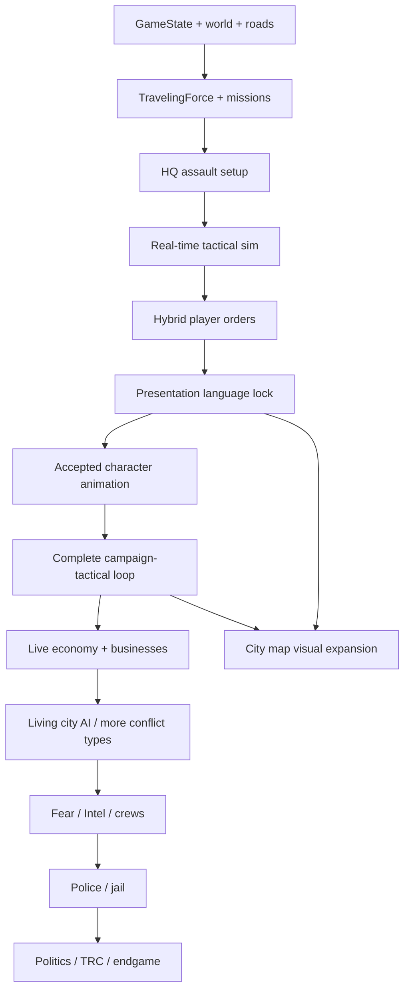

# Dead Street — Project Control

**Canonical living development tracker.**  
Last audit: **2026-09-07**.  
Last product-state correction: **2026-09-07** — Human Generator trial insufficient; DAZ Studio / Genesis 9 is the capability-vetted source pipeline.  
Last implementation milestone: **2026-09-07** — Character Factory V1 first paid-asset local street-gang rifleman visual proof (unbound; **not** visually accepted).  
Cleanup checkpoint: **product owner accepted M7F cleanup without an additional manual F5 baseline test.** That is **not** visual acceptance of any new character art.

This file is not a game design document, not a player encyclopedia, and not a vision rewrite.

| Document | Question it answers |
|---|---|
| Game Design / Encyclopedia (currently **outside this repo**) | What is Dead Street? |
| **This file** | How are we building it, where are we now, and what comes next? |
| The Git repository | What **exists** in code and assets |
| Product owner F5 / play acceptance | What is **accepted** |

A class existing does not mean a feature is production-ready.  
A CORE VALIDATION PASS does not mean the game looks or feels right.

---

## Status legend

| Symbol | Meaning |
|---|---|
| ✅ | COMPLETE / ACCEPTED — product-accepted, not just coded |
| 🟢 | BUILT + VALIDATED — implemented and covered by CORE VALIDATION; product look/feel may still be open |
| 🟡 | PARTIAL / EXPERIMENTAL / NEEDS REVIEW |
| 🔵 | CURRENT — active initiative |
| ⚪ | PLANNED — belongs on the roadmap, not now |
| ⛔ | BLOCKED |
| ❌ | REJECTED / SUPERSEDED — do not casually resurrect |
| ❓ | PRODUCT DECISION REQUIRED — technical lead must not invent the answer |
| 🧱 | TECH DEBT / ARCHITECTURAL RISK |

---

## 1. Document purpose

This file is the single authoritative project-management document for building Dead Street.

It must always be able to answer:

1. What exactly has been built?
2. What is actually working and validated?
3. What is currently being worked on?
4. What is blocked, broken, experimental, or unfinished?
5. What should be built next?
6. Why is that the correct next thing?
7. What depends on what?
8. Where do future ideas live without derailing the current build?
9. Which product decisions are still unresolved?
10. Which approaches are already rejected?
11. What validation must pass before the next milestone?
12. How current work connects to the full Dead Street vision?

Update it after every meaningful milestone. Do not replace it with chat history.

---

## 2. Source-of-truth hierarchy

Precedence, highest first:

1. **Explicit latest product decision from the user**
2. **Accepted current design documentation** (encyclopedia / GDD — currently a large PDF **outside this git repo**; no in-repo encyclopedia `.md` exists)
3. **Actual current repository behavior / architecture**
4. **Validated milestone records** (this file + git checkpoints)
5. **Older design concepts**
6. **Future speculation / backlog ideas**

Rules:

- Later product corrections override older documents.
- The repository tells us what **exists**. It does not automatically tell us what is **accepted**.
- If design docs conflict with a later product correction, **use the later correction** and record it in the Decision Log.
- The technical lead must not silently fill a ❓ gap.

**Known conflict to preserve:** older “whole-force commands only” language is superseded by current **hybrid control** (autonomous soldiers + player MOVE / TARGET / COVER). Whole-force Push / Hold / Focus / Fall Back remain part of the design; they are no longer the only player authority.

---

## 3. Current project snapshot

| Field | State (2026-09-07, Character Factory V1 unpaid rifleman proof) |
|---|---|
| Engine / project | Godot 4.7, Forward Plus, Jolt; main scene `res://gameplay/gameplay_runtime.tscn` |
| Branch | `main` tracking `origin/main` |
| HEAD | `ed79a77` — *Add automated DAZ character factory* (working tree dirty with Character Factory V1 proof tools; **not committed**) |
| Working tree | Dirty: `tools/character_factory/` (recipe/DSA/Godot style profiles). Generated PNGs are **outside** the repo (`%LOCALAPPDATA%\DeadStreetCharacterFactory\`). |
| Tags | none |
| CORE VALIDATION | **PASS** (2026-09-07 after Character Factory V1 proof, ~88s headless) — technical only |
| Last clearly accepted checkpoint | `530dbed` — M7F cleanup accepted **without an additional manual F5 baseline test**. Not visual acceptance of new character art. |
| Current active initiative | 🔵 Tactical **character visual language / source pipeline** |
| Current experiment | 🔵 **DAZ Studio / Genesis 9 Character Factory** — first paid-asset visual proof generated; **visual look not accepted** |
| Superseded experiments | ❌ MPFB `look_calib_01` (retired) · ❌ Human Generator trial (insufficient; no longer active) |
| Immediate next validation gate | Product-owner review of unbound `local_street_gang_rifleman_proof_01` boards. No profile is accepted. |
| Current known blockers | No accepted character look; camera/style profiles remain provisional; proof remains unbound |
| Current ❓ decisions | Permanent character source pipeline; camera/pitch/render must be recalibrated on the next accepted source (do **not** inherit M7F 48°/2.05 or proof 160mm); casualty persistence; HQ garrison fate; vitality HUD vs “hidden” trauma |
| Next recommended milestone | **PRODUCT-OWNER VISUAL REVIEW** of the unbound rifleman proof (then camera/style only if a look is accepted) |
| Do not start yet | Full animation libraries, multiple characters, politics, police, city-map polish, extra factions, Russian units, binding factory PNGs |

**One-line status:** Persistent proving-ground campaign + real-time HQ assault is playable. Rejected M7F character is gone. Procedural fallback remains the runtime unit baseline. Character Factory V1 produced an unbound local street-gang rifleman proof from paid DAZ assets. DAZ look is **not** accepted. Camera and style profiles remain provisional.

---

## 4. Current active initiative

### OBJECTIVE

Produce **one genuinely convincing Dead Street gang-member character** from a coherent rigged 3D source, rendered into the existing lightweight 2D tactical presentation architecture.

The target remains: a small, dimensional, pre-rendered street-gang person from an elevated oblique tactical camera — not a mannequin, not a token, not a generic soldier.

### WHY NOW

Tactical simulation, player orders, HQ proving-ground geometry, and asset-backed environment/vehicles are far enough along that **unreadably wrong units** still make the slice feel fake. M7F proved the machinery again and **failed the look**. Do not mass-produce animation until a new source passes product F5.

### WHAT HAS ALREADY BEEN PROVEN (architecture — KEEP)

These are reusable / accepted unless later repo evidence says otherwise. Product rejection of `look_calib_01` does **not** throw them away:

- Presentation / simulation separation
- `TacticalActorPresenter` retained-actor path
- `TacticalUnitAnimationCatalog` (generic clip/direction bind concept)
- Tactical identity foundation (`TacticalIdentityFactory` / `GangArchetypeCatalog` / `TacticalIdentitySnapshot`)
- Directional / facing support
- Procedural soldier fallback
- Simulation-authoritative hit-testing (`SOLDIER_SELECTION_RADIUS` around presentation origin, not sprite bounds)
- Offline rigged-3D-source → rendered-2D-runtime concept
- `AnimatedSprite2D` / retained presenter approach where applicable
- `TacticalBattleView` must not own `.png` / `Sprite2D` / `Texture2D`
- Character Factory V0 can launch installed DAZ Studio unattended, assemble free Genesis 9 Starter Essentials (Matt + base shirt/shorts + standing pose), write eight directional PNGs outside the repo, and downsample/validate them with Godot
- Character Factory V1 can assemble paid Classic Tank Top Outfit + Multi-Caliber Weapon System carbine + already-installed Worker Uniform Boots, render eight unbound directions, and write three non-canon Godot style boards
- CORE VALIDATION can stay green while art is experimental

### WHAT HAS NOT BEEN PROVEN

- Any character source that **belongs** in Dead Street beside the canonical tactical look
- DAZ / Genesis 9 as a **visually accepted** Dead Street unit
- Human Generator as a viable or permanent production pipeline (trial insufficient; **no longer the active experiment**)
- A locked canonical camera/pitch/scale (M7F 48° / ortho 2.05 is **not** inherited; factory smoke 160mm perspective is **PROVISIONAL_SMOKE_ONLY**)
- Walk / cover / fire / reload / death as one continuous accepted person
- Binding factory smoke renders — or any generated art — into `TacticalUnitAnimationCatalog`

### SUPERSEDED EXPERIMENT (retired from active tree)

**MPFB `look_calib_01`**

| Field | State |
|---|---|
| TECHNICAL | PASS (CORE VALIDATION 2026-09-07, pre-cleanup) |
| PRODUCT / VISUAL | ❌ REJECTED |
| STATUS | SUPERSEDED EXPERIMENT — **physically retired 2026-09-07** |
| Why | Technically coherent, but visually failed the Dead Street unit target |
| MPFB as technology | **Not permanently forbidden.** This specific path/result did not reach the target. |
| Cleanup | `look_calib_01` stills, look board, player_soldier calib bind, MPFB builder, MHCLO masks, local pack zips removed. Generic catalog/presenter/spec/render script **kept**. |

### CURRENT EXPERIMENT

🔵 **DAZ Studio / Genesis 9 Character Factory**

| Field | State |
|---|---|
| Classification | CURRENT CAPABILITY-VETTED SOURCE PIPELINE |
| Status | V0 smoke **and** V1 paid-asset rifleman proof **generated 2026-09-07** (unattended). Visual review **pending**. |
| Acceptance | **NOT EARNED.** Proof is unbound. No style profile is accepted. Camera remains provisional. |
| In repo | Factory launcher/script/recipe/Godot image tool only. No DAZ DUF/textures/renders. |
| DAZ | Studio 6.25.2026.14722 General Release Pro; discovered at runtime, not hardcoded |
| Proof recipe | `local_street_gang_rifleman_proof_01` — Matt, Classic Tank Top Black, Classic Trousers Dark Green, Worker Uniform Boots Black, Mavick Hair Black, PMWS Carbine RH G9M |
| Products used | dForce Classic Tank Top Outfit for Genesis 9 (SKU 102224-1); Multi-Caliber Weapon System (SKU 103057-1); footwear from already-installed Worker Uniform (tank-top product includes no footwear) |
| Runtime | Procedural fallback still active; catalog still unbound |
| Camera / light | `PROVISIONAL_TACTICAL_PROOF_160MM` — framed 160mm elevated perspective. **Not canon.** V0 `PROVISIONAL_SMOKE_ONLY` remains the smoke profile. |
| Style profiles | `clean_downsample` / `grounded_grit` / `digitized_grit` — **NON-CANON** comparison treatments. None accepted. |
| Blender | **Not required** for the core source pipeline. Reserve only for future custom asset work if necessary. |
| Permanent production pipeline? | No — ❓ until a street-clothing + weapon source-character proof **passes product F5** |

### SUCCESS CRITERIA (next: street clothing + weapon source-character proof)

At normal F5 tactical view, without zooming:

1. Upright human with readable torso / arms / legs / stance / facing.
2. Elevated tactical 3/4 camera, not full overhead, not a horizon shot.
3. Reads as a dangerous local street-gang member, not a soldier / operator / mannequin / toy.
4. Same person across the minimal directional stills.
5. Scale belongs next to sedan / sidewalk / door / porch / cover.
6. Uses the **existing** 2D presenter architecture; does not invent a parallel runtime.
7. Rig remains animation-viable.

If it would not sit in the same game as canonical Dead Street tactical art: **reject**. Do not generate hundreds of frames.

### FAILURE CRITERIA

- Shipping `look_calib_01` or the Quaternius mannequin as final body art
- Independent AI-generated frames
- Treating CORE VALIDATION PASS as look acceptance
- Throwing away presenter / catalog / identity / hit-test architecture because the MPFB *result* failed
- Inheriting M7F camera numbers without recalibrating on the new source
- Full animation libraries or extra characters before the first character passes

### NEXT ACTION

1. Documentation correction — **done**
2. Surgical M7F rejection cleanup — **done 2026-09-07**
3. Character Factory V0 DAZ handshake + free Genesis 9 smoke — **done 2026-09-07** (unattended; CORE VALIDATION PASS; **not** visual acceptance)
4. **Next:** DAZ Genesis 9 source-character proof using approved street clothing + weapon assets

### WHAT MUST NOT BE BUILT YET

- Full directional animation libraries
- Multiple characters / portraits / HUD redesign
- Politics, police, jail, TRC, endgame
- Full New Briarport map art
- Defender mouse deployment
- Campaign casualty write-back (needs ❓ first)

---

## 5. System status matrix

Implementation state describes the **repository**. Acceptance is separate.

### 5.1 Core / infrastructure

| System | Product intent | Implementation | Validation | Acceptance | Dependencies | Next required work | Priority |
|---|---|---|---|---|---|---|---|
| `GameState` | Single persistent campaign authority | 🟢 Registries: factions, regions, neighborhoods, road graph, locations, vehicles, soldiers, traveling forces, missions, relationships; turn clock | 🟢 Heavy CORE VALIDATION | 🟢 As proving-ground core | None | Keep as the only campaign authority | Now-protect |
| Serialization | Save/load a campaign | 🟡 `to_dict` / `from_dict` on GameState + leaf models; **no disk save service**, no schema version | 🟢 Round-trip tests | 🟡 API only | GameState | Disk save **later** | Later |
| IDs / repositories | Stable string IDs | 🟢 Dictionaries on GameState | 🟢 | 🟢 for current scale | GameState | No extra repository layer unless scale demands it | Later |
| Validation system | Regression gate for every milestone | 🟢 `CoreValidation.run()` via `validation/core_validation_runner.tscn`; dirty tree includes `vispass_m7b`–`m7f` | 🟢 PASS 2026-09-07 | 🟢 as **technical** gate only | Entire codebase | Keep; do not treat as product acceptance | Now-protect |
| `GameFlowController` / `GameplayRuntime` | Bootable play shell | 🟢 Campaign map ↔ tactical session; debug keys | 🟢 | 🟡 Debug proving-ground shell, not final UX | Starter world, session | Replace debug keys with real campaign UI later | Later |

**Live debug keys (proving ground, not product UX):** `T` advance turn, `H`/`R` HQ assault, `B` enter pending battle, `C` deployment commit, `Space` request tactical active, `Esc` tactical escape.

### 5.2 World

| System | Product intent | Implementation | Validation | Acceptance | Dependencies | Next required work | Priority |
|---|---|---|---|---|---|---|---|
| Map locations / buildings | Persistent geographic places | 🟢 `MapLocation` → `Building` → `Stronghold` / `NeighborhoodHQ` / `Business` | 🟢 | 🟢 data model | GameState | Author a real city later | Later |
| Neighborhoods | Territory + local power | 🟢 Ownership field; capture flips owner | 🟢 | 🟡 No memory/Fear/Intel | Locations | Do not expand until loop is real | Later |
| Neighborhood HQ | Local seat + garrison + assault target | 🟢 `garrison_capacity` default 4; assign APIs | 🟢 | 🟡 Capture does **not** rewrite garrison fate | Soldiers | ❓ garrison-on-capture | Next loop |
| Strongholds | Home station for people/vehicles | 🟢 soldier_ids / vehicle_ids / upkeep | 🟢 | 🟡 Deploy does **not** unassign from keep lists | Soldiers, vehicles | ❓ capacity / exclusivity | Next loop |
| Road graph | Real roads, not a node-board teleport | 🟢 `RoadGraph` Dijkstra on open segments | 🟢 | 🟢 model; 🟡 content is 2 nodes | Locations | Expand graph after visual/loop proof | Later |
| Persistent forces / travel | Forces occupy roads; travel time matters | 🟢 `TravelingForce` + `ForceMovementService`; convoy speed = **min** vehicle movement | 🟢 | 🟢 outbound; 🟡 return unused | Roads, vehicles, soldiers | Automatic `traveling_return` writer | Next loop |
| Retargeting | Re-route a force that is idle at a node | 🟡 Service exists; **no play UI** | 🟢 | 🟡 | Travel | UI later; no mid-segment retarget | Later |
| Road exposure / police stops | Travel is dangerous | ⛔ Missing (`PoliceRegion` is a name shell; TurnManager comments `[future police disruption]`) | — | — | Police systems | After living travel loop | Far |

**Starter world content (`StarterWorldService.create`):** 2 major gangs, 1 neighborhood, 1 stronghold, 1 rival HQ, **2 road nodes + 1 segment** distance 12, 1 car, 3 player soldiers, 3 HQ garrison soldiers, war declared, **zero businesses**. This is a proving graph, not New Briarport.

### 5.3 People

| System | Product intent | Implementation | Validation | Acceptance | Dependencies | Next required work | Priority |
|---|---|---|---|---|---|---|---|
| Factions | Major gangs now; later police, crews, TRC | 🟢 `Faction` / `MajorGang` + `ResourceStore`; restore only `major_gang` | 🟢 | 🟡 MajorGang-only | GameState | Do not add faction types until needed | Later |
| Soldiers | Persistent people with weapons/homes | 🟢 id, faction, home stronghold, garrison HQ, `weapon_type_id`, strategic_strength, upkeep | 🟢 | 🟡 No names/traits; naming deferred in `TacticalIdentitySnapshot` | Strongholds / HQs | Identity presentation after look lock | After look |
| `SoldierGroup` | Force membership | 🟢 ID list + strategic strength sum | 🟢 | 🟢 | Soldiers | — | Protect |
| Recruitment / stationing UI | Build and place crews | ⛔ Stationing APIs exist; **no recruitment service**, no UI | Partial APIs | — | Soldiers | After loop + economy | Later |
| Persistent tactical identity | Gang looks, not generic NATO soldiers | 🟢 `TacticalIdentityFactory` / `GangArchetypeCatalog` / `TacticalIdentitySnapshot` — **keep**; combat role remains `weapon_type` | 🟢 identity vispass | 🟢 architecture accepted; 🟡 no accepted painted body yet | Presentation pipeline | Bind a **future accepted** source to archetypes | 🔵 |

**Operatives:** no specialist combat class exists. Weapon type is the combat role. Do not silently invent operative gunner rules.

### 5.4 Vehicles

| System | Product intent | Implementation | Validation | Acceptance | Dependencies | Next required work | Priority |
|---|---|---|---|---|---|---|---|
| Campaign vehicles | Persistent cars that carry forces | 🟢 `Vehicle` / `VehicleGroup`; capacity + `movement_per_turn` | 🟢 | 🟢 as travel tools | Strongholds | Acquisition/damage later | Later |
| Convoy speed | Slowest vehicle gates the force | 🟢 min movement used at deploy | 🟢 | 🟢 | Vehicles | — | Protect |
| Tactical physical vehicles | Arrived vehicles become objects + cover | 🟢 Oriented footprint, body cover slots, movement blocking | 🟢 | 🟡 **LOS is not blocked** by vehicle body (explicitly validated) | Battle geometry | ❓ whether vehicle LOS should stay open | Open |
| Vehicle presentation | Readable street cars | 🟢 Catalog PNGs + `TacticalActorPresenter` sprites; view has procedural fallback | 🟢 vispasses | 🟡 Product look not separately locked | Visual catalog | Keep while units are the bottleneck | Protect |

### 5.5 Missions

| System | Product intent | Implementation | Validation | Acceptance | Dependencies | Next required work | Priority |
|---|---|---|---|---|---|---|---|
| Mission lifecycle | Travel → arrive → resolve; no teleport home | 🟢 states `traveling_outbound` → `awaiting_resolution` → success/failure; **no production writer for `traveling_return` or `complete`** | 🟢 | 🟡 Stay-at-destination is correct vs teleport; return trip missing | Travel | Return / disband after resolve | Next loop |
| HQ attacks | War + territory-gated assault | 🟢 `NeighborhoodHQAttackService` + debug runtime path | 🟢 | 🟢 as proving loop | Diplomacy, HQ, forces | Real campaign UI | After look |
| Arrivals | Turn sync when force reaches target | 🟢 `MissionService.sync_all_arrivals` | 🟢 | 🟢 | TurnManager | — | Protect |
| Outcome bridge | Tactical result writes campaign | 🟡 `BattleCampaignOutcomeBridgeService` applies HQ capture/fail **only**; **no soldier casualty write-back**; draws unsupported | 🟢 isolation tests | 🟡 Intentional isolation until ❓ | Victory, missions | ❓ then implement | Next loop |
| Business raids | Raid as a conflict source | 🟡 `BusinessRaidResolver` (loot, level-1, close) — **no live launcher** | 🟢 library tests | 🟡 | Economy, missions | After HQ loop is complete | Later |

`BattleSetupService.create_neighborhood_hq_battle` composes **attacker TravelingForce soldiers+vehicles** and **defender HQ garrison only**. Visiting/defending traveling forces are **not** composed.

`NeighborhoodHQCaptureResolver` flips neighborhood + HQ owner and **unclaims** defender businesses (`owner_faction_id = ""`). It does **not** transfer businesses to the attacker and does **not** rewrite garrison lists.

### 5.6 Tactical

| System | Product intent | Implementation | Validation | Acceptance | Dependencies | Next required work | Priority |
|---|---|---|---|---|---|---|---|
| Battle state / sides / participants / forces | Real-time fight objects | 🟢 `BattleState`, `BattleSide`, `BattleParticipant`, `BattleTacticalForce` | 🟢 | 🟢 | Setup | Protect from presentation coupling | Protect |
| Real-time runtime | Continuous combat, **not** turns | 🟢 `BattleRuntimeService.advance(delta)`; turn lifecycle **removed** (`ccfc81b`) | 🟢 no AP / turn order | ✅ Real-time is accepted product | Geometry, combat | Never reintroduce tactical turns | Protect |
| Deployment (attacker) | HUD-first mouse place + commit | 🟢 `TacticalDeploymentController` | 🟢 | 🟢 proving UX | Geometry | Polish later | Protect |
| Deployment (defender) | Legitimate composition then maybe mouse | 🟢 AI place+commit after attacker commit | 🟢 | 🟡 AI-only; HUD: “defender deployment not available” | Garrison composition | Do **not** build defender mouse deploy until composition is real | Later |
| Movement / nav / collision | Honest navigation | 🟢 path plan + follow; obstacles + vehicle bodies block movement | 🟢 | 🟢 | Geometry | Elevation later | Protect |
| Targeting | Autonomous acquire + player override | 🟢 nearest-hostile provisional; player priority target | 🟢 | 🟡 Tuning open | Weapons | Tune after look, not before | Later |
| Weapons | Pistol / shotgun / SMG / rifle / sniper identity via behavior | 🟢 All five in `BattleWeaponCatalog`; shotgun falloff; sniper aim extras; role cover bands | 🟢 | 🟡 Balance provisional | Combat | Tune later | Later |
| Fire control | Mag / reload / cadence | 🟢 `BattleFireControlService` | 🟢 | 🟢 as v1 | Weapons | — | Protect |
| Hidden vitality / trauma | Readable wounds without RPG HP micromanagement | 🟢 Trauma accumulator; healthy / wounded / dead thresholds on baseline 1.5; **HUD still paints vitality % bars** | 🟢 | ❓ HUD vs “hidden” | Combat | ❓ presentation of wound state | Open |
| Wounds / death | Wounded seek cover, shoot worse; dead leave fight | 🟢 | 🟢 | 🟢 tactical-local | Vitality | Campaign persistence is separate | Next loop |
| Victory | Fight ends when a side is eliminated | 🟢 `BattleVictoryService`; draw possible; HQ bridge rejects draws | 🟢 | 🟡 No flee/withdraw from the map | Runtime | ❓ retreat consequences | Open |
| LOS | Hard geometry stays honest | 🟢 Obstacle LOS | 🟢 | 🟢 obstacles; 🟡 vehicles do not block LOS | Geometry | Do not “fix” AI by weakening walls | Protect |
| Directional cover | Cover useful vs threat, not merely nearby | 🟢 Slot facing · to_attacker; rank by protection_factor | 🟢 | 🟢 v1 | Geometry, threats | Protect sticky player cover | Protect |
| Wounded cover | Survival-first | 🟢 Local retreat-to-cover; clears player intent | 🟢 | 🟢 | Cover, vitality | — | Protect |
| Whole-force intent | Push / Hold / Focus L/R / Fall Back | 🟢 Sim: `BattleForceCommandCatalog` / `BattleForceCommandService`; attacker opens on **Push** | 🟢 sim | 🟡 **No gameplay UI issuer** found | Behavior | HUD later — after look, not instead of look | Near |
| Player MOVE | Authoritative relocate | 🟢 `TacticalOrdersController`; clears cover ownership | 🟢 | 🟢 | Nav | — | Protect |
| Player TARGET | Authoritative priority | 🟢 Stays in occupied cover; traveling-to-cover releases | 🟢 | 🟢 | Targeting | — | Protect |
| Player COVER | Sticky until released / replaced / invalidated / wound / death | 🟢 Healthy player COVER **blocks** autonomous reposition (`_player_cover_no_autonomous_reposition_ok`) | 🟢 | 🟢 as current intent | Cover | Do not let AI wander off it | Protect |
| HUD | Readable roles, selection, orders | 🟢 `TacticalUnitHudQuery` + view paint; role labels; empty name stubs | 🟢 | 🟡 Provisional tints; vitality % | Orders | Visual polish after units look right | Later |
| Retreat / flee | Leave the battlefield | 🟡 Local `MOVE_RETREAT` + command Fall Back; **no campaign flee/withdraw** (validated absent) | 🟢 absence | ❓ | Victory, campaign | Do not fake it | Open |
| Casualty campaign persistence | Dead/wounded people stay dead/wounded on the map | ❌ Not wired; isolation is tested | 🟢 isolation | ❓ | Bridge, soldiers | Decision then implement | Next loop |
| Battlefield = strategic event | HQ assault looks like HQ assault; ambush looks like that road | 🟡 Live session always `hq_frontage_assault_v1` proving ground | 🟢 | 🟡 Only HQ frontage exists | Geometry catalog | Ambush layout **after** character language | After look |

### 5.7 Presentation

| System | Product intent | Implementation | Validation | Acceptance | Dependencies | Next required work | Priority |
|---|---|---|---|---|---|---|---|
| `TacticalBattleView` | Read sim; draw overlay; no asset ownership | 🟢 ~4245-line Node2D: camera, procedural fallbacks, HUD, hit-tests | 🟢 no sprites in view | 🟡 Works; 🧱 monolithic | Session | Split later; do not dump more duties into it | Debt |
| Environment geometry | Coherent HQ street | 🟢 Authored proving ground: HQ north/south blocks, alley, road surface, pockets, soft cover | 🟢 vispass m5/m6/m6b | 🟡 Technically committed; not a named product art lock | Catalog | Stop expanding city tiles until units lock | After look |
| Procedural presentation | Fallback so sim is always visible | 🟢 View `_draw_soldier_*` / vehicle chrome when unclaimed | 🟢 | ❌ **Not** the final unit language | View | Keep as fallback only | Protect |
| Visual catalog / bindings | Data-driven textures | 🟢 `TacticalVisualCatalog`, `BattleVisualBinding` | 🟢 | 🟡 Some pipeline-test building IDs; `building_hq_01.png` / `surface_road_01.png` **missing on disk** while block composites exist | Assets | Clean dangling catalog entries | Soon |
| Environment presenter | Retained static sprites | 🟢 `TacticalEnvironmentPresenter` | 🟢 | 🟡 | Catalog | — | Protect |
| Actor presenter | Retained vehicles + units | 🟢 `TacticalActorPresenter` — **kept**; no painted unit claimed | 🟢 vispasses | 🟢 architecture accepted | Catalog, animation catalog | Bind a future accepted set | 🔵 |
| Unit art | Gang members / criminals / survivors | ❌ `look_calib_01` retired; HEAD/runtime procedural fallback; factory V1 rifleman proof unbound | 🟢 technical | ❌ no accepted look | Pipeline | Product-owner board review; then camera if a look is accepted | 🔵 |
| Animation catalog / facing | Directional clips into runtime 2D | 🟢 `TacticalUnitAnimationCatalog` generic contract; `bound_variant_ids()` empty | 🟢 schema | 🟢 architecture; no bound art | Identity, presenter | Register accepted variant later | Protect |
| Animation libraries | Coherent skeletal clips on an accepted body | 🟡 Spec lists clips; no accepted frames | 🟢 schema | ❌ No accepted body | Look lock on **new** source | After source-character F5 accept | After look |
| Character production pipeline | Reuse skeleton/camera/lights; vary people | 🟢 Character Factory V1 (paid-asset unbound proof) + retained generic 2D presenter | 🟢 factory proof technical | ❌ look unaccepted; 160mm camera not canon; no style profile accepted | DAZ G9 | Product-owner review of rifleman boards; recalibrate camera only after look lock | 🔵 |
| Campaign map presentation | Large readable city, not mobile-strategy gloss | 🟡 `CampaignMapView` — **developer visualization**, provisional tints, hardcoded keep/HQ labels | 🟢 | ❌ Not Dead Street art direction (file says so) | GameState | After character + loop, not before | Later |

### 5.8 Strategic systems (beyond the proving loop)

| System | Product intent | Implementation | Validation | Acceptance | Next |
|---|---|---|---|---|---|
| Businesses / economy / resources | City worth controlling; cash + goods + upkeep | 🟡 `EconomyService` + catalog classes; **starter world has no businesses**; `GameplayRuntime` advances turns **without** a catalog so economy is **skipped in live play** | 🟢 service tests | 🟡 | Wire catalog + seed businesses **after** HQ loop completeness |
| Industry | Distinct industries | ⛔ type-id strings only | — | — | Later |
| Neighborhood memory / Fear / Intelligence | Local social power | ⛔ no classes/fields | — | — | After living city AI |
| Small crews | Absorb / fight local crews | ⛔ | — | — | After neighborhood layer |
| Diplomacy | War, peace, deals | 🟡 `declare_war` / `are_at_war` only | 🟢 | 🟡 Gates HQ attacks | Later |
| Police / bribery / arrests / jail | Institutional pressure | ⛔ `PoliceRegion` shell only | — | — | After exposure design |
| Politics / election / TRC | City Hall path to power | ⛔ | — | — | Far — after police/economy |
| Endgame / post-victory sandbox | Dominate then play on | ⛔ | — | — | Last |

---

## 6. Completed / validated milestones

Grouped from 87 commits on `main`. A commit is a checkpoint, not automatic product acceptance.

| Milestone | Purpose | What was added | Validation | Product result | Checkpoint | Status |
|---|---|---|---|---|---|---|
| A0 Bootstrap | Godot project + campaign data | Factions, resources, GameState | Core state tests | Foundation | `70bef61`–`8309114` | 🟢 |
| A1 Persistent world | Geography exists | Locations, buildings, neighborhoods, regions | 🟢 | Model accepted as core | `21e9a24`–`e390829` | 🟢 |
| B1 Roads & travel | Forces move on roads | Road graph, `TravelingForce` | 🟢 | Teleport-home rejected by architecture | `b960f8f`–`099d49f` | 🟢 |
| B2 People & vehicles | Persistent roster + convoy | Soldiers, vehicles, Stronghold deploy | 🟢 | Dual listing while deployed remains interim | `69088f6`–`bdd902b` | 🟢 |
| B3 Missions & turns | Lifecycle + clock | Missions, arrivals, `TurnManager`, economy service | 🟢 | Economy not live-wired | `5e70945`–`e577ec2` | 🟢 |
| B4 War / HQ resolution | Assault is a campaign action | Capture/fail resolvers, battle outcome resolver | 🟢 | Garrison fate deferred in code comments | `491a784`–`ba9db49` | 🟢 |
| C0 Tactical setup | Compose a fight from a mission | Battle setup, deployment assignments, readiness | 🟢 | HQ assault type | `21b5ea9`–`35b435a` | 🟢 |
| C1 Turn combat (superseded) | Actor turns / turn order | Turn lifecycle | then removed | ❌ Rejected | `29498d1`–`561c3c4` | ❌ |
| C2 Real-time combat | Continuous firefight | Remove turns; runtime tick; movement; geometry; nav; LOS; fire; attack; AI | 🟢 | ✅ Real-time accepted | `ccfc81b`–`7dd2701` | ✅ |
| D1 Cover & wounds | Survival-first directional cover | Cover, wounded seek, penalties, protection, mitigation | 🟢 | Directional cover accepted v1 | `0fb6e54`–`97e084a` | 🟢 |
| D2 Force commands | Whole-force intent | Hold / Push / Focus L/R / Fall Back | 🟢 sim | 🟡 No live HUD issuer | `64d7993`–`2740ea3` | 🟡 |
| D3 Pressure / victory / bridge | Fight ends; campaign hears HQ result | Pressure, victory, session, outcome bridge | 🟢 | Casualties isolated on purpose | `9508547`–`e7179cd` | 🟢 |
| D4 Play shell | Boot the loop | Game flow, gameplay runtime, **provisional** campaign map | 🟢 | Map is debug viz | `8313741`–`938ebee` | 🟡 |
| D5 Attacker deployment | Place then fight | Viz, mouse deploy, roster hit fix, commit | 🟢 | Attacker-only interactive | `40b0ede`–`ad19c3a` | 🟢 |
| D6 Defenders & cars | HQ garrison + physical vehicles | Garrison compose, defender AI, tactical vehicles | 🟢 | Visiting forces not composed; vehicle LOS open | `66066a1`–`8d40fa4` | 🟡 |
| D7 Live proving ground | F5-able 3v3 HQ street | Live battles, vitality/weapons, feedback, HQ assault field | 🟢 | Playable slice | `132162b`–`0c0e8ed` | 🟢 |
| D8 Hybrid player control | Individual MOVE / TARGET / COVER + HUD | Orders, unit HUD, HUD-first deploy, sticky cover slots | 🟢 | ✅ Hybrid control is current intent | `f908bb4`–`73d2278` | 🟢 |
| E1 Environment art | Asset-backed street, not only canvas shapes | Vehicles/props, composition, HQ frontage blocks, south projection | 🟢 vispasses | 🟡 Technical yes; not a character-look lock | `81b17a0`–`32602c1` | 🟡 |
| E2 / M7A Identity recover | Keep presentation identity; kill failed unit art | Identity factory, presenter scaffolding, visuals **off** | 🟢 `vispass_m7_*` | ✅ Rejection of failed unit art | `c355e5f` | ✅ |
| E3 / M7B–E Mannequin pipeline | Prove Blender directional sprites | UAL mannequin, 8-dir idle/walk machinery | 🟢 technical | ❌ Look failed F5; mannequin body not final; **generic pipeline concept kept** | This cleanup checkpoint / superseded as art | ❌ as art |
| E4 / M7F Look calibration | One MPFB street-gang person, 3 stills | MPFB `look_calib_01`, S/SE/E idle, catalog bind, look board | 🟢 TECHNICAL PASS 2026-09-07 | ❌ PRODUCT / VISUAL REJECTED | Retired from active tree 2026-09-07 | ❌ SUPERSEDED / RETIRED |

---

## 7. Rejected / superseded approaches

Do not casually reintroduce these.

| Approach | Why rejected | Evidence |
|---|---|---|
| Tactical turn-based combat / AP / initiative / current-actor turns | Product is continuous real-time firefights | Built then removed (`ccfc81b`); validation forbids leftover turn AP |
| Whole-force commands as the **only** player control | Design evolved to hybrid: autonomy + individual MOVE / TARGET / COVER | `TacticalOrdersController`; sticky cover tests |
| Player COVER immediately abandoned because AI wants to push | Makes player authority fake | Healthy player COVER blocks autonomous reposition |
| Nearest-cover without threat direction | Hiding behind the wrong side of an object is not cover | Protection uses facing · to_attacker |
| Weakening hard LOS / making walls stop blocking to “fix” AI | Honesty of the street matters more than convenient shooting | LOS is obstacle-based; do not punch holes for AI |
| Independent wound/kill lottery or “second wound = death” as the core model | Replaced by hidden battle-local trauma → wound → death | `BattleCombatConsequenceService` |
| Programmer-drawn shapes / procedural humans as **final** unit art | Unreadable at tactical scale; not Dead Street | M7A recovered identity and turned painted units off |
| Low-quality pure-overhead character tokens | Failed the dimensional / elevated target | Product F5 of early M7 |
| Independent AI-generated stills per direction | Identity breaks; not one person | Hard-rejected M7B/C (uncommitted) |
| Quaternius **mannequin body** as final character | Proved the pipeline; failed look | M7E F5; UAL kept as animation source only; generic 3D→2D architecture **retained** |
| MPFB `look_calib_01` as the Dead Street unit visual | Technically coherent (CORE VALIDATION PASS) but **visually failed** the product target; movement/presentation did not approach the intended reference. Technical validation ≠ product acceptance. MPFB is **not** permanently forbidden as a technology; this result is ❌ superseded as the current active experiment. | Product-owner manual F5 after M7F; candidate retired from the active tree 2026-09-07 |
| Inheriting M7F camera (48° / ortho 2.05) as canonical | Camera must be recalibrated against the **next** accepted source, not locked because a rejected candidate used it | Product correction 2026-09-07 |
| MB-Lab as character generator | AGPL contamination risk | Rejected during M7F source search |
| Treating CORE VALIDATION PASS as visual/product acceptance | A green suite can still be ugly or tactically stupid | Explicit milestone rule |
| Generic arenas disconnected from the campaign event | HQ assault must feel like HQ assault | Live path is `hq_frontage_assault_v1` only — expand by event type, not by random map pack |
| Teleporting forces home after missions | Geography and travel time would stop mattering | Resolve does not warp home; return trip is simply unimplemented |
| Territory-painting board game | Dead Street is a coherent city; territory is only one power | World model is geographic; content is still a proving graph |
| Russian organized-crime units as the calibration character | Wrong archetype for the look lock | M7F scope |

---

## 8. Known problems / technical debt

| Issue | Type | Severity | Area | User-visible effect | Root cause | Blocks | Handling | When |
|---|---|---|---|---|---|---|---|---|
| Character look not product-accepted | PRESENTATION | High | Units | Fight still reads as prototype | No accepted body; factory smoke unbound | Animation library, city polish | Street clothing + weapon source-character proof → F5 | Now |
| Generic architecture checkpointed without an accepted body | TECH DEBT | Low | Git | Presenter/catalog/spec are in tree but unbound | Cleanup preserved reusable M7 machinery | Future accepted-source bind | Bind only after a product-accepted source | Next milestone |
| `TacticalBattleView` is monolithic (~4245 lines) | TECH DEBT | Medium | Presentation | Hard to change HUD/camera/draw without collisions | View accumulated duties | Future presentation work | Split only with a dedicated milestone | Later |
| `core_validation.gd` is enormous (~75k lines) | TECH DEBT | Medium | Validation | Slow (~72s), brittle, hard to navigate | In-process vispasses boot live scenes | Future velocity | Do not add huge suites for look quality | Ongoing |
| Economy skipped in live turns | DESIGN / WIRING | Medium | Campaign | No income/upkeep while playing F5 | `advance_campaign_turn` passes no catalog; starter has 0 businesses | Strategic layer | Wire after loop completeness | Next loop |
| Forces never auto-return | DESIGN GAP | Medium | Travel | After battle, force sits at destination forever unless retargeted | No `traveling_return` writer | Logistics | Implement after casualty ❓ | Next loop |
| Deployed units still listed on Stronghold | TECH DEBT | Low | Stationing | Dual membership | Deploy does not unassign | Future stationing rules | ❓ then fix | Later |
| Capture does not handle garrison fate | PRODUCT / DESIGN | Medium | HQ | Defenders may remain as data orphans | Explicit comment | Occupation | ❓ | Next loop |
| Visiting forces not in defender roster | DESIGN GAP | Medium | Setup | Extra defenders on site do not fight | v1 BattleSetupService | Honest battles | After garrison ❓ | Next loop |
| Vehicle bodies do not block LOS | DESIGN TENSION | Medium | Tactical | Shots through cars | Vehicle ≠ obstacle | Cover honesty | ❓ keep or change | Open |
| HUD shows vitality % while sim calls vitality hidden | PRODUCT TENSION | Medium | HUD | Looks like HP bars | Provisional HUD | “Hidden trauma” intent | ❓ | Open |
| Force-command sim has no HUD | GAP | Low | Tactical UX | Cannot Push/Hold from play | No controller `set_command` | Hybrid force layer | After look | Near |
| Campaign map is debug shapes | PRESENTATION | Low (now) | Strategy | City does not exist visually | Intentional proving viz | Player fantasy of New Briarport | After character + loop | Later |
| No disk save | GAP | Low (now) | Core | Restart loses campaign | No I/O service | Long campaigns | After loop | Later |
| Catalog entries for missing `building_hq_01.png` / `surface_road_01.png` | TECH DEBT | Low | Assets | Pipeline-test IDs | Leftover catalog | Confusion | Clean when touching catalog | Soon |

No `TODO` / `FIXME` comments were found in `.gd` files. Status lives in architecture comments and this document.

---

## 9. Product decisions still open

Technical lead: **DO NOT CHOOSE**. Record the verdict here when the product owner decides.

| Decision | Why it matters | Blocks | Technical options (informational) | Rule |
|---|---|---|---|---|
| Permanent character-production source pipeline | Every future person depends on this | Animation library, gang roster, portraits | DAZ Studio / Genesis 9 is the **capability-vetted current source pipeline**, not a visually accepted lock. MPFB and Human Generator trials are superseded as current path. | ❓ DO NOT CHOOSE |
| DAZ Genesis 9 street-character visual viability | Whether a Dead Street gang member (street clothing + weapon) can pass product F5 through the existing 2D presenter | All character production | Factory V1 rifleman proof exists unbound. Visual review pending. Camera/style **not** accepted. | ❓ unresolved |
| Exact camera / pitch / render calibration | Locks future character frames | All character renders | **Must be recalibrated against the next accepted source.** Do **not** inherit M7F 48° / ortho 2.05 blindly. | ❓ unresolved |
| Vitality HUD: bars/% vs status-only (healthy/wounded/dead) | “Hidden trauma” vs readable combat | HUD rewrite | Keep bars as provisional; or replace with state chips | ❓ |
| Campaign casualty persistence | Whether dead people stay dead on the campaign | Outcome bridge, recruitment, fear | Write deaths; wound recovery clock; jail vs death — all unchosen | ❓ |
| HQ garrison fate on capture | Who occupies the building the next turn | Occupation, defender composition | Kill / capture / flee / absorb — unchosen | ❓ |
| Visiting forces + HQ garrison composition | Honest defender numbers | Defender mouse deploy, AI deploy | Compose union vs garrison-only | ❓ |
| Defender vehicles in battle | Whether parked defender cars exist | Vehicle deploy | From HQ? From visiting force? None? | ❓ |
| Vehicle LOS blocking | Cars as cover vs as screens | Combat honesty | Keep current (move-block, LOS-open) or add body LOS | ❓ |
| Retreat / flee from the tactical map | How a lost fight ends besides elimination | Victory, force return | No flee; auto-rout at threshold; player withdraw order | ❓ |
| Stronghold capacity / deploy exclusivity | Whether keep lists are inventory or location | Stationing | Unassign on deploy vs allow dual list | ❓ |
| Business claim-on-capture | Unclaim vs transfer | Economy after HQ win | Current code unclaims | ❓ |
| Weapon balance numbers | Identity is already behavioral | Tuning | Do not retune as a stall | ❓ later |
| Exact political / TRC / crew absorption rules | Endgame path | Phases J–K | Encyclopedia will specify; not now | ❓ far |

---

## 10. Dependency map



**Why this order:**

| Temptation | Why it waits |
|---|---|
| Advanced politics before campaign core | City Hall with a 2-node proving graph is a menu, not Dead Street |
| Final tactical animation before look lock | Already wasted a mannequin library and an MPFB still set |
| Defender mouse deployment before real defender composition | You would be placing the wrong people |
| Campaign casualty recovery before casualty authority | Persistence of undefined rules creates garbage campaign state |
| Polish the whole city map before the unit pipeline | A beautiful empty city with toy soldiers fails the game |
| Police / TRC / endgame now | They need travel exposure, economy, and neighborhood memory underneath |

**Protect already-validated layers:** do not change movement speed, nav, LOS honesty, cover math, weapon stats, or hit-testing to make art easier. Do not throw away presenter / catalog / identity architecture because one source result failed.

---

## 11. Master development roadmap

Completed work is marked complete. We do not schedule it again.

### PHASE A — Foundation / persistent world core — ✅ / 🟢 DONE

**Objective:** One `GameState` owns a geographic campaign.  
**Delivered:** IDs, factions (MajorGang), locations, neighborhoods, regions, serialization API, CORE VALIDATION.  
**Deferred:** Disk save, calendar month/year tick, non-gang faction types.

### PHASE B — Campaign movement / forces / vehicles — 🟢 MOSTLY DONE (proving scale)

**Objective:** Forces occupy roads; travel time and convoy speed matter.  
**Delivered:** Road graph, `TravelingForce`, soldiers, vehicles, Stronghold deploy, mission lifecycle, turn advance.  
**Still open:** Return trips, live economy, city-sized graph, exposure.  
**Content:** Still 2 nodes.

### PHASE C — Tactical battle foundation — ✅ DONE (real-time)

**Objective:** Continuous firefight from an HQ mission.  
**Delivered:** Setup, geometry, nav, LOS, weapons, fire, attack, AI, vitality, victory.  
**Rejected:** Tactical turns.

### PHASE D — Tactical intelligence / player control — 🟢 MOSTLY DONE

**Objective:** Hybrid control.  
**Delivered:** Directional cover, wounded behavior, MOVE / TARGET / COVER, sticky player cover, unit HUD, attacker deploy.  
**Partial:** Force-command HUD; defender mouse deploy (correctly waiting).  
**Deferred:** Flee/withdraw.

### PHASE E — Tactical presentation vertical slice — 🔵 CURRENT

**Objective:** The proving-ground street and its people look like Dead Street.  
**Delivered (keep):** Asset-backed environment blocks, vehicles/props, identity foundation, `TacticalActorPresenter`, catalog/facing contract, sim/presentation split, procedural fallback, simulation-authoritative hit-testing.  
**Rejected as current character result:** MPFB `look_calib_01` — technical PASS, product-visual REJECTED, **retired from the active tree 2026-09-07**. Generic presenter/catalog/identity/fallback **kept**.  
**Current source experiment:** DAZ Studio / Genesis 9 Character Factory — capability-vetted; V1 paid-asset rifleman proof generated unbound; **look not accepted**. Human Generator trial is no longer active.  
**Runtime baseline:** procedural soldier fallback (temporary safe state, not the final visual strategy).  
**Success:** One convincing gang-member vertical slice through the **existing** 2D architecture + product-accepted look + camera recalibrated on that source.  
**Explicitly deferred:** Full animation set, extra characters, campaign map art, binding factory PNGs, treating smoke camera as canon. Blender is not required for the core source pipeline.

### PHASE F — Complete campaign ↔ tactical loop — 🟡 NEXT AFTER LOOK

**Objective:** The fight changes the city, and the city still has those people and cars on the road.  
**Prerequisites:** Look language locked enough that we are not rebuilding the battlefield every week.  
**Deliverables (after ❓ decisions):** casualty write-back policy implemented; garrison fate; visiting-force composition; force return or disband; no teleport; maybe defender vehicles.  
**Validation:** CORE VALIDATION + a manual campaign loop (launch → travel turns → deploy → fight → see campaign result).  
**Deferred:** New mission types beyond HQ/raid library.

### PHASE G — Strategic economy / businesses / resources — ⚪ AFTER F

**Objective:** Money, goods, upkeep, and businesses exist in **live** turns.  
**Prerequisites:** Loop F so capturing a hood has economic meaning.  
**Deliverables:** Seed businesses, pass catalog into `TurnManager`, claim/transfer ❓, production/upkeep visible.  
**Deferred:** Deep industry web.

### PHASE H — Living city AI / gang behavior — ⚪ AFTER G

**Objective:** Rivals act on the same map (raids, retaliation, movement) without being scripted debug keys.  
**Prerequisites:** Forces, missions, economy.  
**Deferred:** Full New Briarport population.

### PHASE I — Neighborhood / Fear / Intelligence / crews — ⚪ AFTER H

**Objective:** Territory is not the only power.  
**Prerequisites:** Persistent people and local events that can be remembered.

### PHASE J — Police / arrest / jail / escalation — ⚪ AFTER I

**Objective:** Road exposure and institutional pressure.  
**Prerequisites:** Travel that matters; Fear/Intel hooks.  
**Do not** start from the empty `PoliceRegion` shell alone.

### PHASE K — Politics / elections / TRC — ⚪ AFTER J

**Objective:** City Hall as a path to dominance.  
**Prerequisites:** A city worth capturing politically, not a 2-node graph with a politics menu.

### PHASE L — Content / city expansion / visual polish — ⚪ PARALLEL AFTER E, HEAVY AFTER F

**Objective:** New Briarport as a large continuous readable city.  
**Prerequisites:** Locked character camera/language; working loop.  
**Includes:** Ambush battlefields that match the road; more HQ variants; campaign map that is not debug tint.

### PHASE M — Endgame / balance / full campaign — ⚪ LAST

**Objective:** Long-term dominance and post-victory sandbox.  
**Prerequisites:** K + L. Weapon/economy tuning belongs here more than in Phase E.

---

## 12. Near-term execution plan

The next meaningful milestones. Unrelated exciting features do not jump the queue.

**A (docs correction), B (surgical M7F cleanup), and C (Character Factory V0) are complete.** Character Factory V1 (D) produced an **unbound** paid-asset rifleman proof. Visual review is **pending**. Do not bind. Do not treat camera/style as canon.

| Order | Milestone | Why now | Prerequisites | Definition of Done | Automated validation | Manual validation | Explicitly DO NOT add |
|---|---|---|---|---|---|---|---|
| A | **Documentation correction** | Product F5 of M7F already happened; tracker was stale | Product-owner rejection + HG pivot | This file records M7F as visually rejected | n/a | Product-state review | Implementation, file deletion, commit |
| B | **Surgical M7F rejection cleanup** | Rejected candidate must leave the active path | A | `look_calib_01` gone; look board gone; `player_soldier` procedural; generic architecture kept | **PASS 2026-09-07** | Product owner accepted this cleanup checkpoint **without an additional F5 baseline test**. Not visual acceptance of new art. | Deleting generic architecture; committing rejected art |
| C | **Character Factory V0 — DAZ handshake + free smoke** | Prove Cursor can drive installed DAZ / Genesis 9 unattended | B | Handshake + `smoke_matt_01` eight directions + Godot 128px + preview board; no runtime bind | Factory PASS + CORE VALIDATION PASS 2026-09-07 | Technical inspection of preview board only — **not** product look accept | Binding PNGs; street wardrobe; treating smoke camera as canon |
| D | **DAZ Genesis 9 source-character proof — street clothing + weapon** | Smoke Matt is not Dead Street | C | Unbound factory proof of one gang-member identity with approved street clothing + weapon. **Not** bound into the 2D presenter. Visual review pending. | Factory run + CORE VALIDATION PASS 2026-09-07. **Not** visual accept | Product-owner review of unbound boards vs street reference | Extra characters; animation libraries; HG resurrection; treating any style profile as canon |
| E | **Camera / projection / scale vs accepted tactical reference** | Smoke camera is not canon | D | Elevation/projection/scale chosen from **this** character against the street reference | Pipeline spec updated only after it reads right | Compare to sedan/sidewalk/door/cover | Blindly copying 48° / 2.05 or smoke 160mm |
| F | **Minimal idle / look directional renders** | Prove projection + identity before animation | E | Same person, same rig/camera/light; few representative directions; into existing catalog/presenter | Focused bind tests; no sprite-bound hit-tests | Stills are the same individual | 176+ production frames; fake walk |
| G | **Manual product-owner visual review** | Only F5 can accept look | F | Accept / reject recorded here | CORE VALIDATION PASS ≠ accept | F5 at normal tactical view | Animation library on a rejected body |
| H | **Walk / identity continuity** | Movement must be the same person | G **accepted** | Real walk (or current-speed locomotion) on the accepted body | Clip schema; fallback for unbound clips | F5 walk does not break identity | Cover/fire/death libraries |
| I | **Expand production pipeline** | Many distinct people without per-person animation | H | Reuse skeleton/camera/lights; vary body/clothes/weapons | Catalog contracts | Product review of second variant | Politics, city-map art, mass faction rosters |
| J | **Force-command HUD (thin)** | Sim already has Push/Hold/Focus/Fall Back | Preferably after a passing look so HUD isn’t on toys | Player can issue whole-force intent without breaking sticky COVER | Existing command tests + UI wiring | F5 Push vs Hold | Flee, HUD art redesign |
| K | **Campaign↔tactical loop completeness (decisions first)** | Slice is a demo until consequences persist | ❓ casualty, garrison, visiting forces | Decisions recorded; then implemented; no teleport home | Bridge tests updated honestly | Full debug loop | Police, politics |
| L | **Stop-and-reassess** | Prevent scope runaway | After G at minimum | Update this file; choose more tactical depth vs Phase F loop vs economy | — | Product owner | Auto-start politics |

---

## 13. Idea / feature backlog

**The backlog is not the roadmap.**  
An idea entering this list does **not** gain priority. It waits until the near-term plan says so.

### NOW

- Product-owner visual review of unbound `local_street_gang_rifleman_proof_01` boards
- Keep CORE VALIDATION green without expanding it for taste
- Do not resurrect `look_calib_01`
- Do not bind factory PNGs
- Do not treat 160mm camera or A/B/C style profiles as canon

### NEXT

- Camera/scale recalibration on that source
- Minimal idle/look directional renders
- Product-owner F5 of the **new** candidate
- Only if accepted: walk / identity continuity

### LATER

- Force-command HUD
- Campaign consequence ❓ then implementation
- Live economy seed
- Ambush / shipment / raid live missions
- Defender interactive deployment
- Disk save/load
- Soldier names / portraits
- Mid-route retarget
- Vehicle damage / acquisition
- Campaign map art beyond debug
- Additional gang appearance variants (Black / white / Latino / mixed — race is appearance only, never team ID)
- Russian organized-crime archetype (separate, later)

### FAR FUTURE

- Neighborhood memory, Fear, Intelligence
- Small crew absorption
- Police stops, bribery, arrest, jail
- Elections, City Hall, TRC
- Endgame and post-victory sandbox
- Full New Briarport continuous city

### PRODUCT DECISION REQUIRED

See §9. Do not implement from this list until a decision is logged.

---

## 14. Validation policy

Every meaningful milestone has:

1. Narrow implementation scope
2. Explicit non-goals
3. Automated validation where possible
4. Regression validation (full CORE VALIDATION)
5. Manual F5 / visual review where look or feel matters
6. Product acceptance where gameplay or visuals are subjective
7. Clean git checkpoint **after** acceptance — not before

### How to run CORE VALIDATION

Godot 4.7 headless, from the repo root:

```text
godot --headless --path <repo> --quit-after 2 res://validation/core_validation_runner.tscn
```

Must **not** replace the main scene (`gameplay_runtime.tscn`).  
Optional: `--dump-checks` or `DUMP_ALL_CHECKS` in `validation/core_validation_runner.gd`.

**Last run:** 2026-09-07 — `DEAD STREET CORE VALIDATION: PASS` after Character Factory V1 proof (~88 seconds). Headless prints expected `!is_inside_tree()` camera noise during nested vispasses; the suite still reports PASS.

### Non-equivalence

**AUTOMATED PASS ≠ PRODUCT ACCEPTANCE.**

A tactical scene can technically pass and still be ugly, unreadable, poorly laid out, tactically stupid, or wrong for the design. Character look is a product gate.

**Worked example:** M7F `look_calib_01` — CORE VALIDATION PASS, product-owner visual **REJECTED**.

Do not add validation that pretends to score art quality.

---

## 15. Definition of done

These are not synonyms.

| Term | Meaning |
|---|---|
| **TECHNICALLY COMPLETE** | Code exists, boots, and does the described thing in this repo |
| **VALIDATED** | CORE VALIDATION (and any milestone vispasses) PASS on that behavior |
| **PRODUCT ACCEPTED** | Product owner judged look, feel, or rules acceptable (usually F5) |
| **PRODUCTION READY** | Accepted + validated + checkpointed + not marked experimental; safe to build on |

Examples:

- Real-time combat is **production-ready** as the tactical time model.
- Sticky player COVER is **validated** and treated as **current accepted intent**.
- Generic character-presentation architecture (presenter, catalog, identity, facing, fallback, sim hit-test, 3D→2D concept) is **retained / accepted as architecture**.
- `look_calib_01` was **technically complete** and **validated**, then **product-visually REJECTED**, and is now **retired from the active tree**.
- Character Factory V0 is **technically complete** as an unattended DAZ handshake/smoke. It is **not** product-accepted art.
- Character Factory V1 rifleman proof is **technically generated** and **unbound**. Camera/style profiles remain **provisional**. It is **not** product-accepted art.
- Human Generator trial is **insufficient** and is **no longer the active experiment**.
- EconomyService is **technically complete** and **validated**, not **production-ready** in live play.

---

## 16. Git / checkpoint policy

Intended discipline:

1. Inspect `git status` before a milestone. Know what is already dirty.
2. Do not mix unrelated work on the same dirty tree.
3. Validate.
4. Manual F5 when look/feel/orders are in scope.
5. **Commit only after the milestone is accepted** (or after an explicit recover/reject checkpoint like M7A).
6. Push only after that accepted checkpoint.
7. Update **this file** in the same accepted checkpoint when possible.
8. Do not commit huge local caches (`mpfb_packs/`, `.blend` rebuildables, installer zips). See `tools/character_pipeline/SOURCES.md` and `.gitignore`.

**M7F cleanup checkpoint:** product owner accepted without an additional manual F5 baseline test.  
This is not visual acceptance of any new character art. Do not resurrect `look_calib_01`.

---

## 17. Change / decision log

Append-only. Seeded with verifiable decisions only.

| Date | Decision / Change | Type | Reason | Affected systems | Roadmap impact |
|---|---|---|---|---|---|
| 2026-03-era (`ccfc81b`) | Remove tactical turn lifecycle | PIVOT | Combat is continuous real-time | Battle runtime | Phase C locked; do not resurrect turns |
| 2026 (`761397a`) | Hidden vitality / weapon identity | ARCHITECTURE | Replace lottery wounds | Combat, HUD | Trauma model is current; lottery rejected |
| 2026 (`798a794`, `73d2278`) | Hybrid player orders + sticky COVER | PRODUCT | Autonomy is not the only control | Orders, cover, HUD | Whole-force-only superseded |
| 2026 (`e7179cd`) | HQ outcome bridge **without** casualty write-back | ARCHITECTURE | Isolation until campaign rules exist | Bridge, soldiers | Phase F ❓ |
| 2026 (`32602c1`) | HQ frontage environment + consistent projection | MILESTONE | Proving street must be a place | Environment presentation | Phase E env slice |
| 2026-09-06 (`c355e5f`) | Recover identity; reject failed unit art | REJECTION / MILESTONE | Validation-green art still failed F5 | Identity, presenter | Character look is the gate |
| 2026-09-06 | MPFB chosen over MB-Lab for M7F attempt | ARCHITECTURE | MB-Lab AGPL risk | Character pipeline | M7F used MPFB; later visually rejected |
| 2026-09-07 | This project-control document created | ARCHITECTURE | One living tracker | `docs/` | Process |
| 2026-09-07 | M7F MPFB `look_calib_01` **manually rejected** | PRODUCT / PIVOT / REJECTION | Technically coherent, visually failed Dead Street unit target. Validation ≠ acceptance. | Units, tools, camera spec | Source experiment pivoted to Human Generator (unproven). Generic 3D→2D architecture retained. |
| 2026-09-07 | Surgical M7F rejection cleanup | MILESTONE | Retire rejected candidate without deleting generic architecture | Units, presenter, catalog, validation, tools | `look_calib_01` / look board / MPFB builder removed. Procedural fallback restored. Next = Human Generator vertical slice. |
| 2026-09-07 | Product owner accepted M7F cleanup checkpoint | PRODUCT / MILESTONE | Accepted without an additional manual F5 baseline test | Git, docs | Checkpoint/push allowed. **Not** visual acceptance of new character art. |
| 2026-09-07 | Human Generator trial insufficient | PRODUCT / PIVOT | HG is no longer the active source experiment | Character pipeline | Source pipeline is DAZ Studio / Genesis 9 |
| 2026-09-07 | Character Factory V0 automated DAZ handshake + free Genesis 9 smoke | MILESTONE | Prove unattended DAZ control with Starter Essentials only | `tools/character_factory/` | Technical PASS. **Not** visual acceptance. Renders unbound, outside repo. Next = DAZ GENESIS 9 SOURCE-CHARACTER PROOF — STREET CLOTHING + WEAPON |
| 2026-09-07 | Character Factory V1 first paid-asset local street-gang rifleman visual proof | MILESTONE | Prove paid clothing + carbine + footwear through unattended factory | `tools/character_factory/` | Technical proof generated. Unbound. Camera/style **provisional**. **Not** visual acceptance. Product-owner board review pending. |

---

## 18. Risks

| Risk | Likelihood | Impact | Mitigation | Owner |
|---|---|---|---|---|
| Character pipeline never reaches the visual target | Medium | High — slice stays a prototype | F5 early; stop; change source; do not mass-produce frames | Product (verdict) + technical (source options) |
| Human Generator treated as locked production canon | Low | Wasted pipeline / wrong source | HG trial is **no longer active**. Do not resurrect it as default. | Technical |
| Binding Character Factory smoke PNGs into runtime | Medium | Canonizes Starter Essentials Matt as Dead Street | Catalog stays unbound; renders stay in `%LOCALAPPDATA%` | Technical |
| Treating smoke 160mm camera as canon | Medium | Wrong projection on the next body | Recalibrate from the next accepted street-character source | Technical |
| Throwing away presenter/catalog/identity because M7F look failed | Medium | Rebuild cost; lose validated contracts | Cleanup is surgical: calib candidate out, architecture stays | Technical |
| Inheriting rejected M7F camera as canon | Medium | Wrong projection on the next body | Recalibrate from the new source vs street reference | Technical |
| `TacticalBattleView` keeps absorbing duties | Medium | High maintenance / coupling | Presenters already exist; forbid sprites in the view; split only as a named milestone | Technical |
| Tactical autonomy fights player intent | Medium | Makes orders fake | Keep sticky COVER tests; never let “smarter AI” override player COVER | Technical |
| Simulation coupled to sprite bounds | Low/Med | Gameplay changes with art | Hit-test radius around origin; vispass safety | Technical |
| Campaign systems built as menus instead of one physical city | Medium | Becomes a territory board game | No politics/police until travel+economy+places are real | Technical sequencing |
| Scope expansion outruns vertical-slice proof | High | Never locks look | Near-term plan is look → loop → economy | Both |
| Validation suite becomes slower/more brittle | High | Fear of changing anything | 72s already; add only focused checks | Technical |
| Huge city art investment before pipeline proof | Medium | Sunk cost | Phase L waits on Phase E | Technical |
| Dirty experimental art accidentally committed | Medium | Canonizes the wrong look | Do not commit `look_calib_01`; cleanup before any character checkpoint | Technical |
| Encyclopedia lives only as an outside PDF | Medium | New leads miss product canon | This file points at it; consider a future in-repo pointer, not a rewrite | Product |

---

## 19. Never forget

- Strategic campaign = **turn-based**. Tactical battles = **continuous real time**.
- Real geographic city, real roads, persistent force position. **Not a node board.**
- Forces **do not teleport home** after missions.
- Battles arise from strategic context.
- Territory is only one kind of power.
- New Briarport is a functioning, weakened Gulf Coast city — not a wasteland.
- Product owner owns what the game **is**. Technical lead owns sequencing, architecture, and regression protection.
- Soldiers stay autonomous. Player MOVE / TARGET / COVER is also current intent.
- Sticky player COVER must not be casually overridden.
- Cover is directional / threat-relative. Hard LOS stays honest.
- Visuals need product acceptance, not merely validation. M7F `look_calib_01` is the proof: TECHNICAL PASS, PRODUCT REJECTED.
- Generic prerendered-3D-to-2D architecture stays; rejected **results** do not delete the **pipeline**.
- Units are gang members, criminals, survivors — **not generic soldiers**.
- Do not silently resurrect rejected designs (`look_calib_01`, mannequin body, AI frames, tactical turns).
- Do not implement unresolved ❓ choices (including locking camera or treating factory smoke as canon).
- New ideas go to the **backlog** before they change build order.

---

## 20. How to update this document

After every meaningful milestone:

1. Update **§3 Current Project Snapshot** (date, HEAD, dirty/clean, validation, active initiative).
2. Update **§5 System Status Matrix** symbols — do not mark accepted without F5/product.
3. Move finished work in **§6**; never delete rejected rows from **§7**.
4. Rewrite **§12 Near-Term Execution Plan** if the next 5–10 steps changed.
5. Add/remove blockers in the snapshot and **§8**.
6. Append **§17 Decision Log** for PRODUCT / ARCHITECTURE / MILESTONE / REJECTION / PIVOT / BUG DISCOVERY.
7. Record the git checkpoint (hash + subject). Do not invent hashes.
8. Keep rejected ideas preserved even if someone wants to “just try them again.”
9. Reassess the next milestone from **§10 dependencies**, not from excitement.
10. If a ❓ was decided, move it out of §9 and into the log.

Keep the snapshot short enough to read on one screen. Put detail in the matrix and milestone tables.

This file should remain useful if development continues for years.

---

## Appendix A — Ownership model

| Role | Who | Authority |
|---|---|---|
| **Product / creative owner** | User | What Dead Street should be; gameplay direction; game feel; priorities; visual rightness; fun; major creative calls; final accept/reject |
| **Technical / build lead** | ChatGPT operating through Cursor | Architecture; sequencing; prerequisites; milestone shape; validation gates; anti-rewrite; risk detection; precise implementation prompts; coherence; **recommending** next work; protecting validated systems |

The technical lead must **not** silently make unresolved gameplay/product decisions. Mark ❓ instead.

---

## Appendix B — Repository map (audit)

| Path | Role |
|---|---|
| `core/` | `GameState`, `Faction` / `MajorGang`, `CoreValidation` |
| `world/` | Locations, geography, roads |
| `campaign/` | Travel, missions, turns, economy, diplomacy, soldiers, vehicles, deploy actions |
| `battle/` | Sim: core, combat, geometry, navigation, AI, vehicles, session, identity, presentation catalogs |
| `gameplay/` | Runtime shell, campaign map view, tactical view/presenters/controllers, starter world |
| `validation/` | `core_validation_runner.tscn` |
| `assets/tactical/` | Environment blocks, vehicles, props. Unit stills folder empty after M7F retirement |
| `tools/character_pipeline/` | Generic `render_tactical_sprites.py`, SOURCES, UAL (animation only). MPFB builder/stills retired |
| `docs/` | This file |

Outside repo: large Dead Street design PDF in OneDrive Documents (encyclopedia / GDD). Not copied here.

---

## Appendix C — F5 proving-ground reminder

1. F5 main scene.
2. `R` or `H` launches the debug HQ assault (restore world if needed).
3. `T` advances campaign turns until arrival (starter distance 12, vehicle movement 5 → multi-turn travel).
4. Enter battle; attacker deploys; `C` commits.
5. Inspect look at **normal** tactical zoom.

`look_calib_01` already failed inspection and has been **removed**.

Product owner accepted the M7F cleanup checkpoint **without an additional manual F5 baseline test**. That does **not** accept any new character art. Procedural fallback is the current runtime baseline, not the final visual language.
