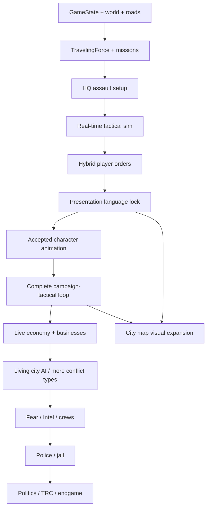

# Current milestone - four menu soundtrack exclusions - 2026-09-15


IMPLEMENTED / VALIDATED: Switch, Ripper, Dead or Alive and Lurk removed only from sandbox menu playlist/shuffle; 18 menu songs remain. All faction mappings, snippets and 43 audio assets unchanged. Native menu check PASS, including old saved preferences. See tools/menu_playlist_trim_20260915/README.md and publication_receipt.json. Reopen Sandbox.


# Current milestone - gun and vehicle comparison / SMG labels - 2026-09-15


IMPLEMENTED / NATIVE-VALIDATED: click to select a gun or vehicle; hover another to compare both values and signed changes across categories. SMG uppercase throughout force selection. 3,736 native checks PASS for 30 guns / 75 vehicles and three layouts. No stat/economy changes. Evidence, interaction rules, scope and continuation: tools/arsenal_compare_20260915/README.md and journal arsenal-compare-02. Current publication receipt records actual Git outcome; prior Faction Audio 50a0007 is published. Reopen Sandbox for owner review.


# Current milestone - faction glossary audio preview - 2026-09-15


IMPLEMENTED / NATIVE-VALIDATED: Faction Audio filled play/stop controls for all 23 factions, automatic menu-music pause and same-position resume, one-shot end/navigation cleanup. 250 native checks PASS. 21 approved snippets and both existing authority sirens reused; no source audio or battlefield changes. Evidence/ownership/continuation: tools/faction_audio_preview_20260915/README.md and journal faction-preview-02. Previous approved menu-polish 07046958 is pushed/verified; current publication status is separate. Reopen normal Sandbox; owner review pending.


# Current milestone - sandbox emblem, precision-art and music polish - 2026-09-15


IMPLEMENTED / NATIVE-VALIDATED. All23 menu emblems lose white outer canvases; AK-47/six sniper close-ups refined; compact158x56 current-song popup; Shuffle rebuilds enabled order and immediately starts its first track.249 native checks PASS. Exact behavior, seven-gun visual evidence, source ownership/delta and reproduction: tools/menu_polish_20260915/README.md and journal menu-polish-02. Prior approved portrait checkpoint dc045054 is pushed/verified. Current publication status is separate in the task receipt. Reopen normal live-source Sandbox; owner appearance review pending. Other scope milestones remain valid below.


# Current milestone — portrait and Arsenal continuation — 2026-09-15


IMPLEMENTED / NATIVE-VALIDATED; owner visual review and economy playtesting remain. All 20 approved leader photographs installed upper right; all 691 standing portraits reviewed and normalized; 75 vehicles ordered by ascending price within category; 30 canonical firearm prices integrated in Arsenal; gun close-ups refined with emphasis on pistols/SMGs. Native 6178 checks PASS. No combat-stat or animation-atlas changes. Exact evidence, review scope and continuation: tools/sandbox_finish_20260915/README.md and journal portrait-arsenal-takeover-03. Reopen normal live-source sandbox. Publication status is separate in the task receipt. Other milestones below remain valid for their own scopes.


# Current milestone - estate presentation refinement - 2026-09-14


IMPLEMENTED / VALIDATED; owner presentation review pending. The estate driveway border meets the public road at x139 with no pavement lip. Shared combat HUD fills the viewport width with 12 logical-unit edge insets while retaining the accepted 226-unit height and uniform text scale; 16 units use two 46-unit card rows. The intro surroundings now continue through fields, wooded belts, access lane, neighboring lots/buildings and utility poles. The bake covers (-1200,-900) through (2896,1404); camera zoom/pan code and fightable geometry are unchanged. Native HUD: 834 checks across bridge/estate and three screen sizes, zero errors. Final capture: 39707 actor-frame checks, zero presentation, arrival, outro or HUD camera violations. Battle comparison against version 4 is exact across seed, timing, phase frames, commands, passenger manifests, shot count, results and every unit outcome; version 4 had already matched owner-accepted version 3. All 195 protected source hashes match. Siren, survivor-first results, units, arrivals and combat remain unchanged.

Video version 6: 88.197s, 1280x720/30fps H.264/AAC, 7520962 bytes, decoded through the end. SHA256 64a8b2cc27cd13bdb7b71b9cb17b9efba9404bdf16bf05dc9e7808b373d21210. Saved under existing libfile_5962de2d811081919c16f93b3f306b4c; version 4 is preserved in width_scenery_20260914/prior_version4. Evidence: width_scenery_20260914/verification.json and hud_layout.json, intro_full.png, opening_cover.png and record.json. Reproduce with run.py pack, --check=estate_bake, repack, --check=hud_layout_review / estate_scenery_preview, then record_worker.py and encode.py. Never repack during capture. No broad gameplay suite or fresh performance benchmark; historical estate performance and global caps remain open.


# Current milestone - accepted estate / final presentation refinement - 2026-09-14


OWNER-ACCEPTED: the version-3 estate battle, map, arrivals, cover, units, HUD and vehicle placements. Brandon requests only TRC siren correction (0.75 speed, 18 dB combat reduction instead of 6 dB) and a shared final-card rule: living units, including wounded survivors, precede dead units for both factions in every battle. Changes implemented and validated; video version 4 saved. Exact battle timing, commands, arrivals, shot count and all unit outcomes match the accepted version 3. Only the revised siren/card presentation remains for review. All other battle/gameplay sources preserved. See latest journal and estate README; this acceptance supersedes older owner-review-pending statements about the battle itself. Revised siren/card presentation remains for review.


# Current milestone - owner feedback applied - 2026-09-14


IMPLEMENTED / VALIDATED; owner review pending. Vocals removed and parked; uniform bridge-sized HUD with condensed two-row cards; TRC broken siren at half speed, driving sound preserved; complete lower fence/open garage gate; angled assault parking and all attackers in real opening cover; exact 7/5/4 passengers with four-person Vigil flank; white Workhorse moved onto paved circle. Final 88.197-second version-3 video is fully decoded and saved. Native HUD 786 checks and existing native controls 43 checks pass; final record has zero HUD/presentation/route errors. See estate README and journal active-resume-16 for exact evidence and failures. Remaining: owner review, historical 44.42 FPS performance gap, global caps and shield proposal. All faction voice expansion is parked. Older conflicting statuses below are historical.


# Current milestone - second estate correction - 2026-09-14


PUSHED / VERIFIED, 2026-09-14: origin/build/arsenal-checkpoint-20260911 is verified at a493f38afd27802798d84159ee56ef3abc7221f7, including gameplay 15c6bbc, handoff cd23759 and completion receipt a493f38. Brandon explicitly approved publication of the receipt in the active chat. Both publication blocks are resolved. Owner video feedback and visual/listening acceptance remain pending. This local status update will accompany the next substantive build checkpoint; no further publication is needed for this approval turn.


IMPLEMENTED / VALIDATED; owner review pending. Shared estate projection/scale fixed; measured HUD framing and continuous local aftermath; full intro names, quieter mansion-positioned music and 36 TRC/Whittaker pack-07 voice clips. Corrected 74.537-second video saved as existing recording version 2. 31,514 actor-frame checks, zero overlap/hidden-survivor/route errors, zero result-camera jump; current command 128 and native UI 43 checks passed. Fresh estate native sample 44.42 FPS/p95 41.517 ms: performance remains open. Other 17 voice profiles not installed; no pressure hook or shield mechanics added. See tools/whittaker_estate/README.md and journal for exact sources, reproduction, failed checks and limits. Next: Brandon reviews corrected video; earlier review-next claims below describe superseded deliveries.


## Current milestone — corrected Whittaker Estate — 2026-09-14


IMPLEMENTED / VALIDATED; owner visual and listening review pending. Rebuilt road-facing mansion with upright volume, shared render/collision footprint, improved fountain court, gatehouse, service building, parking and landscaping. Original 106 BPM Southern-major guitar replaces the rejected dark cue; persistent TRC warning horn is louder on arrival, ducked in combat and subdued behind Whittaker victory music. Existing units/fleet/weapons reused. Verified 16 v 16 defender-win mobile recording, complete decode, survivor cards and HUD models. This fixture does not raise production caps.


See [estate report](../tools/whittaker_estate/README.md) and latest journal for exact evidence, failed/superseded attempts and limits. Native 32-unit sample remains below 60 FPS. Vocals integration is paused; riot shield remains a proposal. Next: Brandon reviews this corrected map and audio. All earlier conflicting next-step statements below are historical.


## Current milestone — faction victory audio and final battle recording — 2026-09-14


IMPLEMENTED / VALIDATED; owner review pending. Raiders metal returns to its -18 dB

intro level during the ending and becomes centered foreground music; sirens stay

quiet beneath it. The mobile recording adds five seconds of victory cards and

shows remaining survivor counts. Explicit retreat outcomes have dedicated wording;

tactical flee execution remains future work. Intro NBPD name is expanded then

abbreviated, and HUD cards show actual equipped weapon names below their class.


Owner-approved rule for every future battle: both factions have their own audio

presence, combat music recedes, and the winner takes over the victory-card outro.

Current implementation covers existing convoy radio; broader assets/integration

remain future work. Native audio/count/model checks and export checks passed.

Details and exact validation limits are in the latest journal.


Next: Brandon reviews the final recording. Performance and Whittaker remain parked.


## Current milestone — sparse heavy radio / combat fade / context roles — 2026-09-14


IMPLEMENTED / VALIDATED; owner listening review pending. Prior 102 BPM music was

rejected as too busy and too loud in combat. Replacement: 84 BPM Drop-A, twelve

sustained chord strikes over eight bars, and an explicit 14 dB fade before combat.

ATTACKING now aligns beneath Raiders with DEFENDING beneath NBPD; ROAD BLOCKADE

is at the context box top right. The replacement mobile recording retains the

Raiders victory and accepted convoy/command visuals. Native gain telemetry verifies

the fade; details and validation limits are in the latest journal.


Next: Brandon reviews the revised recording. Performance and Whittaker remain parked.

Earlier conflicting milestones are historical.


## Current milestone — original-audio Raiders victory video — 2026-09-14


IMPLEMENTED / VALIDATED; owner review pending. Correct eastbound arrivals, hidden

persistent unit paths and quieter sirens are included in the final mobile video.

The radio uses an original heavy guitar riff; no outside music or samples are used.

The requested Raiders win uses a disclosed veteran/equipment advantage in the

recording fixture. Global combat balance is unchanged. The lane/arrival pass had

102 native checks; final capture has zero route or script errors and passed video

decode/audio checks. Details, hashes and limits are in the latest journal.


Next: Brandon reviews the completed Raiders-victory video with original audio.

Performance and Whittaker remain parked. Earlier conflicting milestones are history.


## Current milestone — Raiders convoy and battle recording — 2026-09-14


IMPLEMENTED / VALIDATED; owner acceptance pending. Stateline motorcycle trios count

as one convoy slot each. The 12-person arrival has six bikes (seven occupants) and

one Mesa pickup (five occupants, two in the bed). Moving/ridden arrival, pillion,

rear bed exits and legal cover routes are implemented. Original muffled guitar

radio and localized NBPD sirens support the arrival and combat. 67 native checks

passed. The full natural battle has been recorded and encoded to mobile-shareable

H.264/AAC MP4 with audio. Exact timing/hash and validation limits are in the journal

and recording reports. This supersedes the earlier recording-on-hold status.


Rules: [Convoy arrival](../tools/convoy_arrival/README.md). Next: deliver the video,

then Brandon reviews arrival, audio and command feel. Performance and Whittaker

Estate remain parked; other faction abilities and universal convoy limits are open.


## Current milestone — cover-aware battle commands — 2026-09-14


IMPLEMENTED / VALIDATED; owner playtest acceptance pending. Hold now chooses nearby

protective cover. Push and Fall Back use directional map lines with transient visual

and audio acknowledgement. Each Push recipient completes a role-appropriate advance

and returns to normal AI; Fall Back reaches friendly-side cover and becomes Holding.

Live card text reflects ownership and interruptions. All 125 command checks and

43 native UI checks passed in official Godot 4.7.2 release with zero final errors.

Real runtime advance/retreat completion was exercised; this is not a new performance

or exhaustive all-map acceptance campaign.


Rules and evidence: [Tactical controls](TACTICAL_CONTROLS_2026-09-13.md).

Next: Brandon's in-game command playtest and refinements. Scripted recording is

explicitly on hold; Whittaker Estate and dedicated optimization remain deferred.

Earlier milestone next-step statements below are historical and are superseded here.


## Current milestone — performance parked; sandbox resumes — 2026-09-13


Brandon explicitly wants to move on from performance. The final bounded cover

pass removes unused LOS/range work from retained-cover checks and rejects stale

movement decisions before expensive key construction. All 4,545 focused/exact

replay checks passed. Normal 24-unit release averaged 59.67 FPS (P95 17.028 ms,

max 33.297 ms); minor dips remain. This supports returning to sandbox development.

Steady frame pacing and expansion headroom remain unresolved backlog items.


See [bounded results and reproduction](../tools/bridge_perf/cover_close/README.md).

Next: Return to the Whittaker Estate sandbox map: recover its agreed design brief and begin its first build pass. Keep remaining frame-pacing and expansion-headroom work on the backlog unless current-scale play regresses.


## Current milestone — controlled targeting optimization — 2026-09-13


Assault targeting now culls impossible ranges before sorting candidate rows.

9,820 focused/exact replay checks passed. A matched 32-unit rendered battle

improved from 61.06 to 65.97 FPS, simulation 9.73 to 8.78 ms/step, with identical

recorded battle state. P95 remains about 18.4 ms; P99 did not improve.

Normal variable-step results remain inconsistent (48.15–64.66 FPS).

**Steady 60 FPS and expansion headroom remain open.** This is a narrow CPU

optimization and stronger benchmark control, not normal-play acceptance.


See [evidence and reproduction](../tools/bridge_perf/slow_frames/README.md).

Next: Use the fixed-step rendered benchmark to isolate the remaining combat/cover validation cost and frame-time tails, then verify gains in the normal variable-step game. Steady 60 FPS and larger-battle headroom remain open.


## Current milestone — release-runtime comparison — 2026-09-13


Approved official Godot 4.7.2 release runtime downloaded, verified and tested.

This pass adds benchmark packaging/evidence; it changes no production gameplay.


Release normal: 24 units 59.87 FPS; 32 units

58.66 FPS, repeat 59.78 FPS on the 60 Hz display.

Uncapped release 24 averaged 85.59 FPS; 32 repeat 63.64 FPS,

P95 19.185 ms. The much slower earlier 32-unit batch remains

documented as unstable evidence. Its cause is not established; background sync

activity was observed in repeat telemetry.


All 11,022 focused/replay/actor checks passed in release with zero final

script/engine errors. Full core-suite acceptance was not re-established.

**Steady 60 FPS and expansion headroom remain open.** Production remains

12 units per side; this does not approve final convoy/personnel caps.


Next: Profile the 32-unit release battle during its slow windows, isolate the remaining simulation cost from system-load variation, and remove that cost while preserving combat behavior. Judge the next change by frame-time tails and full-roster windows, not the overall average alone.


See [the headroom report](../tools/bridge_perf/HEADROOM_2026-09-13.md) and

[reproduction instructions](../tools/bridge_perf/headroom/README.md).

Earlier milestones below remain history.


## Current milestone — bridge runtime cleanup — 2026-09-13


The receiving chat owns continuation. The fresh native 24-unit battle improved

from 30.15 to 42.34 FPS; matched fixed-step simulation fell 22.706 to 16.745 ms.

Fixed repeated empty-obstacle-cell script errors and removed redundant collision,

pressure, connectivity, termination and full-map validation work. 5,947 scoped

checks and 1,215 deterministic replay checks passed; final runs have zero script

errors. Stable 60 FPS remains unfinished: the worst playable frame was 292.985 ms.


See [the runtime cleanup report](../tools/bridge_perf/RUNTIME_CLEANUP_2026-09-13.md)

for evidence, limitations, reproducible error-sensitive checks and integration

scope. The checkpoint includes the previously uncommitted bridge/performance

source. No unit/art reduction, balance change or new convoy cap was made.

Next: remaining combat/target selection costs and worst-frame spikes, then a

matched normal playable comparison. The following milestones remain history.


## Current milestone — river suspension bridge first pass — 2026-09-13


The owner approved a first playable pass of the larger suspension bridge: elevated side view, left-to-right battle, four lanes (two each direction), traversable central strip, tall structural cover, stopped traffic and the defending faction’s actual vehicles blocking the road. Close/middle/far arrival choices are not universal. The bridge uses its west approach; defenders are already at the blockade. Civilian pre-fight animation is explicitly deferred until after the sandbox.


Custom Battle Setup now selects Harold Avenue or River Suspension Bridge. Both factions retain their own units and individual class weapons, training tiers and HP-only armor. Bridge setup includes both convoys and checks actual seating and drivers. The 180 × 58 crossing contains 36 existing fleet vehicles, matched physical footprints, tower plinths, service cabinets, cover slots and non-traversable river boundaries. Normal battle rules and HUD apply. Bridge aftermath stays on the crossing; campaign travel reopening is not yet connected.


The native map shares the accepted unit scale and ground projection. Upper tower sections fade when they obscure living units. Static river/deck/scenery drawing is reproducibly baked from its GDScript source, while vehicles, actors, structural occlusion and cover remain separate. Navigation and deployment queries share synchronous geometry validation, and geometry checks reuse already validated obstacle bounds. Collision and cover edge semantics are preserved.


The native 8v8 review recorded 17 FPS on the GTX 1650 test PC. Geometry validation and static rendering costs were reduced, but active-combat performance still requires further work before sandbox completion. This limitation is not an art-acceptance gate.


This is a first art/playability pass for owner review, not owner-approved final artwork or a declaration that the sandbox is finished. Reproduction, validation reports, performance measurements and native screenshots are under `tools/bridge_map`. The remaining map is Whittaker Estate; vehicle riding/dismount and later cross-map balance review remain on the sandbox list. Helicopters remain tabled; ships and additional wealth systems are deferred concepts. Git history and the bridge receipt record commit/push status; standing authorization remains valid and unrelated working changes are preserved.


The earlier dated milestones below remain as project history.


## Current milestone — flexible faction battle setup — 2026-09-13


Active scope is the completed battle sandbox. The owner clarified that setup is **faction vs faction**: one faction per side, adding only that faction’s five regular unit classes. Individual units independently choose any weapon within their class, unit tier 1–3 and optional armor. Guide weapon choices are illustrative. Armor is still an HP modifier and never changes outfits.


The new Custom Battle Setup supports 1–12 units on each side in Harold Avenue, duplicate classes, uneven forces, scrollable rosters, faction emblems and actual outfit portraits. Convoy selection checks the real attacking force size and driver requirements; Auto-Fit Seats is explicit. Defenders start on foot. The HUD pages through all participants; results scroll through both full forces. Continue/Escape retains the setup for another run. Existing quick 5v5 and Encounter Lab fixtures remain available.


Baseline checkpoint: `a8a1aa95c58e6732eb9f584d58dca2a936707107` on `build/arsenal-checkpoint-20260911`, confirmed pushed to `LeadLasso-LL/DEADSTREET`. The earlier automatic push-review block mentioned in historical entries below has been resolved. Standing commit/push authorization remains valid. Unrelated existing working-tree changes are preserved. Git history and the milestone receipt record the new checkpoint.


Validation and native review are reproducible through `tools/sandbox_setup/README.md`; reports/captures live in `tools/sandbox_setup/results`. Rules checks exercise 1v1, 7v3, 3v9 and 12v12 through actual deployment and battle services. Native review covers both uneven and full forces, exact selected outfits/equipment, paging and all 24 results cards. The results test deliberately supplies a terminal state after live combat. Technical/visual review does not substitute for owner acceptance of the new setup experience.


Next sandbox work: owner review of flexible setup; the bridge/blockade and Whittaker Estate maps; outstanding vehicle riding/dismount presentation; then scenario/playability review across the three maps. The 12-unit bound is a Harold sandbox constraint, not a global campaign limit. Campaign logistics/economy/outcome integration remains deferred. Helicopters are tabled; ships and new wealth systems are concepts, not active implementation.


Historical status tables and plans below remain preserved; this dated milestone supersedes their older active-work descriptions.


## Blockade support vehicles - 2026-09-13


Roadwarden Lockdown and Bloodhound Pursuit bring the fleet to 75 models and 1,560 directional/door sprites. All are unlocked in the battle sandbox. The Nocturne's approved gloss-black revision is retained. Roadwarden: 8 seats, 6 cargo slots, 4.2 movement, $940,000, $1,700/turn. Bloodhound: 5 seats, zero cargo, 6.6 movement, $385,000, $680/turn.


Lockdown needs an active owned checkpoint, the truck physically stationed there, and at least two crew. Setup spends one movement point. Its two portable tactical barriers are ordinary cover with collision; the fortified checkpoint stops automatic light-blockade breaches. Losing or withdrawing its support removes the bonus. Withdrawal ends movement until next turn. Fortification never wins a battle automatically.


Pursuit Net requires a crewed Bloodhound stationed at an owned checkpoint. Once per vehicle per turn, it can intercept a hostile convoy together at one directly road-connected node within its remaining movement. It pays the edge distance, leaves the checkpoint, and holds both sides for a normal battle. Invalid targets have no side effects. Save/load and explicit battle-result settlement preserve usage, movement and actual survivors; no automatic loot or capture is awarded.


The Encounter Lab provides deploy/withdraw/counter-test scenarios and a Play Encounter Battle button for both vehicles. Lockdown constructs a physical Roadwarden plus two steel cover screens in the existing Harold test map. Pursuit opens a normal battle with Bloodhound arrivals. These are controlled five-versus-five fixtures using sandbox outfits and weapons; automatic campaign encounter generation, participant mapping for arbitrary campaign forces and campaign outcome dispatch remain pending. Battle results are not automatically written back to campaign or lab state.


Validation evidence is recorded in tools/vehicle_fleet/validation_blockades.json, validation_blockade_fleet.json and blockade_review/report.json. Git history is authoritative for local commit status; the earlier automatic push review remains unresolved. The active milestone is the completed battle sandbox, not campaign completion.


## 2034 fleet proportions and expansion - 2026-09-12


**Built and validated; new art awaits product review. 60 models, 1,248 directional/door sprites and 60 icons.** Twelve Two-Wheelers, nineteen Passenger Cars, thirteen Utility Vehicles and sixteen Heavy Transports. The 2034 setting now guides contemporary silhouettes: lower cabins, fuller hood/deck proportions, raked glazing, sculpted bodywork and visible wheel openings. The TRC and NBPD retain branded options in every class. Intentional heritage/scavenged vehicles preserve faction character.


Fourteen additions include electric road/trail transport, a copper roadster, a shooting brake, rally hatch, hypercar, electric pickup, desert pickup, performance SUV, TRC communications van and luxury shuttle. Two dedicated Raiders of the Sand heavy models complete the request: Lastlight Prison Bus (12 units/12 cargo slots) and Dustchapel RV (8/8). All are unlocked in the sandbox, with individual prices, upkeep and campaign movement. Only Heavy Transports carry campaign resources; seats include drivers.


Windows Godot 4.7.2 passed 3,730 model/gameplay checks, 43 mixed-convoy checks, script and selector checks, and six native D3D12/Forward+ scenarios. All eight vehicle facings, representative door phases, sprite bounds, the 22-page guide and twelve phone sheets were reviewed. See `tools/vehicle_fleet/README.md` for reproducible steps and limits.


This remains battle-sandbox work. Two-wheeler riding/pedaling animations, full campaign vehicle interfaces, fuel/charging/repair and specialists remain pending. Vehicle visuals add no unit armor or outfit changes. Applied changes were guarded against the prior `db92794` checkpoint, preserving unrelated work. Git history and remote confirmation record the new checkpoint.


## Vehicle fleet expansion and visual revision — 2026-09-12


**46 models; 944 directional/door sprites; 46 icons.** Ten Two-Wheelers, fourteen Passenger Cars, ten Utility Vehicles and twelve Heavy Transports. Motorcycle wheels are exposed and exhausts shortened; two low-bar sportbikes and two V-twin cruiser/tourer silhouettes are distinct. Scarlet, lime, azure, plum/ivory, champagne/burgundy and pearl/black finishes expand the sports/luxury range, with beveled fenders and sculpted body shapes.


TRC and NBPD each have dedicated branded models in every class. New models: Outrider TRC, Marshal Police, Veloce Rosso, Vigil TRC, Aegis Armored TRC and Bulwark SWAT. Watchdog is now a black armored utility truck. All models remain unlocked and faction recommendations impose no restrictions. Only Heavy Transports carry resources; seats still include the driver.


Windows Godot 4.7.2 passed 2876 model/gameplay checks and 43 mixed-convoy checks, plus selector and script-load tests. Four native D3D12/Forward+ scenarios passed: TRC armored, NBPD SWAT, mixed exotics and authority motorcycles. Representative captures were visually inspected. All revised facings and the 19-page guide were reviewed. Three phone-friendly sheets cover motorcycles, sports/luxury cars and authority class coverage.


This is an artwork/catalog expansion within the battle-sandbox milestone. Two-wheelers still use parked arrivals; riding/pedaling animations remain pending. No turret, vehicle damage, hidden armor bonus or unit-outfit changes were added. Sources were applied to the authorized development folder with baseline guards; unrelated work was preserved. Git history records commit/push status.


## Vehicle fleet installed and validated - 2026-09-12


**40 models installed on the development PC and validated on Windows Godot 4.7.2.** Four classes: eight Two-Wheelers (1–2 seats), twelve Passenger Cars (1–4), ten Utility Vehicles (1–7), and ten Heavy Transports (1–12). Only Heavy Transports carry campaign resources. Seats include the driver; every moving vehicle reserves one actual unit. Six suggested models for each of the 23 factions are recommendations, not restrictions. Every model is available in the battle sandbox fleet selector.


Includes prices, upkeep, movement, seats, cargo limits, purchase/cargo/save services, campaign icons, model footprints, mixed-convoy assignment, arrival placement, door cover and disembark paths. Artwork comprises 832 directional/door sprites and 40 icons, with a 17-page illustrated guide. The 2,528 model/gameplay checks and 43 mixed-convoy checks passed on Linux and Windows. Selector and script-load checks passed. A native D3D12/Forward+ run passed four visual scenarios; representative TRC transport, NBPD patrol, Raider bus and bicycle screenshots were inspected. Two-wheelers use parked arrivals; riding and pedaling animations remain necessary work.


The user specifically approved writing to `C:\Users\brand\OneDrive\Documents\dead-street`; the earlier transfer block is resolved. Changes were applied with baseline hash guards and unrelated work preserved. Existing GitHub push authorization remains valid. See `tools/vehicle_fleet/README.md` and `docs/vehicle_fleet/Fleet_Specifications.md`. Git history and remote confirmation are authoritative for synchronization status.


The active milestone remains the completed battle sandbox. Full campaign purchasing/loading screens, fuel/repair systems and later specialists remain separate work. This vehicle milestone does not declare the whole sandbox finished.


## Full regular roster and independent unit tiers - 2026-09-12


**Built and validated; ready for owner sandbox playtest.** The accepted 23-faction, 115-outfit regular roster is connected to runtime animations. Every faction can use all six existing models in each of its five weapon classes: 690 combinations, each with all 17 regular clips in eight directions. Existing Mercer and regular Orlov atlases are retained; 636 additional animation sets complete the roster. Approved body proportions and wardrobes are preserved.


The Faction Units Guide weapon pairings are presentation suggestions only. The sandbox unlocks every faction, weapon and training tier. Both sides select a faction plus one weapon and tier per class, then launch all five classes in a 5v5 battle. Use `tools/arsenal_production/Open-Arsenal.ps1`. Campaign unlocks, recruitment progression and special-unit expansion remain separate work.


Unit tiers are independent of weapon tiers: **1 Regular, 2 Experienced, 3 Veteran**, displayed as one, two or three small gold HUD stars. Initial balance gives higher tiers modest improvements to accuracy, acquisition, reload and recoil handling. Health, damage per hit, critical chance, range, movement, magazine size and firing cadence are unchanged. Soldier tiers persist in saves and transfer into battles; older saves default to tier one. Exact trial values and reproduction commands are in `tools/faction_roster/README.md`.


Validation covers all 2,070 faction/model/tier assignments, all 690 runtime animation sets, 636 production anatomy/edge reports, PNG integrity and wound/muzzle anchors, cache retention beyond twelve active variants, raw PNG loading from a game pack, and rendered mixed-tier 5v5 battles. The existing Mercer dual-pistol specialist also passes both-hand battle regression checks. Large elapsed-time values never end a living battle. Technical checks and visual inspection do not replace owner approval of the new live experience.


Older entries below that list regular-faction runtime integration as pending are superseded by this milestone. New faction specialists, armor design, the vehicle catalog, bridge battle and Whittaker Estate remain future roadmap work. The user's standing commit/push authorization remains valid; the earlier automatic push-approval block has not been resolved.


# Dead Street — Project Control


## Blacktop Apostles regular outfit review - 2026-09-12


Five regular leather outfits and shared hooded-skeleton/cracked-halo patches built. Full 1,080-frame geometry/render review passed; front/back, shoulders, facings and motion samples visually inspected. See BLACKTOP_UNIT_DESIGN.md. Final faction in the regular outfit design sequence; user review pending. Gameplay atlas integration and special units remain pending. Next proposed milestone: consolidated roster/integration audit. Local checkpoint only.


## Ashford-Crane regular outfit review - 2026-09-12


Five regular outfits with distinct ivory theatrical masks completed on the accepted rig. Full 1,080-frame geometry/render checks passed; standing shoulders, facings and motion samples visually inspected. See ASHFORD_CRANE_UNIT_DESIGN.md. Gameplay atlas integration and special units remain pending. Next: Blacktop Apostles MC. Local checkpoint only.


## Kurgan regular outfit review ? 2026-09-12


Five regular outfits implemented on the accepted rig; full 1,080-frame geometry/render review and visual inspection. See KURGAN_UNIT_DESIGN.md. Review assets only; gameplay atlas binding and special units remain pending. Next: Ashford-Crane Collective, then Blacktop Apostles MC. Local checkpoint; no push claimed.


## Al-Saffar regular outfits - 2026-09-11


Five regular outfit profiles and motion review assets completed; all 1,080 geometry/render checks passed, with standing shoulders, eight-direction aiming and motion samples visually inspected. See SAFFAR_UNIT_DESIGN.md and tools/faction_design/saffar/. Gameplay atlas integration remains pending; special units remain deferred. Next outfit faction: The Kurgan Group.


## Raiders of the Sand regular outfits - 2026-09-11


Five regular outfits and motion review assets complete; final 1,080 geometry/render checks passed, with shoulders, facings and motion samples visually reviewed. See SAND_RAIDERS_UNIT_DESIGN.md and tools/faction_design/sand_raiders/. Gameplay atlas integration remains pending. Brute, Coyote, specials and melee behavior remain separate later work. Next outfit faction: Majmu’at al-Saffar.


## Lombardia regular outfits - 2026-09-11


Five regular outfit profiles completed; 1,080 geometry/render checks passed and standing shoulders, eight-direction aiming and motion samples visually inspected. See LOMBARDIA_UNIT_DESIGN.md and tools/faction_design/lombardia/. Gameplay atlas integration remains pending; special units remain deferred. Next faction for outfit direction: Raiders of the Sand.


## Union del Sur regular outfits - 2026-09-11


Five approved regular outfits implemented in the existing review rig. Full 1,080-frame geometry/render review passed; standing shoulders, eight-direction aiming, and motion samples visually inspected. See UNION_SUR_UNIT_DESIGN.md and tools/faction_design/union_sur/. Live gameplay atlas integration remains pending; special units remain deferred. Next outfit faction: L'Ordine di Lombardia.


## W&M replacement wardrobe - 2026-09-11


Owner superseded the reused-outfit roster with five original W&M outfits retaining the two family styles. See WM_CORP_UNIT_DESIGN.md for current specifications. Dedicated profile and all review outputs replaced; original parent factions preserved. Full 1,080-frame validation passed, shoulders/directions/motion reviewed. Local checkpoint; live integration pending.


## W&M Corporation regular outfit review - 2026-09-11


Original McAllister pistol/rifle and Whittaker SMG/shotgun/sniper wardrobes combined by role. All 1,080 frame checks passed; direction and motion sheets visually reviewed. See WM_CORP_UNIT_DESIGN.md. Local checkpoint; existing automatic push block and pending live gameplay integration remain. La Union del Sur follows.


## Mercer 44s regular outfit review - 2026-09-11


Five regular outfits built and visually reviewed; 1,080 frame checks passed. See MERCER44_UNIT_DESIGN.md. Local checkpoint, previous push block unchanged. Live gameplay integration pending. Whittaker-McAllister Corporation follows.


## NBPD regular outfit review ? 2026-09-11


Five NBPD regular outfits built on the accepted rig; shared green/gold striped trousers, police duty belts, white uniforms and green bomber jackets. Full 1,080-frame validation passed and standing/aiming directions plus motion samples visually reviewed. See NBPD_UNIT_DESIGN.md. Review assets only; live gameplay atlas integration remains pending. Local checkpoint; previous automatic push rejection remains unresolved. Both authority regular rosters are now built for review; Mercer 44s follows in sheet order.


## TRC headwear and trouser revision (2026-09-11)


Owner changed sniper pants to black and rifle headwear to exactly match the shotgun black helmet and ski mask. See TRC_UNIT_DESIGN.md.


## TRC regular outfit review (2026-09-11)


Five owner-specified TRC outfits are built for review with shared black/forest-green clothing, distinct helmets and masks, modest armor, shell loops, pouches and small star-and-eye patches. Full 1,080-frame geometry/render-bound checks passed. Standing left shoulders, both joins, eight idle/aim facings and SE motion samples were visually inspected. See [TRC_UNIT_DESIGN.md](TRC_UNIT_DESIGN.md).


Owner acceptance and full runtime atlas/faction binding remain subsequent work. NBPD is next; new specials remain deferred. This checkpoint is local while the earlier automatic push-approval blockage remains unresolved.


## McAllister regular outfit review (2026-09-11)


All five owner-specified white McAllister units are built for review with the estate/sporting wardrobe. Full 1,080-frame geometry/render-bound checks passed after correcting a preview adapter palette-binding mismatch. Standing left shoulders, both joins, eight idle/aim facings and SE motion samples were visually inspected. See [MCALLISTER_UNIT_DESIGN.md](MCALLISTER_UNIT_DESIGN.md).


Owner visual acceptance and full runtime atlas/faction binding remain subsequent work. Major-gang regular outfit reviews are now built; Texas Recovery Coalition is next. New specials remain deferred. This checkpoint is local while the earlier automatic push-approval blockage remains unresolved.


## Sierra Roja mask revision (2026-09-11)


Owner replaced pistol head/face styling with an olive-green ski mask and the shotgun cowboy hat/face styling with a black ski mask. Other outfits and proportions remain unchanged. See SIERRA_ROJA_UNIT_DESIGN.md.


## Sierra Roja regular outfit review (2026-09-11)


All five owner-specified Mexican Sierra Roja outfits are built for review, including the cream chain-print shirt, high crossbody bag, cowboy hat, fitted tactical vest and woodland boonie/shoulder strips. The full 1,080-frame geometry/render-bound check passed. Standing left shoulders, both joins, eight idle/aim facings and SE motion samples were visually inspected. See [SIERRA_ROJA_UNIT_DESIGN.md](SIERRA_ROJA_UNIT_DESIGN.md).


Owner visual acceptance and full runtime atlas/faction binding remain subsequent work. Whittaker was completed early, making McAllister Holdings next. New specials remain deferred. This checkpoint is local while the earlier automatic push-approval blockage remains unresolved.


## Stateline Raiders MC regular outfit review (2026-09-11)


All five owner-specified Stateline outfits are built for review with club back/chest patches, distinctive hair and beards, denim/leather layers and normal anatomy. Final 1,080-frame geometry/render-bound checks passed. Standing left shoulders, both joins, eight idle/aim facings, back patches and SE motion were visually reviewed; final sleeve plaid and upper-arm tattoos were rechecked. See [STATELINE_RAIDERS_UNIT_DESIGN.md](STATELINE_RAIDERS_UNIT_DESIGN.md).


Owner visual acceptance and full runtime atlas/faction binding remain subsequent work. Cartel de Sierra Roja is next; new specials remain deferred. This checkpoint is local while the earlier automatic push-approval blockage remains unresolved.


## Bìtiān regular outfit review (2026-09-11)


All five owner-specified Chinese Bìtiān outfits are built for review. The full 1,080-frame geometry/render-bound review passed. Standing left shoulders, both joins, eight idle/aim facings and SE motion samples were visually inspected. Normal anatomy and weapon scale are preserved. See [BITIAN_UNIT_DESIGN.md](BITIAN_UNIT_DESIGN.md).


Owner visual acceptance and full runtime atlas/faction binding remain subsequent work. Stateline Raiders MC is next; new specials remain deferred. This checkpoint is local while the earlier automatic push-approval blockage remains unresolved.


## Zangyaku regular outfit review (2026-09-11)


All five owner-specified Japanese Zangyaku outfits are built for review. The corrected final 1,080-frame geometry/bounds pass succeeds. Standing left shoulders, both joins, direction sheets and SE motion samples were visually reviewed. Normal body and leg proportions are preserved. See [ZANGYAKU_UNIT_DESIGN.md](ZANGYAKU_UNIT_DESIGN.md).


Owner visual acceptance and full runtime atlas/faction binding remain subsequent work. Bìtiān is next; new specials remain deferred.


## Orlov sniper outfit review (2026-09-11)


The owner clarified that Orlov's pistol, SMG, shotgun and rifle outfits already exist and must be kept. Only its sniper required new design. The supplied ushanka, snug black face covering, zipped heavy black jacket, dark green trousers/gloves and black boots are built for review. All 216 sniper-class frames pass geometry/bounds checks. Standing left shoulder, both joins, eight idle/aim facings, motion samples and all six rifle fits were visually inspected. See [ORLOV_SNIPER_DESIGN.md](ORLOV_SNIPER_DESIGN.md).


Owner visual review and full runtime atlas/faction binding remain subsequent work. Existing Orlov regular outfits are preserved. Zangyaku is next; new specials remain deferred.


## Ravicci regular outfit review (2026-09-11)


All five owner-specified Italian-American Ravicci outfits are built for review on the existing normal rig: layered tailoring, three eyewear treatments, an open camel coat and buttoned black sniper coat. The final 1,080-frame geometry/bounds review passed. Standing left shoulders, eight standing/aiming facings and SE motion samples were visually inspected. See [RAVICCI_UNIT_DESIGN.md](RAVICCI_UNIT_DESIGN.md).


Full runtime atlas production and faction binding remain subsequent work; visual acceptance belongs to the owner. Orlov Bratva is next in the regular faction order. New specials remain deferred.


## Ventresca regular outfit review (2026-09-11)


All five owner-specified Italian-American Ventresca regular outfits are built on the accepted rig, including the pistol wristwatch, layered tailoring and sniper's mid-thigh wool coat. The full 1,080-frame review passed geometry and clipping checks. Technical visual inspection covered every standing left shoulder and both shoulder joins, eight standing/aiming facings, SE motion samples and all 30 weapons in SE aiming. Body proportions are unchanged. The sniper inherits the Calle Ocho SE/SW stock-fit refinement. See [VENTRESCA_UNIT_DESIGN.md](VENTRESCA_UNIT_DESIGN.md).


These are outfit review candidates; owner visual acceptance, full runtime atlas production and faction binding remain subsequent work. Ravicci Family is next. New faction-specific specials remain deferred. Standing authorization covers routine commits and pushes to the established build branch.


## Calle Ocho regular outfit review and sniper stock fit (2026-09-11)


The owner approved the Whittaker outfit review and supplied all five Calle Ocho designs, with Mexican-American units throughout. Calle Ocho's regular pistol, SMG, shotgun, rifle and sniper outfits are built on the accepted rig. The full 1,080-frame review passed geometry and clipping checks. Technical visual inspection covered standing shoulder joins, eight standing/aiming facings, SE action samples and all 30 weapons in SE aiming. See [CALLE_OCHO_UNIT_DESIGN.md](CALLE_OCHO_UNIT_DESIGN.md).


A conservative Calle Ocho sniper carry-position adjustment seats the stock closer to the shoulder in SE/SW without resizing the body or rifle. All six sniper models improved in the focused aiming comparison; 96 pose pairs preserved body geometry and weapon scale/anchors/angles. The other six facings are byte-identical. Existing faction atlases have not been rebuilt with this review adjustment.


Calle Ocho is ready for outfit review; full runtime production and binding remain subsequent work. Ventresca Family is next in the regular-unit sheet order. Specials remain deferred. Whittaker 17bd646 and Calle Ocho 22994c3 are pushed and verified on the existing GitHub build branch. The owner renewed standing project-wide push authorization in perpetuity; see [PROJECT_WORKFLOW_AUTHORIZATION.md](PROJECT_WORKFLOW_AUTHORIZATION.md).


## Whittaker regular outfit review (2026-09-11)


The owner approved Eastex's outfits, then authorized a one-time jump to Whittaker. All five regular Whittaker outfits are built to the exact owner directions, with white units throughout, using the existing anatomy and standard motion clips. The final 1,080-frame review passes geometry and frame-bound checks. Technical visual inspection covered standing shoulder joins, all eight standing/aiming facings, SE action samples and all 30 weapons in SE aiming; the SMG side-hair correction was rechecked afterward. See [WHITTAKER_UNIT_DESIGN.md](WHITTAKER_UNIT_DESIGN.md) for specifications, review outputs and reproduction.


The owner approved Whittaker clothing; full runtime atlas production and faction binding remain subsequent work. Return to Calle Ocho after this one-time exception, then continue the canonical sheet order. New faction-specific specials remain deferred.


The shared faction runner batches generation, rendering, checks and review sheets, supports targeted outfit revisions, and records full versus partial scope explicitly. Its regression build reproduced all six accepted Eastex PNG sheets and the motion GIF byte-for-byte. Full final checks and human visual inspection remain required.


## Eastex outfit acceptance (2026-09-11)


The owner approved the five regular Eastex 44's outfit designs after the pushed review at 3ace811. See [EASTEX_44S_UNIT_DESIGN.md](EASTEX_44S_UNIT_DESIGN.md) for the exact wardrobe and 1,080-frame review evidence. Full runtime atlas production and faction binding remain subsequent work.


## Current roadmap decisions (2026-09-11)


The owner has split faction production into two passes: **regular units for every faction first; new faction-specific special units afterward**. Eastex follows Mercer in the official sheet order. Preserve the completed Mercer sniper and dual-pistol specialist; regular sniper outfits remain part of the regular roster pass. See §12 and [FACTION_WORK_ORDER.md](FACTION_WORK_ORDER.md).


**Vehicle roster development is now an explicit roadmap workstream:** variety comparable to the gun armory, faction vehicle differences, distinct models/designs, campaign movement range and unit carrying capacity. See §11 for scope and open decisions. This is a roadmap update; detailed vehicle design and implementation are still to come.


Current Mercer animation/gameplay checkpoint: `6d1aaee`, committed and pushed on `build/arsenal-checkpoint-20260911`; see [MERCER_ANIMATION_GAMEPLAY.md](MERCER_ANIMATION_GAMEPLAY.md). The older factory snapshots and restrictions below are historical; the latest approved drawn-unit architecture and current plan govern ongoing production.


## Current unit art correction and push authorization (2026-09-11)


The owner rejected both the oversized specialist shirt and the later shrunken torso. Clothing instructions never authorize changes to the established anatomy. Use folds or omit bagginess. Every new unit requires an explicit visual check of its standing left shoulder and consistent weapon/body proportions across facings and stances. See [UNIT_ART_STANDARD.md](UNIT_ART_STANDARD.md).


Owner authorization: "You have my explicit authorization to push what you need to for this entire project." This is standing authorization for ongoing Dead Street project commits and pushes to the established LeadLasso-LL/DEADSTREET repository. The current checkpoint branch is build/arsenal-checkpoint-20260911. A pushed review candidate is not automatically product-accepted art.


The revised Mercer preview restores the existing pistol unit's exact torso geometry and placement, verified together with the unchanged lower body in six poses. Both new outfits receive connected shoulder/sleeve joins. The sniper front/rear rifle projection is corrected without replacing its weapon drawing or changing body proportions. Eighteen frames include the existing unit for a fixed-scale comparison; rendering and geometry checks pass. Standing left shoulders and front rifle proportions were visually inspected by the technical lead. The previews were followed by completed eight-direction animation and specialist combat integration in `6d1aaee`; see [MERCER_ANIMATION_GAMEPLAY.md](MERCER_ANIMATION_GAMEPLAY.md).


## Mercer Saints outfit and specialist design record


The owner approved preserving the existing four Mercer outfits, a black hooded sniper with a lower-face bandana, black pants/boots and one red pocket rag, and a dual-Glock pistol specialist with a baggier red long-sleeve shirt, black pants, white shoes and a black ski mask. Specialist starting stats are approved for playtesting; faction-wide caps are required but their values remain open. See [MERCER_SAINTS_UNIT_DESIGN.md](MERCER_SAINTS_UNIT_DESIGN.md).


The isolated standing/aiming previews under `tools/faction_design/` are visual review candidates built from the native rig. Full animation production and specialist gameplay integration are now implemented in `6d1aaee`; the earlier isolated previews remain the design record. Existing combat regression status remains documented below. Faction clothing uses believable cultural/workwear identities and selective color accents.


## Current checkpoint and attacker tactics (2026-09-11 UTC)


The recovered arsenal is committed and pushed as `d18c486` on `build/arsenal-checkpoint-20260911`. Automatic approval review rejected direct publication to `main`; the audited checkpoint branch was used instead. The owner authorized further editing after review.


The attacker tactics follow-up is implemented and verified: advancing units select usable targets, retain protective firing positions, and break mutual tucked-cover peek deadlocks. Matched-loadout attackers improved from 0/3 wins to 2/3 on the same seeds. All 11 final comparison battles resolved naturally; the previously stalled pair resolved in 51.15 seconds. Time never determines a battle result. The diagnostic explicitly labels observation cutoffs and checks that elapsed time alone cannot resolve combat.


Focused checks pass: 12 tactics and 290 arsenal assertions. Full CORE VALIDATION remains at the identical 166 failed assertions of the arsenal checkpoint, with no failures added by this follow-up. The arsenal's earlier increase from 120 to 166 remains open. See [ATTACKER_TACTICS_2026-09-11.md](ATTACKER_TACTICS_2026-09-11.md) for behavior, reproducible evidence and limits. Visual/feel review and broader balance tuning remain available from this checkpoint.


## Historical recovery record: arsenal production pass (2026-09-11 UTC)


The following records the state at initial recovery, before the completed checkpoint and tactics work above. Recovered directly from the laptop after the active build conversation was interrupted. At that point the pass was on disk and uncommitted, with HEAD at `ee3694a` (approved weapon roster checkpoint). Thirty equipment models, 78 new animated faction/model variants (143,520 frames), 90 shot sounds, model-specific tuning, sniper behavior, and the isolated arsenal review scene are built. Dedicated sniper outfits remain deferred. See [ARSENAL_PRODUCTION_REPORT.md](ARSENAL_PRODUCTION_REPORT.md) and [ARSENAL_MODEL_REFERENCE.md](ARSENAL_MODEL_REFERENCE.md).


Recovery re-ran the current arsenal gameplay and presentation validators: 290 gameplay checks and 12,800 presentation checks passed, no reported failures. Final frame-clearance production completed. The saved 12-battle comparison has 11 defender wins and one non-sniper matchup (pair 2, seed 4202) still active at 120 seconds; all six sniper matchups resolved. The saved report incorrectly said all 12 resolved; this was corrected during recovery. A prior rendered sniper battle completed with 54 shots, median 49 FPS and sampled low 34 FPS. No new full CORE VALIDATION or live graphics run was performed during recovery.


Remaining: investigate the unresolved comparison seed, assess balance and owner visual/feel review, then complete a scoped git checkpoint. `tools/arsenal_production/stage_tmp.py` was prepared before interruption but its `stage_manifest.json` is absent; do not claim the pass was staged, committed or pushed. Existing unrelated dirty work remains. The current user request was recovery and a factual follow-up; no new gameplay or art behavior was changed in recovery.


## Prior implementation: Harold 4v4 recording (2026-09-10)


See [BATTLE_SHOWCASE_2026-09-10.md](BATTLE_SHOWCASE_2026-09-10.md) for the faction wardrobe specification, live four-card HUD, recovered whole-force controls, backward deaths, validation and reproducible recording setup. The prior approved Harold map baseline remains in force; new character/HUD visuals are ready for product-owner review.


> **2026-09-10 approved map baseline — latest:** Brandon visually accepted the complete Harold Ave. street pass and final arrival-car correction through `139d10c`, and directed that it become the reusable standard for future maps. The accepted drawn/pixel-art map and units supersede the older DAZ/source-style gates below as the active visual baseline. Read [MAP_BUILDING_STANDARD.md](MAP_BUILDING_STANDARD.md) for consolidated art/cover rules, workflow and versioned reference captures, and [HAROLD_AVE_IMPLEMENTATION.md](HAROLD_AVE_IMPLEMENTATION.md) for technical evidence. The street is visually accepted; deployment/arrival/HUD and broader combat work retain their separate status. Await Brandon's next requested scope. Earlier tracker entries are historical and do not revoke this acceptance.


> **2026-09-08 owner style clarification and grip correction (latest):** Owner explicitly identifies the primary gap as DRAWN/ILLUSTRATED versus reduced/rendered realism. Clothing/proportion changes alone do not solve it and must not displace the static illustration gate. Direct enlarged inspection confirms G test support hand is crowded against the firing hand near the receiver, with awkward wrist/finger arrangement; small solver residuals did not validate a plausible grip. Earlier "no more grip refinement" statement is superseded. Make one bounded support-grip correction, verify source close-up and small-size read, then freeze it for the illustration test. Reference analysis is appended to the source-correction report. No new asset purchase, camera canonization, runtime bind or animation implied.


> **2026-09-08 source correction (latest, supersedes older next-gate text):** Direct reference comparison exposed composition and lighting faults. Both legacy light colors read back black; environment settings had targeted the wrong object; 96/20 intensity requests both clamped to 2. Isolated composition_04 now verifies scene-only environment, ground off and corrected white photometric lights, producing real cast shadows. Front yaw 0 / elevation 40 / 320 mm and G test pose are REVIEW CANDIDATES ONLY. Graphic G/H/I/J processing is repeatable; J soft-contour result remains unaccepted. Compact proportions, garment structure and integrated style still fall short of the reference. Legacy default render path has NOT been migrated; use the explicitly verified experimental path. Static style remains the gate; no direction production/animation/bind. See [source correction evidence](CHARACTER_FACTORY_V14_SOURCE_CORRECTION.md). HEAD unchanged; experiments uncommitted.


> **2026-09-08 latest checkpoint (supersedes earlier next-gate text):** Owner saw and approved G_NEUTRAL_FORWARD50 for temporary testing only. The first V1.4 reconstruction matrix is complete and independently repeatable; no style accepted. D improves rifle contrast but lifts clothing too much and remains too flat. Static style remains the gate. Material-label guidance and E/F reconstruction are now implemented and independently repeatable; about 11% of solid pixels remain unclassified and retain source RGB. E/F improve material distinction, but no style is accepted. Next preflight: source composition and broad body forms against the reference, before further filter tuning. Pose/camera changes require review as candidates. See reconstruction evidence for exact runs. No more grip refinement is required for this test. Catalog unbound, HEAD 5a7d3bd, experiments uncommitted. See [reconstruction evidence](CHARACTER_FACTORY_V14_RECONSTRUCTION.md). Use inline images plus direct open links for review.


> **2026-09-08 current-state correction (supersedes the older next-gate text below):** V1.3 post-processing is insufficient; no static style accepted. SOURCE_2 alpha16 preview bounds are contaminated and 96/80/64 labels are not gameplay screen heights. Integrity diagnostics proved the carbine is present but occluded in HYBRID_B. Direct remote arm probes now demonstrate rifle visibility at the same camera, but fail support-hand placement. Follow-up weapon-local contact solving produced `G_NEUTRAL_FORWARD50`: a readable across-body carry with repeatable joints/camera and support-hand target residuals about 1.9/2.3 DAZ units. This is an unaccepted posture candidate, not collision-free production proof. The owner authorized G_NEUTRAL_FORWARD50 as a temporary test pose without seeing the comparison (image delivery failed). This is authorization to continue testing, NOT visual acceptance of the pose or style. Next: bounded grip refinement and V1.4 graphic reconstruction; ensure review images are actually accessible before asking for visual judgment. Camera and HYBRID_B remain provisional; catalog remains unbound. HEAD is still `5a7d3bd`; integrity/probe tooling and reports are uncommitted. See [arm probe evidence](CHARACTER_FACTORY_V14_ARM_PROBE.md).


**Canonical living development tracker.**

Last audit: **2026-09-07**.

Last product-state correction: **2026-09-07** — Human Generator trial insufficient; DAZ Studio / Genesis 9 is the capability-vetted source pipeline.

Last implementation milestone: **2026-09-07** — Character Factory V1.3 style-conversion 3×3 generated on the V1.2 baseline (56° + HYBRID_B). **No style accepted.** Look remains **not** accepted.

Cleanup checkpoint: **product owner accepted M7F cleanup without an additional manual F5 baseline test.** That is **not** visual acceptance of any new character art.


This file is not a game design document, not a player encyclopedia, and not a vision rewrite.


| Document | Question it answers |

|---|---|

| Game Design / Encyclopedia (currently **outside this repo**) | What is Dead Street? |

| **This file** | How are we building it, where are we now, and what comes next? |

| The Git repository | What **exists** in code and assets |

| Product owner F5 / play acceptance | What is **accepted** |


A class existing does not mean a feature is production-ready.

A CORE VALIDATION PASS does not mean the game looks or feels right.


---


## Status legend


| Symbol | Meaning |

|---|---|

| ✅ | COMPLETE / ACCEPTED — product-accepted, not just coded |

| 🟢 | BUILT + VALIDATED — implemented and covered by CORE VALIDATION; product look/feel may still be open |

| 🟡 | PARTIAL / EXPERIMENTAL / NEEDS REVIEW |

| 🔵 | CURRENT — active initiative |

| ⚪ | PLANNED — belongs on the roadmap, not now |

| ⛔ | BLOCKED |

| ❌ | REJECTED / SUPERSEDED — do not casually resurrect |

| ❓ | PRODUCT DECISION REQUIRED — technical lead must not invent the answer |

| 🧱 | TECH DEBT / ARCHITECTURAL RISK |


---


## 1. Document purpose


This file is the single authoritative project-management document for building Dead Street.


It must always be able to answer:


1. What exactly has been built?

2. What is actually working and validated?

3. What is currently being worked on?

4. What is blocked, broken, experimental, or unfinished?

5. What should be built next?

6. Why is that the correct next thing?

7. What depends on what?

8. Where do future ideas live without derailing the current build?

9. Which product decisions are still unresolved?

10. Which approaches are already rejected?

11. What validation must pass before the next milestone?

12. How current work connects to the full Dead Street vision?


Update it after every meaningful milestone. Do not replace it with chat history.


---


## 2. Source-of-truth hierarchy


Precedence, highest first:


1. **Explicit latest product decision from the user**

2. **Accepted current design documentation** (encyclopedia / GDD — currently a large PDF **outside this git repo**; no in-repo encyclopedia `.md` exists)

3. **Actual current repository behavior / architecture**

4. **Validated milestone records** (this file + git checkpoints)

5. **Older design concepts**

6. **Future speculation / backlog ideas**


Rules:


- Later product corrections override older documents.

- The repository tells us what **exists**. It does not automatically tell us what is **accepted**.

- If design docs conflict with a later product correction, **use the later correction** and record it in the Decision Log.

- The technical lead must not silently fill a ❓ gap.


**Known conflict to preserve:** older “whole-force commands only” language is superseded by current **hybrid control** (autonomous soldiers + player MOVE / TARGET / COVER). Whole-force Push / Hold / Focus / Fall Back remain part of the design; they are no longer the only player authority.


---


## 3. Historical project snapshot — 2026-09-07


| Field | State (2026-09-07, Character Factory V1.3 style-conversion experiment) |

|---|---|

| Engine / project | Godot 4.7, Forward Plus, Jolt; main scene `res://gameplay/gameplay_runtime.tscn` |

| Branch | `main` tracking `origin/main` |

| HEAD | Checkpoint *Calibrate DAZ rifleman silhouette* (`5a7d3bd`) |

| Working tree | V1.3 factory tooling + this tracker (uncommitted). Generated PNGs stay **outside** the repo (`%LOCALAPPDATA%\DeadStreetCharacterFactory\`). |

| Tags | none |

| CORE VALIDATION | **PASS** (2026-09-07 after V1.3 style-conversion run) — technical only |

| Last clearly accepted checkpoint | `530dbed` — M7F cleanup accepted **without an additional manual F5 baseline test**. Not visual acceptance of new character art. |

| Current active initiative | 🔵 Tactical **character visual language / source pipeline** |

| Current experiment | 🔵 **DAZ Studio / Genesis 9 Character Factory** — V1.3 3×3 style matrix generated; **no style accepted**; look **not** accepted |

| Superseded experiments | ❌ MPFB `look_calib_01` (retired) · ❌ Human Generator trial (insufficient; no longer active) |

| Immediate next validation gate | Product-owner review of V1.3 style-conversion boards. No style accepted. |

| Current known blockers | No accepted character look; camera remains provisional; no style profile accepted; proof remains unbound |

| Current ❓ decisions | Permanent character source pipeline; camera/pitch/render must be recalibrated on the next accepted source (do **not** inherit M7F 48°/2.05, and do **not** treat 56° as canon); casualty persistence; HQ garrison fate; vitality HUD vs “hidden” trauma |

| Next recommended milestone | Product-owner review of V1.3 boards. Do **not** assume 8-direction or movement is next. |

| Do not start yet | 8-direction production, walk-cycle proof, Godot movement integration, full animation libraries, multiple characters, politics, police, city-map polish, extra factions, Russian units, binding factory PNGs |


**One-line status:** Persistent proving-ground campaign + real-time HQ assault is playable. Procedural fallback remains the runtime unit baseline. Character Factory V1.3 generated a 3 source × 3 post style matrix on the provisional 56° + HYBRID_B baseline. **No style is accepted.** Camera remains provisional. Next = product-owner review of the boards.


---


## 4. Historical active initiative — 2026-09-07


### OBJECTIVE


Produce **one genuinely convincing Dead Street gang-member character** from a coherent rigged 3D source, rendered into the existing lightweight 2D tactical presentation architecture.


The target remains: a small, dimensional, pre-rendered street-gang person from an elevated oblique tactical camera — not a mannequin, not a token, not a generic soldier.


### WHY NOW


Tactical simulation, player orders, HQ proving-ground geometry, and asset-backed environment/vehicles are far enough along that **unreadably wrong units** still make the slice feel fake. M7F proved the machinery again and **failed the look**. Do not mass-produce animation until a new source passes product F5.


### WHAT HAS ALREADY BEEN PROVEN (architecture — KEEP)


These are reusable / accepted unless later repo evidence says otherwise. Product rejection of `look_calib_01` does **not** throw them away:


- Presentation / simulation separation

- `TacticalActorPresenter` retained-actor path

- `TacticalUnitAnimationCatalog` (generic clip/direction bind concept)

- Tactical identity foundation (`TacticalIdentityFactory` / `GangArchetypeCatalog` / `TacticalIdentitySnapshot`)

- Directional / facing support

- Procedural soldier fallback

- Simulation-authoritative hit-testing (`SOLDIER_SELECTION_RADIUS` around presentation origin, not sprite bounds)

- Offline rigged-3D-source → rendered-2D-runtime concept

- `AnimatedSprite2D` / retained presenter approach where applicable

- `TacticalBattleView` must not own `.png` / `Sprite2D` / `Texture2D`

- Character Factory V0 can launch installed DAZ Studio unattended, assemble free Genesis 9 Starter Essentials (Matt + base shirt/shorts + standing pose), write eight directional PNGs outside the repo, and downsample/validate them with Godot

- Character Factory V1 can assemble paid Classic Tank Top Outfit + Multi-Caliber Weapon System carbine + already-installed Worker Uniform Boots, render eight unbound directions, and write three non-canon Godot style boards

- Character Factory V1.1 tested 48° / 56° / 64° elevations and three pose families (SE only); **56°** is the provisional continuation camera, **not canon**

- Character Factory V1.2 tested three hybrid rifle-silhouette variants; **HYBRID_B** is the provisional continuation pose, **not accepted art**

- Character Factory V1.3 generated a 3 source × 3 post style matrix on that baseline; **no style is accepted**

- CORE VALIDATION can stay green while art is experimental


### WHAT HAS NOT BEEN PROVEN


- Any character source that **belongs** in Dead Street beside the canonical tactical look

- DAZ / Genesis 9 as a **visually accepted** Dead Street unit

- Human Generator as a viable or permanent production pipeline (trial insufficient; **no longer the active experiment**)

- A locked canonical camera/pitch/scale (M7F 48° / ortho 2.05 is **not** inherited; 56° / `PROVISIONAL_TACTICAL_56` is **continuation only**, not canon)

- Walk / cover / fire / reload / death as one continuous accepted person

- Binding factory smoke renders — or any generated art — into `TacticalUnitAnimationCatalog`


### SUPERSEDED EXPERIMENT (retired from active tree)


**MPFB `look_calib_01`**


| Field | State |

|---|---|

| TECHNICAL | PASS (CORE VALIDATION 2026-09-07, pre-cleanup) |

| PRODUCT / VISUAL | ❌ REJECTED |

| STATUS | SUPERSEDED EXPERIMENT — **physically retired 2026-09-07** |

| Why | Technically coherent, but visually failed the Dead Street unit target |

| MPFB as technology | **Not permanently forbidden.** This specific path/result did not reach the target. |

| Cleanup | `look_calib_01` stills, look board, player_soldier calib bind, MPFB builder, MHCLO masks, local pack zips removed. Generic catalog/presenter/spec/render script **kept**. |


### CURRENT EXPERIMENT


🔵 **DAZ Studio / Genesis 9 Character Factory**


| Field | State |

|---|---|

| Classification | CURRENT CAPABILITY-VETTED SOURCE PIPELINE |

| Status | V0–V1.2 factory work plus V1.3 style-conversion 3×3 **generated 2026-09-07**. Static visual style **UNACCEPTED**. Product review pending. |

| Acceptance | **NOT EARNED.** Proof is unbound. No style profile is accepted. Camera remains provisional. |

| In repo | Factory launcher/script/recipes/Godot image tool + `provisional_baseline.json` only. No DAZ DUF/textures/renders. |

| DAZ | Studio 6.25.2026.14722 General Release Pro; discovered at runtime, not hardcoded |

| Proof recipe | `local_street_gang_rifleman_proof_01` — Matt, Classic Tank Top Black, Classic Trousers Dark Green, Worker Uniform Boots Black, Mavick Hair Black, PMWS Carbine RH G9M |

| Products used | dForce Classic Tank Top Outfit for Genesis 9 (SKU 102224-1); Multi-Caliber Weapon System (SKU 103057-1); footwear from already-installed Worker Uniform (tank-top product includes no footwear) |

| Runtime | Procedural fallback still active; catalog still unbound (`bound_variant_ids()` empty) |

| Camera / light | **Provisional continuation:** `PROVISIONAL_TACTICAL_56` / 56°. **Not canon.** V1.1 also tested 48° and 64° (history retained). V0 `PROVISIONAL_SMOKE_ONLY` remains the smoke profile. Do not write this into `TacticalUnitPipelineSpec`. |

| Pose | **Provisional continuation:** `HYBRID_B`. **Not accepted.** V1.2 HYBRID_A / HYBRID_C retained as history. |

| Style profiles | V1 comparison `clean_downsample` / `grounded_grit` / `digitized_grit` and V1.3 `POST_0`/`POST_1`/`POST_2` on `SOURCE_0`/`SOURCE_1`/`SOURCE_2` — **NON-CANON**. None accepted. |

| Blender | **Not required** for the core source pipeline. Reserve only for future custom asset work if necessary. |

| Permanent production pipeline? | No — ❓ until a street-clothing + weapon source-character proof **passes product F5** |


### SUCCESS CRITERIA (unchanged product look target)


At normal F5 tactical view, without zooming:


1. Upright human with readable torso / arms / legs / stance / facing.

2. Elevated tactical 3/4 camera, not full overhead, not a horizon shot.

3. Reads as a dangerous local street-gang member, not a soldier / operator / mannequin / toy.

4. Same person across the minimal directional stills.

5. Scale belongs next to sedan / sidewalk / door / porch / cover.

6. Uses the **existing** 2D presenter architecture; does not invent a parallel runtime.

7. Rig remains animation-viable.


If it would not sit in the same game as canonical Dead Street tactical art: **reject**. Do not generate hundreds of frames.


### FAILURE CRITERIA


- Shipping `look_calib_01` or the Quaternius mannequin as final body art

- Independent AI-generated frames

- Treating CORE VALIDATION PASS as look acceptance

- Throwing away presenter / catalog / identity / hit-test architecture because the MPFB *result* failed

- Inheriting M7F camera numbers without recalibrating on the new source

- Full animation libraries or extra characters before the first character passes


### NEXT ACTION


1. Documentation correction — **done**

2. Surgical M7F rejection cleanup — **done 2026-09-07**

3. Character Factory V0 DAZ handshake + free Genesis 9 smoke — **done 2026-09-07** (unattended; CORE VALIDATION PASS; **not** visual acceptance)

4. Character Factory V1 paid-asset rifleman proof — **done 2026-09-07** (unbound; **not** visual acceptance)

5. Character Factory V1.1 camera/pose calibration (48°/56°/64° × three poses, SE) — **done 2026-09-07**; 56° chosen as **provisional continuation only**

6. Character Factory V1.2 hybrid rifle silhouette (HYBRID_A/B/C at 56°, SE) — **done 2026-09-07**; HYBRID_B chosen as **provisional continuation pose only**

7. Character Factory V1.3 style-conversion 3×3 (SE, 56°, HYBRID_B) — **generated 2026-09-07**; **no style accepted**

8. **Next:** Product-owner review of V1.3 boards. Do **not** start 8-direction production, walk-cycle, or Godot movement until a static style is selected.


### WHAT MUST NOT BE BUILT YET


- Full directional animation libraries

- Multiple characters / portraits / HUD redesign

- Politics, police, jail, TRC, endgame

- Full New Briarport map art

- Defender mouse deployment

- Campaign casualty write-back (needs ❓ first)


---


## 5. System status matrix


Implementation state describes the **repository**. Acceptance is separate.


### 5.1 Core / infrastructure


| System | Product intent | Implementation | Validation | Acceptance | Dependencies | Next required work | Priority |

|---|---|---|---|---|---|---|---|

| `GameState` | Single persistent campaign authority | 🟢 Registries: factions, regions, neighborhoods, road graph, locations, vehicles, soldiers, traveling forces, missions, relationships; turn clock | 🟢 Heavy CORE VALIDATION | 🟢 As proving-ground core | None | Keep as the only campaign authority | Now-protect |

| Serialization | Save/load a campaign | 🟡 `to_dict` / `from_dict` on GameState + leaf models; **no disk save service**, no schema version | 🟢 Round-trip tests | 🟡 API only | GameState | Disk save **later** | Later |

| IDs / repositories | Stable string IDs | 🟢 Dictionaries on GameState | 🟢 | 🟢 for current scale | GameState | No extra repository layer unless scale demands it | Later |

| Validation system | Regression gate for every milestone | 🟢 `CoreValidation.run()` via `validation/core_validation_runner.tscn`; dirty tree includes `vispass_m7b`–`m7f` | 🟢 PASS 2026-09-07 | 🟢 as **technical** gate only | Entire codebase | Keep; do not treat as product acceptance | Now-protect |

| `GameFlowController` / `GameplayRuntime` | Bootable play shell | 🟢 Campaign map ↔ tactical session; debug keys | 🟢 | 🟡 Debug proving-ground shell, not final UX | Starter world, session | Replace debug keys with real campaign UI later | Later |


**Live debug keys (proving ground, not product UX):** `T` advance turn, `H`/`R` HQ assault, `B` enter pending battle, `C` deployment commit, `Space` request tactical active, `Esc` tactical escape.


### 5.2 World


| System | Product intent | Implementation | Validation | Acceptance | Dependencies | Next required work | Priority |

|---|---|---|---|---|---|---|---|

| Map locations / buildings | Persistent geographic places | 🟢 `MapLocation` → `Building` → `Stronghold` / `NeighborhoodHQ` / `Business` | 🟢 | 🟢 data model | GameState | Author a real city later | Later |

| Neighborhoods | Territory + local power | 🟢 Ownership field; capture flips owner | 🟢 | 🟡 No memory/Fear/Intel | Locations | Do not expand until loop is real | Later |

| Neighborhood HQ | Local seat + garrison + assault target | 🟢 `garrison_capacity` default 4; assign APIs | 🟢 | 🟡 Capture does **not** rewrite garrison fate | Soldiers | ❓ garrison-on-capture | Next loop |

| Strongholds | Home station for people/vehicles | 🟢 soldier_ids / vehicle_ids / upkeep | 🟢 | 🟡 Deploy does **not** unassign from keep lists | Soldiers, vehicles | ❓ capacity / exclusivity | Next loop |

| Road graph | Real roads, not a node-board teleport | 🟢 `RoadGraph` Dijkstra on open segments | 🟢 | 🟢 model; 🟡 content is 2 nodes | Locations | Expand graph after visual/loop proof | Later |

| Persistent forces / travel | Forces occupy roads; travel time matters | 🟢 `TravelingForce` + `ForceMovementService`; convoy speed = **min** vehicle movement | 🟢 | 🟢 outbound; 🟡 return unused | Roads, vehicles, soldiers | Automatic `traveling_return` writer | Next loop |

| Retargeting | Re-route a force that is idle at a node | 🟡 Service exists; **no play UI** | 🟢 | 🟡 | Travel | UI later; no mid-segment retarget | Later |

| Road exposure / police stops | Travel is dangerous | ⛔ Missing (`PoliceRegion` is a name shell; TurnManager comments `[future police disruption]`) | — | — | Police systems | After living travel loop | Far |


**Starter world content (`StarterWorldService.create`):** 2 major gangs, 1 neighborhood, 1 stronghold, 1 rival HQ, **2 road nodes + 1 segment** distance 12, 1 car, 3 player soldiers, 3 HQ garrison soldiers, war declared, **zero businesses**. This is a proving graph, not New Briarport.


### 5.3 People


| System | Product intent | Implementation | Validation | Acceptance | Dependencies | Next required work | Priority |

|---|---|---|---|---|---|---|---|

| Factions | Major gangs now; later police, crews, TRC | 🟢 `Faction` / `MajorGang` + `ResourceStore`; restore only `major_gang` | 🟢 | 🟡 MajorGang-only | GameState | Do not add faction types until needed | Later |

| Soldiers | Persistent people with weapons/homes | 🟢 id, faction, home stronghold, garrison HQ, `weapon_type_id`, strategic_strength, upkeep | 🟢 | 🟡 No names/traits; naming deferred in `TacticalIdentitySnapshot` | Strongholds / HQs | Identity presentation after look lock | After look |

| `SoldierGroup` | Force membership | 🟢 ID list + strategic strength sum | 🟢 | 🟢 | Soldiers | — | Protect |

| Recruitment / stationing UI | Build and place crews | ⛔ Stationing APIs exist; **no recruitment service**, no UI | Partial APIs | — | Soldiers | After loop + economy | Later |

| Persistent tactical identity | Gang looks, not generic NATO soldiers | 🟢 `TacticalIdentityFactory` / `GangArchetypeCatalog` / `TacticalIdentitySnapshot` — **keep**; combat role remains `weapon_type` | 🟢 identity vispass | 🟢 architecture accepted; 🟡 no accepted painted body yet | Presentation pipeline | Bind a **future accepted** source to archetypes | 🔵 |


**Operatives:** no specialist combat class exists. Weapon type is the combat role. Do not silently invent operative gunner rules.


### 5.4 Vehicles


| System | Product intent | Implementation | Validation | Acceptance | Dependencies | Next required work | Priority |

|---|---|---|---|---|---|---|---|

| Campaign vehicles | Persistent cars that carry forces | 🟢 `Vehicle` / `VehicleGroup`; capacity + `movement_per_turn` | 🟢 | 🟢 as travel tools | Strongholds | Acquisition/damage later | Later |

| Convoy speed | Slowest vehicle gates the force | 🟢 min movement used at deploy | 🟢 | 🟢 | Vehicles | — | Protect |

| Tactical physical vehicles | Arrived vehicles become objects + cover | 🟢 Oriented footprint, body cover slots, movement blocking | 🟢 | 🟡 **LOS is not blocked** by vehicle body (explicitly validated) | Battle geometry | ❓ whether vehicle LOS should stay open | Open |

| Vehicle presentation | Readable street cars | 🟢 Catalog PNGs + `TacticalActorPresenter` sprites; view has procedural fallback | 🟢 vispasses | 🟡 Product look not separately locked | Visual catalog | Keep while units are the bottleneck | Protect |


### 5.5 Missions


| System | Product intent | Implementation | Validation | Acceptance | Dependencies | Next required work | Priority |

|---|---|---|---|---|---|---|---|

| Mission lifecycle | Travel → arrive → resolve; no teleport home | 🟢 states `traveling_outbound` → `awaiting_resolution` → success/failure; **no production writer for `traveling_return` or `complete`** | 🟢 | 🟡 Stay-at-destination is correct vs teleport; return trip missing | Travel | Return / disband after resolve | Next loop |

| HQ attacks | War + territory-gated assault | 🟢 `NeighborhoodHQAttackService` + debug runtime path | 🟢 | 🟢 as proving loop | Diplomacy, HQ, forces | Real campaign UI | After look |

| Arrivals | Turn sync when force reaches target | 🟢 `MissionService.sync_all_arrivals` | 🟢 | 🟢 | TurnManager | — | Protect |

| Outcome bridge | Tactical result writes campaign | 🟡 `BattleCampaignOutcomeBridgeService` applies HQ capture/fail **only**; **no soldier casualty write-back**; draws unsupported | 🟢 isolation tests | 🟡 Intentional isolation until ❓ | Victory, missions | ❓ then implement | Next loop |

| Business raids | Raid as a conflict source | 🟡 `BusinessRaidResolver` (loot, level-1, close) — **no live launcher** | 🟢 library tests | 🟡 | Economy, missions | After HQ loop is complete | Later |


`BattleSetupService.create_neighborhood_hq_battle` composes **attacker TravelingForce soldiers+vehicles** and **defender HQ garrison only**. Visiting/defending traveling forces are **not** composed.


`NeighborhoodHQCaptureResolver` flips neighborhood + HQ owner and **unclaims** defender businesses (`owner_faction_id = ""`). It does **not** transfer businesses to the attacker and does **not** rewrite garrison lists.


### 5.6 Tactical


| System | Product intent | Implementation | Validation | Acceptance | Dependencies | Next required work | Priority |

|---|---|---|---|---|---|---|---|

| Battle state / sides / participants / forces | Real-time fight objects | 🟢 `BattleState`, `BattleSide`, `BattleParticipant`, `BattleTacticalForce` | 🟢 | 🟢 | Setup | Protect from presentation coupling | Protect |

| Real-time runtime | Continuous combat, **not** turns | 🟢 `BattleRuntimeService.advance(delta)`; turn lifecycle **removed** (`ccfc81b`) | 🟢 no AP / turn order | ✅ Real-time is accepted product | Geometry, combat | Never reintroduce tactical turns | Protect |

| Deployment (attacker) | HUD-first mouse place + commit | 🟢 `TacticalDeploymentController` | 🟢 | 🟢 proving UX | Geometry | Polish later | Protect |

| Deployment (defender) | Legitimate composition then maybe mouse | 🟢 AI place+commit after attacker commit | 🟢 | 🟡 AI-only; HUD: “defender deployment not available” | Garrison composition | Do **not** build defender mouse deploy until composition is real | Later |

| Movement / nav / collision | Honest navigation | 🟢 path plan + follow; obstacles + vehicle bodies block movement | 🟢 | 🟢 | Geometry | Elevation later | Protect |

| Targeting | Autonomous acquire + player override | 🟢 nearest-hostile provisional; player priority target | 🟢 | 🟡 Tuning open | Weapons | Tune after look, not before | Later |

| Weapons | Pistol / shotgun / SMG / rifle / sniper identity via behavior | 🟢 All five in `BattleWeaponCatalog`; shotgun falloff; sniper aim extras; role cover bands | 🟢 | 🟡 Balance provisional | Combat | Tune later | Later |

| Fire control | Mag / reload / cadence | 🟢 `BattleFireControlService` | 🟢 | 🟢 as v1 | Weapons | — | Protect |

| Hidden vitality / trauma | Readable wounds without RPG HP micromanagement | 🟢 Trauma accumulator; healthy / wounded / dead thresholds on baseline 1.5; **HUD still paints vitality % bars** | 🟢 | ❓ HUD vs “hidden” | Combat | ❓ presentation of wound state | Open |

| Wounds / death | Wounded seek cover, shoot worse; dead leave fight | 🟢 | 🟢 | 🟢 tactical-local | Vitality | Campaign persistence is separate | Next loop |

| Victory | Fight ends when a side is eliminated | 🟢 `BattleVictoryService`; draw possible; HQ bridge rejects draws | 🟢 | 🟡 No flee/withdraw from the map | Runtime | ❓ retreat consequences | Open |

| LOS | Hard geometry stays honest | 🟢 Obstacle LOS | 🟢 | 🟢 obstacles; 🟡 vehicles do not block LOS | Geometry | Do not “fix” AI by weakening walls | Protect |

| Directional cover | Cover useful vs threat, not merely nearby | 🟢 Slot facing · to_attacker; rank by protection_factor | 🟢 | 🟢 v1 | Geometry, threats | Protect sticky player cover | Protect |

| Wounded cover | Survival-first | 🟢 Local retreat-to-cover; clears player intent | 🟢 | 🟢 | Cover, vitality | — | Protect |

| Whole-force intent | Push / Hold / Focus L/R / Fall Back | 🟢 Sim: `BattleForceCommandCatalog` / `BattleForceCommandService`; attacker opens on **Push** | 🟢 sim | 🟡 **No gameplay UI issuer** found | Behavior | HUD later — after look, not instead of look | Near |

| Player MOVE | Authoritative relocate | 🟢 `TacticalOrdersController`; clears cover ownership | 🟢 | 🟢 | Nav | — | Protect |

| Player TARGET | Authoritative priority | 🟢 Stays in occupied cover; traveling-to-cover releases | 🟢 | 🟢 | Targeting | — | Protect |

| Player COVER | Sticky until released / replaced / invalidated / wound / death | 🟢 Healthy player COVER **blocks** autonomous reposition (`_player_cover_no_autonomous_reposition_ok`) | 🟢 | 🟢 as current intent | Cover | Do not let AI wander off it | Protect |

| HUD | Readable roles, selection, orders | 🟢 `TacticalUnitHudQuery` + view paint; role labels; empty name stubs | 🟢 | 🟡 Provisional tints; vitality % | Orders | Visual polish after units look right | Later |

| Retreat / flee | Leave the battlefield | 🟡 Local `MOVE_RETREAT` + command Fall Back; **no campaign flee/withdraw** (validated absent) | 🟢 absence | ❓ | Victory, campaign | Do not fake it | Open |

| Casualty campaign persistence | Dead/wounded people stay dead/wounded on the map | ❌ Not wired; isolation is tested | 🟢 isolation | ❓ | Bridge, soldiers | Decision then implement | Next loop |

| Battlefield = strategic event | HQ assault looks like HQ assault; ambush looks like that road | 🟡 Live session always `hq_frontage_assault_v1` proving ground | 🟢 | 🟡 Only HQ frontage exists | Geometry catalog | Ambush layout **after** character language | After look |


### 5.7 Presentation


| System | Product intent | Implementation | Validation | Acceptance | Dependencies | Next required work | Priority |

|---|---|---|---|---|---|---|---|

| `TacticalBattleView` | Read sim; draw overlay; no asset ownership | 🟢 ~4245-line Node2D: camera, procedural fallbacks, HUD, hit-tests | 🟢 no sprites in view | 🟡 Works; 🧱 monolithic | Session | Split later; do not dump more duties into it | Debt |

| Environment geometry | Coherent HQ street | 🟢 Authored proving ground: HQ north/south blocks, alley, road surface, pockets, soft cover | 🟢 vispass m5/m6/m6b | 🟡 Technically committed; not a named product art lock | Catalog | Stop expanding city tiles until units lock | After look |

| Procedural presentation | Fallback so sim is always visible | 🟢 View `_draw_soldier_*` / vehicle chrome when unclaimed | 🟢 | ❌ **Not** the final unit language | View | Keep as fallback only | Protect |

| Visual catalog / bindings | Data-driven textures | 🟢 `TacticalVisualCatalog`, `BattleVisualBinding` | 🟢 | 🟡 Some pipeline-test building IDs; `building_hq_01.png` / `surface_road_01.png` **missing on disk** while block composites exist | Assets | Clean dangling catalog entries | Soon |

| Environment presenter | Retained static sprites | 🟢 `TacticalEnvironmentPresenter` | 🟢 | 🟡 | Catalog | — | Protect |

| Actor presenter | Retained vehicles + units | 🟢 `TacticalActorPresenter` — **kept**; no painted unit claimed | 🟢 vispasses | 🟢 architecture accepted | Catalog, animation catalog | Bind a future accepted set | 🔵 |

| Unit art | Gang members / criminals / survivors | ❌ `look_calib_01` retired; HEAD/runtime procedural fallback; factory rifleman proof unbound; 56° + HYBRID_B provisional continuation only | 🟢 technical | ❌ no accepted look | Pipeline | Style-conversion V1.3 on the provisional baseline | 🔵 |

| Animation catalog / facing | Directional clips into runtime 2D | 🟢 `TacticalUnitAnimationCatalog` generic contract; `bound_variant_ids()` empty | 🟢 schema | 🟢 architecture; no bound art | Identity, presenter | Register accepted variant later | Protect |

| Animation libraries | Coherent skeletal clips on an accepted body | 🟡 Spec lists clips; no accepted frames | 🟢 schema | ❌ No accepted body | Look lock on **new** source | After source-character F5 accept | After look |

| Character production pipeline | Reuse skeleton/camera/lights; vary people | 🟢 Character Factory V1–V1.2 (unbound proof + camera/pose/silhouette calibration) + retained generic 2D presenter | 🟢 factory technical | ❌ look unaccepted; 56° not canon; no style profile accepted | DAZ G9 | Style-conversion V1.3; then 8-dir proof of selected style; walk/Godot bind later | 🔵 |

| Campaign map presentation | Large readable city, not mobile-strategy gloss | 🟡 `CampaignMapView` — **developer visualization**, provisional tints, hardcoded keep/HQ labels | 🟢 | ❌ Not Dead Street art direction (file says so) | GameState | After character + loop, not before | Later |


### 5.8 Strategic systems (beyond the proving loop)


| System | Product intent | Implementation | Validation | Acceptance | Next |

|---|---|---|---|---|---|

| Businesses / economy / resources | City worth controlling; cash + goods + upkeep | 🟡 `EconomyService` + catalog classes; **starter world has no businesses**; `GameplayRuntime` advances turns **without** a catalog so economy is **skipped in live play** | 🟢 service tests | 🟡 | Wire catalog + seed businesses **after** HQ loop completeness |

| Industry | Distinct industries | ⛔ type-id strings only | — | — | Later |

| Neighborhood memory / Fear / Intelligence | Local social power | ⛔ no classes/fields | — | — | After living city AI |

| Small crews | Absorb / fight local crews | ⛔ | — | — | After neighborhood layer |

| Diplomacy | War, peace, deals | 🟡 `declare_war` / `are_at_war` only | 🟢 | 🟡 Gates HQ attacks | Later |

| Police / bribery / arrests / jail | Institutional pressure | ⛔ `PoliceRegion` shell only | — | — | After exposure design |

| Politics / election / TRC | City Hall path to power | ⛔ | — | — | Far — after police/economy |

| Endgame / post-victory sandbox | Dominate then play on | ⛔ | — | — | Last |


---


## 6. Completed / validated milestones


Grouped from 87 commits on `main`. A commit is a checkpoint, not automatic product acceptance.


| Milestone | Purpose | What was added | Validation | Product result | Checkpoint | Status |

|---|---|---|---|---|---|---|

| A0 Bootstrap | Godot project + campaign data | Factions, resources, GameState | Core state tests | Foundation | `70bef61`–`8309114` | 🟢 |

| A1 Persistent world | Geography exists | Locations, buildings, neighborhoods, regions | 🟢 | Model accepted as core | `21e9a24`–`e390829` | 🟢 |

| B1 Roads & travel | Forces move on roads | Road graph, `TravelingForce` | 🟢 | Teleport-home rejected by architecture | `b960f8f`–`099d49f` | 🟢 |

| B2 People & vehicles | Persistent roster + convoy | Soldiers, vehicles, Stronghold deploy | 🟢 | Dual listing while deployed remains interim | `69088f6`–`bdd902b` | 🟢 |

| B3 Missions & turns | Lifecycle + clock | Missions, arrivals, `TurnManager`, economy service | 🟢 | Economy not live-wired | `5e70945`–`e577ec2` | 🟢 |

| B4 War / HQ resolution | Assault is a campaign action | Capture/fail resolvers, battle outcome resolver | 🟢 | Garrison fate deferred in code comments | `491a784`–`ba9db49` | 🟢 |

| C0 Tactical setup | Compose a fight from a mission | Battle setup, deployment assignments, readiness | 🟢 | HQ assault type | `21b5ea9`–`35b435a` | 🟢 |

| C1 Turn combat (superseded) | Actor turns / turn order | Turn lifecycle | then removed | ❌ Rejected | `29498d1`–`561c3c4` | ❌ |

| C2 Real-time combat | Continuous firefight | Remove turns; runtime tick; movement; geometry; nav; LOS; fire; attack; AI | 🟢 | ✅ Real-time accepted | `ccfc81b`–`7dd2701` | ✅ |

| D1 Cover & wounds | Survival-first directional cover | Cover, wounded seek, penalties, protection, mitigation | 🟢 | Directional cover accepted v1 | `0fb6e54`–`97e084a` | 🟢 |

| D2 Force commands | Whole-force intent | Hold / Push / Focus L/R / Fall Back | 🟢 sim | 🟡 No live HUD issuer | `64d7993`–`2740ea3` | 🟡 |

| D3 Pressure / victory / bridge | Fight ends; campaign hears HQ result | Pressure, victory, session, outcome bridge | 🟢 | Casualties isolated on purpose | `9508547`–`e7179cd` | 🟢 |

| D4 Play shell | Boot the loop | Game flow, gameplay runtime, **provisional** campaign map | 🟢 | Map is debug viz | `8313741`–`938ebee` | 🟡 |

| D5 Attacker deployment | Place then fight | Viz, mouse deploy, roster hit fix, commit | 🟢 | Attacker-only interactive | `40b0ede`–`ad19c3a` | 🟢 |

| D6 Defenders & cars | HQ garrison + physical vehicles | Garrison compose, defender AI, tactical vehicles | 🟢 | Visiting forces not composed; vehicle LOS open | `66066a1`–`8d40fa4` | 🟡 |

| D7 Live proving ground | F5-able 3v3 HQ street | Live battles, vitality/weapons, feedback, HQ assault field | 🟢 | Playable slice | `132162b`–`0c0e8ed` | 🟢 |

| D8 Hybrid player control | Individual MOVE / TARGET / COVER + HUD | Orders, unit HUD, HUD-first deploy, sticky cover slots | 🟢 | ✅ Hybrid control is current intent | `f908bb4`–`73d2278` | 🟢 |

| E1 Environment art | Asset-backed street, not only canvas shapes | Vehicles/props, composition, HQ frontage blocks, south projection | 🟢 vispasses | 🟡 Technical yes; not a character-look lock | `81b17a0`–`32602c1` | 🟡 |

| E2 / M7A Identity recover | Keep presentation identity; kill failed unit art | Identity factory, presenter scaffolding, visuals **off** | 🟢 `vispass_m7_*` | ✅ Rejection of failed unit art | `c355e5f` | ✅ |

| E3 / M7B–E Mannequin pipeline | Prove Blender directional sprites | UAL mannequin, 8-dir idle/walk machinery | 🟢 technical | ❌ Look failed F5; mannequin body not final; **generic pipeline concept kept** | This cleanup checkpoint / superseded as art | ❌ as art |

| E4 / M7F Look calibration | One MPFB street-gang person, 3 stills | MPFB `look_calib_01`, S/SE/E idle, catalog bind, look board | 🟢 TECHNICAL PASS 2026-09-07 | ❌ PRODUCT / VISUAL REJECTED | Retired from active tree 2026-09-07 | ❌ SUPERSEDED / RETIRED |


---


## 7. Rejected / superseded approaches


Do not casually reintroduce these.


| Approach | Why rejected | Evidence |

|---|---|---|

| Tactical turn-based combat / AP / initiative / current-actor turns | Product is continuous real-time firefights | Built then removed (`ccfc81b`); validation forbids leftover turn AP |

| Whole-force commands as the **only** player control | Design evolved to hybrid: autonomy + individual MOVE / TARGET / COVER | `TacticalOrdersController`; sticky cover tests |

| Player COVER immediately abandoned because AI wants to push | Makes player authority fake | Healthy player COVER blocks autonomous reposition |

| Nearest-cover without threat direction | Hiding behind the wrong side of an object is not cover | Protection uses facing · to_attacker |

| Weakening hard LOS / making walls stop blocking to “fix” AI | Honesty of the street matters more than convenient shooting | LOS is obstacle-based; do not punch holes for AI |

| Independent wound/kill lottery or “second wound = death” as the core model | Replaced by hidden battle-local trauma → wound → death | `BattleCombatConsequenceService` |

| Programmer-drawn shapes / procedural humans as **final** unit art | Unreadable at tactical scale; not Dead Street | M7A recovered identity and turned painted units off |

| Low-quality pure-overhead character tokens | Failed the dimensional / elevated target | Product F5 of early M7 |

| Independent AI-generated stills per direction | Identity breaks; not one person | Hard-rejected M7B/C (uncommitted) |

| Quaternius **mannequin body** as final character | Proved the pipeline; failed look | M7E F5; UAL kept as animation source only; generic 3D→2D architecture **retained** |

| MPFB `look_calib_01` as the Dead Street unit visual | Technically coherent (CORE VALIDATION PASS) but **visually failed** the product target; movement/presentation did not approach the intended reference. Technical validation ≠ product acceptance. MPFB is **not** permanently forbidden as a technology; this result is ❌ superseded as the current active experiment. | Product-owner manual F5 after M7F; candidate retired from the active tree 2026-09-07 |

| Inheriting M7F camera (48° / ortho 2.05) as canonical | Camera must be recalibrated against the **next** accepted source, not locked because a rejected candidate used it | Product correction 2026-09-07 |

| MB-Lab as character generator | AGPL contamination risk | Rejected during M7F source search |

| Treating CORE VALIDATION PASS as visual/product acceptance | A green suite can still be ugly or tactically stupid | Explicit milestone rule |

| Generic arenas disconnected from the campaign event | HQ assault must feel like HQ assault | Live path is `hq_frontage_assault_v1` only — expand by event type, not by random map pack |

| Teleporting forces home after missions | Geography and travel time would stop mattering | Resolve does not warp home; return trip is simply unimplemented |

| Territory-painting board game | Dead Street is a coherent city; territory is only one power | World model is geographic; content is still a proving graph |

| Russian organized-crime units as the calibration character | Wrong archetype for the look lock | M7F scope |


---


## 8. Known problems / technical debt


| Issue | Type | Severity | Area | User-visible effect | Root cause | Blocks | Handling | When |

|---|---|---|---|---|---|---|---|---|

| Character look not product-accepted | PRESENTATION | High | Units | Fight still reads as prototype | No accepted body; factory smoke unbound | Animation library, city polish | Street clothing + weapon source-character proof → F5 | Now |

| Generic architecture checkpointed without an accepted body | TECH DEBT | Low | Git | Presenter/catalog/spec are in tree but unbound | Cleanup preserved reusable M7 machinery | Future accepted-source bind | Bind only after a product-accepted source | Next milestone |

| `TacticalBattleView` is monolithic (~4245 lines) | TECH DEBT | Medium | Presentation | Hard to change HUD/camera/draw without collisions | View accumulated duties | Future presentation work | Split only with a dedicated milestone | Later |

| `core_validation.gd` is enormous (~75k lines) | TECH DEBT | Medium | Validation | Slow (~72s), brittle, hard to navigate | In-process vispasses boot live scenes | Future velocity | Do not add huge suites for look quality | Ongoing |

| Economy skipped in live turns | DESIGN / WIRING | Medium | Campaign | No income/upkeep while playing F5 | `advance_campaign_turn` passes no catalog; starter has 0 businesses | Strategic layer | Wire after loop completeness | Next loop |

| Forces never auto-return | DESIGN GAP | Medium | Travel | After battle, force sits at destination forever unless retargeted | No `traveling_return` writer | Logistics | Implement after casualty ❓ | Next loop |

| Deployed units still listed on Stronghold | TECH DEBT | Low | Stationing | Dual membership | Deploy does not unassign | Future stationing rules | ❓ then fix | Later |

| Capture does not handle garrison fate | PRODUCT / DESIGN | Medium | HQ | Defenders may remain as data orphans | Explicit comment | Occupation | ❓ | Next loop |

| Visiting forces not in defender roster | DESIGN GAP | Medium | Setup | Extra defenders on site do not fight | v1 BattleSetupService | Honest battles | After garrison ❓ | Next loop |

| Vehicle bodies do not block LOS | DESIGN TENSION | Medium | Tactical | Shots through cars | Vehicle ≠ obstacle | Cover honesty | ❓ keep or change | Open |

| HUD shows vitality % while sim calls vitality hidden | PRODUCT TENSION | Medium | HUD | Looks like HP bars | Provisional HUD | “Hidden trauma” intent | ❓ | Open |

| Force-command sim has no HUD | GAP | Low | Tactical UX | Cannot Push/Hold from play | No controller `set_command` | Hybrid force layer | After look | Near |

| Campaign map is debug shapes | PRESENTATION | Low (now) | Strategy | City does not exist visually | Intentional proving viz | Player fantasy of New Briarport | After character + loop | Later |

| No disk save | GAP | Low (now) | Core | Restart loses campaign | No I/O service | Long campaigns | After loop | Later |

| Catalog entries for missing `building_hq_01.png` / `surface_road_01.png` | TECH DEBT | Low | Assets | Pipeline-test IDs | Leftover catalog | Confusion | Clean when touching catalog | Soon |


No `TODO` / `FIXME` comments were found in `.gd` files. Status lives in architecture comments and this document.


---


## 9. Product decisions still open


Technical lead: **DO NOT CHOOSE**. Record the verdict here when the product owner decides.


| Decision | Why it matters | Blocks | Technical options (informational) | Rule |

|---|---|---|---|---|

| Permanent character-production source pipeline | Every future person depends on this | Animation library, gang roster, portraits | DAZ Studio / Genesis 9 is the **capability-vetted current source pipeline**, not a visually accepted lock. MPFB and Human Generator trials are superseded as current path. | ❓ DO NOT CHOOSE |

| DAZ Genesis 9 street-character visual viability | Whether a Dead Street gang member (street clothing + weapon) can pass product F5 through the existing 2D presenter | All character production | Factory V1–V1.2 unbound. 56° + HYBRID_B are **provisional continuation only**. Style **not** accepted. | ❓ unresolved |

| Exact camera / pitch / render calibration | Locks future character frames | All character renders | **Must be recalibrated against an accepted source.** Do **not** inherit M7F 48° / ortho 2.05. Do **not** treat 56° as canon. | ❓ unresolved |

| Vitality HUD: bars/% vs status-only (healthy/wounded/dead) | “Hidden trauma” vs readable combat | HUD rewrite | Keep bars as provisional; or replace with state chips | ❓ |

| Campaign casualty persistence | Whether dead people stay dead on the campaign | Outcome bridge, recruitment, fear | Write deaths; wound recovery clock; jail vs death — all unchosen | ❓ |

| HQ garrison fate on capture | Who occupies the building the next turn | Occupation, defender composition | Kill / capture / flee / absorb — unchosen | ❓ |

| Visiting forces + HQ garrison composition | Honest defender numbers | Defender mouse deploy, AI deploy | Compose union vs garrison-only | ❓ |

| Defender vehicles in battle | Whether parked defender cars exist | Vehicle deploy | From HQ? From visiting force? None? | ❓ |

| Vehicle LOS blocking | Cars as cover vs as screens | Combat honesty | Keep current (move-block, LOS-open) or add body LOS | ❓ |

| Retreat / flee from the tactical map | How a lost fight ends besides elimination | Victory, force return | No flee; auto-rout at threshold; player withdraw order | ❓ |

| Stronghold capacity / deploy exclusivity | Whether keep lists are inventory or location | Stationing | Unassign on deploy vs allow dual list | ❓ |

| Business claim-on-capture | Unclaim vs transfer | Economy after HQ win | Current code unclaims | ❓ |

| Weapon balance numbers | Identity is already behavioral | Tuning | Do not retune as a stall | ❓ later |

| Exact political / TRC / crew absorption rules | Endgame path | Phases J–K | Encyclopedia will specify; not now | ❓ far |


---


## 10. Dependency map





**Why this order:**


| Temptation | Why it waits |

|---|---|

| Advanced politics before campaign core | City Hall with a 2-node proving graph is a menu, not Dead Street |

| Final tactical animation before look lock | Already wasted a mannequin library and an MPFB still set |

| Defender mouse deployment before real defender composition | You would be placing the wrong people |

| Campaign casualty recovery before casualty authority | Persistence of undefined rules creates garbage campaign state |

| Polish the whole city map before the unit pipeline | A beautiful empty city with toy soldiers fails the game |

| Police / TRC / endgame now | They need travel exposure, economy, and neighborhood memory underneath |


**Protect already-validated layers:** do not change movement speed, nav, LOS honesty, cover math, weapon stats, or hit-testing to make art easier. Do not throw away presenter / catalog / identity architecture because one source result failed.


---


## 11. Master development roadmap


Completed work is marked complete. We do not schedule it again. The current content priorities below supersede older phase descriptions where the production order differs.


### Current content priorities — owner decision, 2026-09-11


**Faction units:** Complete regular-unit designs across all factions before a separate faction-specialist pass. Follow §12 and [FACTION_WORK_ORDER.md](FACTION_WORK_ORDER.md). Completed Mercer work is retained.


**Vehicle roster development — PLANNED:** Develop vehicles with the variety and meaningful choices of the gun armory. This expands the existing movement/vehicle foundation; it is a design workstream, not a claim that a full vehicle roster already exists.


| Design area | Scope to develop |

|---|---|

| Models and appearance | Distinct vehicle types/models with their own recognizable designs |

| Faction differences | Faction vehicle preferences and roster differences; decide which models are shared or restricted |

| Campaign movement range | Per-model movement capability, expressed consistently with the campaign travel system |

| Unit carrying capacity | Per-model unit capacity and clear driver/passenger accounting |

| Meaningful choices | Movement, capacity and other approved traits should create useful alternatives, as in the gun armory |


Specific models, faction allocations and numerical specs remain open for collaborative design. Cost, upkeep, durability and tactical vehicle behavior are possible additional dimensions to decide, not approved rules. Plan model/spec definitions, faction rosters and visual designs together, then integrate approved options with campaign travel and the battle-testing vehicle selector. The bridge blockade and Whittaker Estate maps will need these vehicle choices; map-specific compositions remain open.


### PHASE A — Foundation / persistent world core — ✅ / 🟢 DONE


**Objective:** One `GameState` owns a geographic campaign.

**Delivered:** IDs, factions (MajorGang), locations, neighborhoods, regions, serialization API, CORE VALIDATION.

**Deferred:** Disk save, calendar month/year tick, non-gang faction types.


### PHASE B — Campaign movement / forces / vehicles — 🟢 MOSTLY DONE (proving scale)


**Objective:** Forces occupy roads; travel time and convoy speed matter.

**Delivered:** Road graph, `TravelingForce`, soldiers, vehicles, Stronghold deploy, mission lifecycle, turn advance.

**Still open:** Return trips, live economy, city-sized graph, exposure.

**Content:** Still 2 nodes.


### PHASE C — Tactical battle foundation — ✅ DONE (real-time)


**Objective:** Continuous firefight from an HQ mission.

**Delivered:** Setup, geometry, nav, LOS, weapons, fire, attack, AI, vitality, victory.

**Rejected:** Tactical turns.


### PHASE D — Tactical intelligence / player control — 🟢 MOSTLY DONE


**Objective:** Hybrid control.

**Delivered:** Directional cover, wounded behavior, MOVE / TARGET / COVER, sticky player cover, unit HUD, attacker deploy.

**Partial:** Force-command HUD; defender mouse deploy (correctly waiting).

**Deferred:** Flee/withdraw.


### PHASE E — Tactical presentation vertical slice — 🔵 CURRENT


**Objective:** The proving-ground street and its people look like Dead Street.

**Delivered (keep):** Asset-backed environment blocks, vehicles/props, identity foundation, `TacticalActorPresenter`, catalog/facing contract, sim/presentation split, procedural fallback, simulation-authoritative hit-testing.

**Rejected as current character result:** MPFB `look_calib_01` — technical PASS, product-visual REJECTED, **retired from the active tree 2026-09-07**. Generic presenter/catalog/identity/fallback **kept**.

**Current source experiment:** DAZ Studio / Genesis 9 Character Factory — capability-vetted; V1–V1.2 unbound rifleman proof + camera/pose/silhouette calibration; **56° + HYBRID_B provisional continuation only**; **look not accepted**. Human Generator trial is no longer active.

**Runtime baseline:** procedural soldier fallback (temporary safe state, not the final visual strategy).

**Success:** One convincing gang-member vertical slice through the **existing** 2D architecture + product-accepted look + camera recalibrated on that source.

**Explicitly deferred:** Walk-cycle proof and Godot movement integration until a static style is selected and proven across 8 directions. Full animation set, extra characters, campaign map art, binding factory PNGs, treating 56° as canon. Blender is not required for the core source pipeline.


### PHASE F — Complete campaign ↔ tactical loop — 🟡 NEXT AFTER LOOK


**Objective:** The fight changes the city, and the city still has those people and cars on the road.

**Prerequisites:** Look language locked enough that we are not rebuilding the battlefield every week.

**Deliverables (after ❓ decisions):** casualty write-back policy implemented; garrison fate; visiting-force composition; force return or disband; no teleport; maybe defender vehicles.

**Validation:** CORE VALIDATION + a manual campaign loop (launch → travel turns → deploy → fight → see campaign result).

**Deferred:** New mission types beyond HQ/raid library.


### PHASE G — Strategic economy / businesses / resources — ⚪ AFTER F


**Objective:** Money, goods, upkeep, and businesses exist in **live** turns.

**Prerequisites:** Loop F so capturing a hood has economic meaning.

**Deliverables:** Seed businesses, pass catalog into `TurnManager`, claim/transfer ❓, production/upkeep visible.

**Deferred:** Deep industry web.


### PHASE H — Living city AI / gang behavior — ⚪ AFTER G


**Objective:** Rivals act on the same map (raids, retaliation, movement) without being scripted debug keys.

**Prerequisites:** Forces, missions, economy.

**Deferred:** Full New Briarport population.


### PHASE I — Neighborhood / Fear / Intelligence / crews — ⚪ AFTER H


**Objective:** Territory is not the only power.

**Prerequisites:** Persistent people and local events that can be remembered.


### PHASE J — Police / arrest / jail / escalation — ⚪ AFTER I


**Objective:** Road exposure and institutional pressure.

**Prerequisites:** Travel that matters; Fear/Intel hooks.

**Do not** start from the empty `PoliceRegion` shell alone.


### PHASE K — Politics / elections / TRC — ⚪ AFTER J


**Objective:** City Hall as a path to dominance.

**Prerequisites:** A city worth capturing politically, not a 2-node graph with a politics menu.


### PHASE L — Content / city expansion / visual polish — ⚪ PARALLEL AFTER E, HEAVY AFTER F


**Objective:** New Briarport as a large continuous readable city.

**Prerequisites:** Locked character camera/language; working loop.

**Includes:** Ambush battlefields that match the road; more HQ variants; campaign map that is not debug tint.


### PHASE M — Endgame / balance / full campaign — ⚪ LAST


**Objective:** Long-term dominance and post-victory sandbox.

**Prerequisites:** K + L. Weapon/economy tuning belongs here more than in Phase E.


---


## 12. Near-term execution plan


The current unit pass covers **regular units for every faction first**, following [FACTION_WORK_ORDER.md](FACTION_WORK_ORDER.md). Eastex 44's is next after Mercer. Regular class outfits, including snipers, stay in this pass; faction-unique special units have their own later pass.


1. Work through each faction's regular roster in the official sheet's left-to-right row order. Reuse the established anatomy, weapon rig and standard animation clips after outfit review.

2. Move to the next faction's regular roster without waiting for custom special-unit design, animations or gameplay. Record special-unit ideas as they arise.

3. After every faction's regular units have been designed, return to faction-specific special units as a separate pass, including their unique specs, animations, balance and faction-wide caps. Exact caps remain undecided.

4. Develop the vehicle roster as a dedicated roadmap workstream described in §11. Its detailed scheduling and model/stat choices remain open; this entry records scope and does not start production.


Preserve the completed Mercer sniper and dual-pistol specialist in checkpoint `6d1aaee`; the new order changes future work. Existing shoulder-join and consistent body/weapon-proportion review requirements still apply.


### Historical execution plan — 2026-09-07 (superseded)


The following factory plan is retained as history. Its old production restrictions do not set the current faction build order.


The next meaningful milestones. Unrelated exciting features do not jump the queue.


**A–E factory work through V1.3 is generated.** Static visual style remains **UNACCEPTED**. Camera remains **provisional**. Paid-asset proof remains **unbound**. Next is product-owner style review, not 8-direction production or movement.


| Order | Milestone | Why now | Prerequisites | Definition of Done | Automated validation | Manual validation | Explicitly DO NOT add |

|---|---|---|---|---|---|---|---|

| A | **Documentation correction** | Product F5 of M7F already happened; tracker was stale | Product-owner rejection + HG pivot | This file records M7F as visually rejected | n/a | Product-state review | Implementation, file deletion, commit |

| B | **Surgical M7F rejection cleanup** | Rejected candidate must leave the active path | A | `look_calib_01` gone; look board gone; `player_soldier` procedural; generic architecture kept | **PASS 2026-09-07** | Product owner accepted this cleanup checkpoint **without an additional F5 baseline test**. Not visual acceptance of new art. | Deleting generic architecture; committing rejected art |

| C | **Character Factory V0 — DAZ handshake + free smoke** | Prove Cursor can drive installed DAZ / Genesis 9 unattended | B | Handshake + `smoke_matt_01` eight directions + Godot 128px + preview board; no runtime bind | Factory PASS + CORE VALIDATION PASS 2026-09-07 | Technical inspection of preview board only — **not** product look accept | Binding PNGs; street wardrobe; treating smoke camera as canon |

| D | **DAZ Genesis 9 source-character proof — street clothing + weapon** | Smoke Matt is not Dead Street | C | Unbound factory proof of one gang-member identity with approved street clothing + weapon. **Not** bound into the 2D presenter. | Factory run + CORE VALIDATION PASS 2026-09-07. **Not** visual accept | Product-owner review vs street reference | Extra characters; animation libraries; HG resurrection; treating any style profile as canon |

| D1 | **Camera / pose calibration (V1.1)** | V1 camera was provisional | D | Test 48° / 56° / 64° and three pose families, SE only | Factory + CORE VALIDATION | Product-owner comparison boards | Treating any camera as canon; 8-dir waste |

| D2 | **Hybrid rifle silhouette (V1.2)** | Black rifle disappeared on black tank | D1 | Three hybrid poses at 56°; HYBRID_B selected as **provisional continuation only** | Factory + CORE VALIDATION | Product-owner 80/64px boards | Binding; deleting A/C history; calling pose accepted |

| E | **DEAD STREET STYLE CONVERSION V1.3** | Source baseline is locked provisionally; look language is not | D2 | 3 DAZ sources × 3 Godot posts on 56° + HYBRID_B, SE only. **No style accepted.** Product review pending. | Factory PASS 2026-09-07; **CORE VALIDATION: PASS** | Judge all 9 cells at 80/64px vs the tactical-unit reference | Binding; naming a winner; 8-dir; walk; Godot bind |

| F | **Prove selected style across 8 directions** | One SE cell is not a unit | E **style selected** | Same person, same style, eight directions | Factory + CORE VALIDATION | Identity continuity across facings | Animation libraries |

| G | **Manual product-owner visual review** | Only F5 can accept look | F | Accept / reject recorded here | CORE VALIDATION PASS ≠ accept | F5 at normal tactical view | Animation library on a rejected body |

| H | **Walk / identity continuity** | Movement must be the same person | G **accepted** | Real walk on the accepted body, then Godot movement-speed sync / foot-slide evaluation | Clip schema; fallback for unbound clips | F5 walk does not break identity | Cover/fire/death libraries |

| I | **Expand production pipeline** | Many distinct people without per-person animation | H | Reuse skeleton/camera/lights; vary body/clothes/weapons | Catalog contracts | Product review of second variant | Politics, city-map art, mass faction rosters |

| J | **Force-command HUD (thin)** | Sim already has Push/Hold/Focus/Fall Back | Preferably after a passing look so HUD isn’t on toys | Player can issue whole-force intent without breaking sticky COVER | Existing command tests + UI wiring | F5 Push vs Hold | Flee, HUD art redesign |

| K | **Campaign↔tactical loop completeness (decisions first)** | Slice is a demo until consequences persist | ❓ casualty, garrison, visiting forces | Decisions recorded; then implemented; no teleport home | Bridge tests updated honestly | Full debug loop | Police, politics |

| L | **Stop-and-reassess** | Prevent scope runaway | After G at minimum | Update this file; choose more tactical depth vs Phase F loop vs economy | — | Product owner | Auto-start politics |


---


## 13. Idea / feature backlog


**The backlog is not the roadmap.**

An idea entering this list does **not** gain priority. It waits until the near-term plan says so.


### NOW


- Regular faction-unit design pass, starting with Eastex after Mercer; see §12.

- Reuse the established rig and animations, with explicit standing-left-shoulder and consistent-proportion review.


### NEXT / SCHEDULED SEPARATELY


- Finish regular-unit designs for all factions before producing new faction-specific special units.

- Keep special-unit concepts in the backlog during the regular pass; preserve the completed Mercer specialist.

- Vehicle roster development: faction differences, models/designs, campaign movement range, unit carrying capacity and meaningful tradeoffs. See §11; exact scheduling, models and specs remain open.


### LATER


- Force-command HUD

- Campaign consequence ❓ then implementation

- Live economy seed

- Ambush / shipment / raid live missions

- Defender interactive deployment

- Disk save/load

- Soldier names / portraits

- Mid-route retarget

- Vehicle damage / acquisition

- Campaign map art beyond debug

- Additional gang appearance variants (Black / white / Latino / mixed — race is appearance only, never team ID)

- Russian organized-crime archetype (separate, later)


### FAR FUTURE


- Neighborhood memory, Fear, Intelligence

- Small crew absorption

- Police stops, bribery, arrest, jail

- Elections, City Hall, TRC

- Endgame and post-victory sandbox

- Full New Briarport continuous city


### PRODUCT DECISION REQUIRED


See §9. Do not implement from this list until a decision is logged.


---


## 14. Validation policy


Every meaningful milestone has:


1. Narrow implementation scope

2. Explicit non-goals

3. Automated validation where possible

4. Regression validation (full CORE VALIDATION)

5. Manual F5 / visual review where look or feel matters

6. Product acceptance where gameplay or visuals are subjective

7. Clean git checkpoint **after** acceptance — not before


### How to run CORE VALIDATION


Godot 4.7 headless, from the repo root:


```text

godot --headless --path <repo> --quit-after 2 res://validation/core_validation_runner.tscn

```


Must **not** replace the main scene (`gameplay_runtime.tscn`).

Optional: `--dump-checks` or `DUMP_ALL_CHECKS` in `validation/core_validation_runner.gd`.


**Last run:** 2026-09-07 — `DEAD STREET CORE VALIDATION: PASS` after Character Factory V1.3 style-conversion 3×3. Headless prints expected `!is_inside_tree()` camera noise during nested vispasses; the suite still reports PASS.


### Non-equivalence


**AUTOMATED PASS ≠ PRODUCT ACCEPTANCE.**


A tactical scene can technically pass and still be ugly, unreadable, poorly laid out, tactically stupid, or wrong for the design. Character look is a product gate.


**Worked example:** M7F `look_calib_01` — CORE VALIDATION PASS, product-owner visual **REJECTED**.


Do not add validation that pretends to score art quality.


---


## 15. Definition of done


These are not synonyms.


| Term | Meaning |

|---|---|

| **TECHNICALLY COMPLETE** | Code exists, boots, and does the described thing in this repo |

| **VALIDATED** | CORE VALIDATION (and any milestone vispasses) PASS on that behavior |

| **PRODUCT ACCEPTED** | Product owner judged look, feel, or rules acceptable (usually F5) |

| **PRODUCTION READY** | Accepted + validated + checkpointed + not marked experimental; safe to build on |


Examples:


- Real-time combat is **production-ready** as the tactical time model.

- Sticky player COVER is **validated** and treated as **current accepted intent**.

- Generic character-presentation architecture (presenter, catalog, identity, facing, fallback, sim hit-test, 3D→2D concept) is **retained / accepted as architecture**.

- `look_calib_01` was **technically complete** and **validated**, then **product-visually REJECTED**, and is now **retired from the active tree**.

- Character Factory V0 is **technically complete** as an unattended DAZ handshake/smoke. It is **not** product-accepted art.

- Character Factory V1 rifleman proof is **technically generated** and **unbound**. Camera/style profiles remain **provisional**. It is **not** product-accepted art.

- Character Factory V1.1/V1.2 selected **56° + HYBRID_B** as a **provisional continuation baseline** for style conversion. That is **not** canonical camera and **not** accepted static art.

- Human Generator trial is **insufficient** and is **no longer the active experiment**.

- EconomyService is **technically complete** and **validated**, not **production-ready** in live play.


---


## 16. Git / checkpoint policy


Intended discipline:


1. Inspect `git status` before a milestone. Know what is already dirty.

2. Do not mix unrelated work on the same dirty tree.

3. Validate.

4. Manual F5 when look/feel/orders are in scope.

5. **Commit only after the milestone is accepted** (or after an explicit recover/reject checkpoint like M7A).

6. Push only after that accepted checkpoint.

7. Update **this file** in the same accepted checkpoint when possible.

8. Do not commit huge local caches (`mpfb_packs/`, `.blend` rebuildables, installer zips). See `tools/character_pipeline/SOURCES.md` and `.gitignore`.


**M7F cleanup checkpoint:** product owner accepted without an additional manual F5 baseline test.

This is not visual acceptance of any new character art. Do not resurrect `look_calib_01`.


---


## 17. Change / decision log


Append-only. Seeded with verifiable decisions only.


| Date | Decision / Change | Type | Reason | Affected systems | Roadmap impact |

|---|---|---|---|---|---|

| 2026-03-era (`ccfc81b`) | Remove tactical turn lifecycle | PIVOT | Combat is continuous real-time | Battle runtime | Phase C locked; do not resurrect turns |

| 2026 (`761397a`) | Hidden vitality / weapon identity | ARCHITECTURE | Replace lottery wounds | Combat, HUD | Trauma model is current; lottery rejected |

| 2026 (`798a794`, `73d2278`) | Hybrid player orders + sticky COVER | PRODUCT | Autonomy is not the only control | Orders, cover, HUD | Whole-force-only superseded |

| 2026 (`e7179cd`) | HQ outcome bridge **without** casualty write-back | ARCHITECTURE | Isolation until campaign rules exist | Bridge, soldiers | Phase F ❓ |

| 2026 (`32602c1`) | HQ frontage environment + consistent projection | MILESTONE | Proving street must be a place | Environment presentation | Phase E env slice |

| 2026-09-06 (`c355e5f`) | Recover identity; reject failed unit art | REJECTION / MILESTONE | Validation-green art still failed F5 | Identity, presenter | Character look is the gate |

| 2026-09-06 | MPFB chosen over MB-Lab for M7F attempt | ARCHITECTURE | MB-Lab AGPL risk | Character pipeline | M7F used MPFB; later visually rejected |

| 2026-09-07 | This project-control document created | ARCHITECTURE | One living tracker | `docs/` | Process |

| 2026-09-07 | M7F MPFB `look_calib_01` **manually rejected** | PRODUCT / PIVOT / REJECTION | Technically coherent, visually failed Dead Street unit target. Validation ≠ acceptance. | Units, tools, camera spec | Source experiment pivoted to Human Generator (unproven). Generic 3D→2D architecture retained. |

| 2026-09-07 | Surgical M7F rejection cleanup | MILESTONE | Retire rejected candidate without deleting generic architecture | Units, presenter, catalog, validation, tools | `look_calib_01` / look board / MPFB builder removed. Procedural fallback restored. Next = Human Generator vertical slice. |

| 2026-09-07 | Product owner accepted M7F cleanup checkpoint | PRODUCT / MILESTONE | Accepted without an additional manual F5 baseline test | Git, docs | Checkpoint/push allowed. **Not** visual acceptance of new character art. |

| 2026-09-07 | Human Generator trial insufficient | PRODUCT / PIVOT | HG is no longer the active source experiment | Character pipeline | Source pipeline is DAZ Studio / Genesis 9 |

| 2026-09-07 | Character Factory V0 automated DAZ handshake + free Genesis 9 smoke | MILESTONE | Prove unattended DAZ control with Starter Essentials only | `tools/character_factory/` | Technical PASS. **Not** visual acceptance. Renders unbound, outside repo. Next = DAZ GENESIS 9 SOURCE-CHARACTER PROOF — STREET CLOTHING + WEAPON |

| 2026-09-07 | Character Factory V1 first paid-asset local street-gang rifleman visual proof | MILESTONE | Prove paid clothing + carbine + footwear through unattended factory | `tools/character_factory/` | Technical proof generated. Unbound. Camera/style **provisional**. **Not** visual acceptance. |

| 2026-09-07 | Character Factory V1.1 camera/pose calibration | MILESTONE | Isolate elevation + rifle pose | `tools/character_factory/` | Tested 48° / 56° / 64° and three pose families (SE). **56°** chosen as provisional continuation only. **Not** canon. |

| 2026-09-07 | Character Factory V1.2 hybrid rifle silhouette | MILESTONE | Improve rifle readability without changing assets | `tools/character_factory/` | HYBRID_A/B/C at 56°. **HYBRID_B** chosen as provisional continuation pose only. **Not** accepted art. Alternates retained. |

| 2026-09-07 | Static rifleman calibration checkpoint | PRODUCT / MILESTONE | Lock source baseline for style conversion | Factory + this file | Next = **DEAD STREET STYLE CONVERSION V1.3**. Movement/Godot bind deferred until style is selected and proven across 8 directions. |

| 2026-09-07 | Character Factory V1.3 style-conversion 3×3 | MILESTONE | Test DAZ source treatments × deterministic sprite posts on the same HYBRID_B / 56° source | `tools/character_factory/` | 3 sources × 3 posts generated. **No style accepted.** Unbound. Product review pending. |

| 2026-09-11 | Regular faction units before new faction-specialist production | PRODUCT / ROADMAP | Custom special-unit design, animations and gameplay take longer and must not slow the regular roster pass | Unit art, animation, faction rosters | Finish regular-unit designs for every faction first in official sheet order; Eastex next. Preserve completed Mercer work. Produce new faction specials in a separate later pass. |

| 2026-09-11 | Develop a varied vehicle roster comparable to the gun armory | PRODUCT / ROADMAP | Vehicle choice should have faction identity and meaningful model/spec differences | Vehicles, campaign travel, faction rosters, battle testing | Plan distinct designs/models, faction vehicle differences, movement range and carrying capacity. Specific models, numbers and detailed scheduling remain open. |


---


## 18. Risks


| Risk | Likelihood | Impact | Mitigation | Owner |

|---|---|---|---|---|

| Character pipeline never reaches the visual target | Medium | High — slice stays a prototype | F5 early; stop; change source; do not mass-produce frames | Product (verdict) + technical (source options) |

| Human Generator treated as locked production canon | Low | Wasted pipeline / wrong source | HG trial is **no longer active**. Do not resurrect it as default. | Technical |

| Binding Character Factory smoke PNGs into runtime | Medium | Canonizes Starter Essentials Matt as Dead Street | Catalog stays unbound; renders stay in `%LOCALAPPDATA%` | Technical |

| Treating 56° or HYBRID_B as canon/accepted art | Medium | Locks a continuation experiment as production look | Keep `provisional_baseline.json` explicitly not-canon; do not write into `TacticalUnitPipelineSpec` | Technical |

| Treating smoke 160mm camera as canon | Medium | Wrong projection on the next body | Recalibrate from the next accepted street-character source | Technical |

| Throwing away presenter/catalog/identity because M7F look failed | Medium | Rebuild cost; lose validated contracts | Cleanup is surgical: calib candidate out, architecture stays | Technical |

| Inheriting rejected M7F camera as canon | Medium | Wrong projection on the next body | Recalibrate from the new source vs street reference | Technical |

| `TacticalBattleView` keeps absorbing duties | Medium | High maintenance / coupling | Presenters already exist; forbid sprites in the view; split only as a named milestone | Technical |

| Tactical autonomy fights player intent | Medium | Makes orders fake | Keep sticky COVER tests; never let “smarter AI” override player COVER | Technical |

| Simulation coupled to sprite bounds | Low/Med | Gameplay changes with art | Hit-test radius around origin; vispass safety | Technical |

| Campaign systems built as menus instead of one physical city | Medium | Becomes a territory board game | No politics/police until travel+economy+places are real | Technical sequencing |

| Scope expansion outruns vertical-slice proof | High | Never locks look | Near-term plan is look → loop → economy | Both |

| Validation suite becomes slower/more brittle | High | Fear of changing anything | 72s already; add only focused checks | Technical |

| Huge city art investment before pipeline proof | Medium | Sunk cost | Phase L waits on Phase E | Technical |

| Dirty experimental art accidentally committed | Medium | Canonizes the wrong look | Do not commit `look_calib_01`; cleanup before any character checkpoint | Technical |

| Encyclopedia lives only as an outside PDF | Medium | New leads miss product canon | This file points at it; consider a future in-repo pointer, not a rewrite | Product |


---


## 19. Never forget


- Strategic campaign = **turn-based**. Tactical battles = **continuous real time**.

- Real geographic city, real roads, persistent force position. **Not a node board.**

- Forces **do not teleport home** after missions.

- Battles arise from strategic context.

- Territory is only one kind of power.

- New Briarport is a functioning, weakened Gulf Coast city — not a wasteland.

- Product owner owns what the game **is**. Technical lead owns sequencing, architecture, and regression protection.

- Soldiers stay autonomous. Player MOVE / TARGET / COVER is also current intent.

- Sticky player COVER must not be casually overridden.

- Cover is directional / threat-relative. Hard LOS stays honest.

- Visuals need product acceptance, not merely validation. M7F `look_calib_01` is the proof: TECHNICAL PASS, PRODUCT REJECTED.

- Generic prerendered-3D-to-2D architecture stays; rejected **results** do not delete the **pipeline**.

- Units are gang members, criminals, survivors — **not generic soldiers**.

- Do not silently resurrect rejected designs (`look_calib_01`, mannequin body, AI frames, tactical turns).

- Do not implement unresolved ❓ choices (including locking camera or treating factory smoke as canon).

- New ideas go to the **backlog** before they change build order.


---


## 20. How to update this document


After every meaningful milestone:


1. Update **§3 Current Project Snapshot** (date, HEAD, dirty/clean, validation, active initiative).

2. Update **§5 System Status Matrix** symbols — do not mark accepted without F5/product.

3. Move finished work in **§6**; never delete rejected rows from **§7**.

4. Rewrite **§12 Near-Term Execution Plan** if the next 5–10 steps changed.

5. Add/remove blockers in the snapshot and **§8**.

6. Append **§17 Decision Log** for PRODUCT / ARCHITECTURE / MILESTONE / REJECTION / PIVOT / BUG DISCOVERY.

7. Record the git checkpoint (hash + subject). Do not invent hashes.

8. Keep rejected ideas preserved even if someone wants to “just try them again.”

9. Reassess the next milestone from **§10 dependencies**, not from excitement.

10. If a ❓ was decided, move it out of §9 and into the log.


Keep the snapshot short enough to read on one screen. Put detail in the matrix and milestone tables.


This file should remain useful if development continues for years.


---


## Appendix A — Ownership model


| Role | Who | Authority |

|---|---|---|

| **Product / creative owner** | User | What Dead Street should be; gameplay direction; game feel; priorities; visual rightness; fun; major creative calls; final accept/reject |

| **Technical / build lead** | ChatGPT operating through Cursor | Architecture; sequencing; prerequisites; milestone shape; validation gates; anti-rewrite; risk detection; precise implementation prompts; coherence; **recommending** next work; protecting validated systems |


The technical lead must **not** silently make unresolved gameplay/product decisions. Mark ❓ instead.


---


## Appendix B — Repository map (audit)


| Path | Role |

|---|---|

| `core/` | `GameState`, `Faction` / `MajorGang`, `CoreValidation` |

| `world/` | Locations, geography, roads |

| `campaign/` | Travel, missions, turns, economy, diplomacy, soldiers, vehicles, deploy actions |

| `battle/` | Sim: core, combat, geometry, navigation, AI, vehicles, session, identity, presentation catalogs |

| `gameplay/` | Runtime shell, campaign map view, tactical view/presenters/controllers, starter world |

| `validation/` | `core_validation_runner.tscn` |

| `assets/tactical/` | Environment blocks, vehicles, props. Unit stills folder empty after M7F retirement |

| `tools/character_pipeline/` | Generic `render_tactical_sprites.py`, SOURCES, UAL (animation only). MPFB builder/stills retired |

| `docs/` | This file |


Outside repo: large Dead Street design PDF in OneDrive Documents (encyclopedia / GDD). Not copied here.


---


## Appendix C — F5 proving-ground reminder


1. F5 main scene.

2. `R` or `H` launches the debug HQ assault (restore world if needed).

3. `T` advances campaign turns until arrival (starter distance 12, vehicle movement 5 → multi-turn travel).

4. Enter battle; attacker deploys; `C` commits.

5. Inspect look at **normal** tactical zoom.


`look_calib_01` already failed inspection and has been **removed**.


Product owner accepted the M7F cleanup checkpoint **without an additional manual F5 baseline test**. That does **not** accept any new character art. Procedural fallback is the current runtime baseline, not the final visual language.


## Harold audio and cinematics checkpoint — 2026-09-10


Implemented arrival/result presentation and original audio on top of the accepted map and 4v4 HUD/outfits. See `docs/AUDIO_CINEMATICS_2026-09-10.md` for the presentation contract, original emblem provenance, sound design, validation and recording reproduction. Use the approved Mercer Saints M and Orlov Bratva eagle consistently in context, unit markers and results.


The 62.4-second `Dead_Street_Harold_Audio_Cinematics.mp4` contains covered deployment, arrival, live combat audio and terminal results. 121 new presentation checks pass. The existing medium arrival slot remains in use; the separately planned close/medium/far selector is still a future deployment milestone.


## Relative strength and reactive AI — 2026-09-10


Added the live bottom-HUD strength meter and strength-aware AI force intent. See `docs/RELATIVE_STRENGTH_AI_2026-09-10.md` for authority rules, provisional thresholds, the unscripted counterattack evidence and deferred visual feedback. 853 checks passed. The approved audio/cinematics video remains the earlier staged showcase; the new AI review has no timed defender orders.


### Harold battle polish — 2026-09-10


Arrival choices, four open door cover spots, compact context panel, stalled aggressive-cover recovery, and revised weapon-only audio are implemented. See docs/HAROLD_BATTLE_POLISH_2026-09-10.md and docs/references/battle_polish for evidence and limitations. Original heartbeat/ambience assets are preserved. Second map requires discussion; broader campaign work, including individual tactical aftermath persistence, remains deferred.


### Harold battle effects and aftermath — 2026-09-10


Added modestly stronger hit spray, wounded trails and death pools; removed hit circles and floating combat-state labels. Exposed navigation to cover gains 18% speed without changing base or wounded tuning. All three requested victory endings now play before results: attackers enter the objective; defenders kneel beside fallen comrades; casualty-free defenders regroup, with wounded entering and healthy guarding outward. Original 72 BPM muffled 808 apartment instrumental and dry weapon revision 3 are reusable and reproducible. Heartbeat/start is preserved exactly. See docs/HAROLD_BATTLE_FINISH_2026-09-10.md and docs/references/battle_finish. Campaign consequences remain deferred.


## Endgame vehicle expansion — 2026-09-12


Active objective remains the completed battle sandbox. Fleet expands from 60 to 71 with two endgame flagships per class, two independent bank cash trucks and one prison carrier. New artwork, costs, upkeep, seats, movement and class limits are catalog-backed. Every model is available in the sandbox; independent services are excluded from normal faction purchase. Existing unit outfits and armor-as-HP rules are unchanged.


Eight named abilities are implemented as stateful rules in the playable Vehicle Fleet -> Encounter Lab, including journey charges, scoped occupants, heat, secure extraction, delayed bonded cargo claims, source ownership checks, exactly-once bank settlement and allegiance-preserving prisoner release. Automatic world encounter generation and actual battle ability triggers remain a later integration step. Do not describe these as automatically active in the normal campaign. The lab supports snapshot save/load and positive/counterplay scenarios. See tools/vehicle_fleet/README.md and docs/vehicle_fleet/endgame/Dead_Street_Endgame_Fleet.pdf.


## Drive-by vehicles — 2026-09-12


Added premium Revenant R2 motorcycle and Nocturne RS car; fleet total 73. Drive-By destroys an undefended enemy business/building without ending the turn or resetting remaining movement. Normal road costs still apply. Initial balance: once per vehicle per turn, at least two occupants, +30 heat, no loot or territory capture. A single defender blocks the ability. Destruction disables income and production. The interactive lab demonstrates approach, destruction and continuation; production campaign event hooks remain pending. Native vehicle arrivals are available in the battle sandbox.


## 2026-09-13 — Tactical HUD and player controls


IMPLEMENTED / VALIDATED; owner acceptance pending. Full compact roster with

monochrome class icons, stable living-before-eliminated ordering, multi/class/all

selection, per-unit positioning and independent target priority, selected Hold /

Push / Fall Back / Clear Orders, current-order badges, route/target feedback, and

tactical pause / 0.5× / 1× / 1.5× grouped beside audio. Wounds retain survival

priority and do not reorder the deck. 63 order/runtime + 39 native UI/input checks

passed in official release, with clean error gates. See

[the authoritative control rules and limits](TACTICAL_CONTROLS_2026-09-13.md).

Next: owner HUD/control review; Whittaker Estate remains deferred.


## 2026-09-13 — HUD review refinements and fleet scale


IMPLEMENTED / VALIDATED (146 native checks, no errors); owner review pending. Applied Brandon’s leaner

header/control layout, recognizable playback symbols and pistol icon, selected-emblem

yellow ring/glow, modestly lower badge anchors, and removal of ground selection/order

circles. Fleet art and physical geometry now share the accepted road traffic’s 1.6×

scale, including door/cover geometry. See [control rules](TACTICAL_CONTROLS_2026-09-13.md)

for exact behavior, evidence and remaining limits. Next: revised screenshot and owner

HUD/control review; Whittaker Estate stays deferred and performance work parked.


## 2026-09-13 — Aligned faction and strength header (IMPLEMENTED / VISUALLY CHECKED)


Source: Brandon liked the revised HUD and requested the faction emblem/name and

relative strength to fill the upper-right space after the Sniper selector as two

aligned fields, with a thin white divider. Faction emblem grows from 26 to 38;

name uses larger wrapping type. Strength label grows and its thicker meter sits

lower. Both fields use the available header height without overlapping cards or

class selectors. This changes layout only. Native screenshot reviewed at 1440×1000 in official Godot 4.7.2 release with

zero script/engine errors: `tools/tactical_controls/hud_header.png` and

`header_preview.log`. No combat/performance suite rerun for this layout change.

Next: owner review before Whittaker Estate.


## 2026-09-14 - Opening / menu music preview checkpoint

- OWNER-ACCEPTED: original DEAD STREET title art. Warning-sign direction accepted; bullet-hole revision and full motion preview awaiting owner review.

- VALIDATED / SAVED: 48-second opening + sandbox Music handoff MP4, libfile_bd207446ea3c81919a3d39bce90ae156 v0; 1440 frames, exact 12s reveal/17s button, uninterrupted B-22 signature audio. See tools/menu_title_20260914/README.md and journal 20260914-opening-preview-06.

- Latest rule: Dead Street by B-22 continues into sandbox; now-playing card settles into clickable Music/playlist. This supersedes random track selection immediately on entry.

- Native intro/music controller is not installed. Preview uses actual recorded battle footage and a real sandbox UI still with the proposed Music overlay. No gameplay/production UI changed. Next: owner motion review, then native integration and more supplied music tracks.


## 2026-09-14 — Pistol card anatomy pass (pistol-portrait-03)


IMPLEMENTED / VALIDATED: all 138 regular pistol portraits across 23 factions repaired for visible SW far/right forearm continuity, with connected legacy Mercer/Orlov shoulders. SW/SE static views reviewed; unchanged dual specialist included in 139-entry native loading check (556 checks, zero failures). Preserve accepted battle and full animation assets. Owner visual acceptance pending. Evidence and required portrait finishing step: [pistol card README](../tools/pistol_portrait_20260914/README.md).


## 2026-09-14 - Opening cinematic revision 2 (20260914-opening-preview-08)


VALIDATED / SAVED; owner review pending. This supersedes the earlier 12-second title / 17-second button checkpoint. Black 11.5-13s; pixel reveal 13-21s; full title, continuous tiny hover and background fade at 21s; Open Sandbox at 27s. FIRST visible footage is an active firefight. Eleven actual gameplay cuts include deaths, TRC grass convoy and dismounts, with short fades. Music UI 12% smaller and B-22 signature continuous through entry. MP4 57s / 1710 frames, full decode and timing/source/audio continuity PASS; libfile_bd207446ea3c81919a3d39bce90ae156 v1. Native intro/music remains unimplemented; no gameplay source or commit/push. See tools/menu_title_20260914/revision2/README.md and journal 20260914-opening-preview-08. Next: owner motion review, then coordinated native integration. Preserve parallel tutorial/BUILD work.


## 2026-09-14 - Sandbox Tutorial


IMPLEMENTED / VALIDATED; owner review pending. New Tutorial entry in the current sandbox scene opens a frozen real Harold Apartments Mercer Saints vs Orlov Bratva fight with 126 HUD/map help regions, plain gameplay instructions and a tan hover outline/glow. Supports bounded popups, zoom/pan/fit, hotspot visibility, tap and keyboard browsing. Opening it creates no battle or campaign state. Native smoke/record each pass 73 checks across four viewports; desktop visual review completed. Saved 37.1-second MP4 preview: libfile_d56b156bea7c81919ef35265ee17c7a9 v0. [Tutorial details and evidence](../tools/sandbox_tutorial_20260914/README.md); journal sandbox-tutorial-01 through -03. Future release packaging must include both tutorial assets; shared runtime and parallel title/audio preview scopes preserved. Next: owner tutorial review and coordinated future opening-menu integration.


Publication: owner explicitly approved the push; source 04034d81fc1727bcefa3f261c59ee6bf91dac213 is PUSHED / VERIFIED on origin/build/arsenal-checkpoint-20260911. Prior automatic-approval block resolved. Visual owner review remains pending; see journal sandbox-tutorial-06.


## 2026-09-14 — All-faction audio audition 01


PREVIEW PRODUCED / TECHNICALLY VALIDATED / SAVED; OWNER LISTENING APPROVAL PENDING. Eighteen previously unscored faction identities now have 21-32-second original instrumental sketches. Labeled 7m53s reel, self-contained player and individual MP3s saved; full decode/level gates passed, all 18 title cards visually checked. No runtime integration, loop-master preparation or independent auditory-quality approval. Existing five themed sources unchanged by this pass; vocals remain parked. [Production and review handoff](../tools/faction_audio_preview_20260914/README.md), [directions](FACTION_AUDIO_DIRECTION_2026-09-14.md), journal faction-audio-preview-03. Next: owner hears all samples, then targeted revisions.


## Opening cinematic revision 3 - 20260914-opening-preview-10


VALIDATED / SAVED; owner review pending. Added three real Harold Apartments Mercer Saints/Orlov Bratva firefight cuts. Caution now holds fully visible 1.25s before zoom; corrected crop removes top white sliver. All 45 blackout frames and final zoom frames decode entirely black. Existing 21s completed title/background and 27s Open Sandbox cues, first Bridge firefight, TRC convoy/dismount, 12%-smaller Music and continuous B-22 signature retained. 57s / 1710 frames, full decode/cue/source/audio checks PASS; preview libfile_bd207446ea3c81919a3d39bce90ae156 v2. Native intro/music still pending; no production edits or commit/push. See tools/menu_title_20260914/revision3/README.md and journal 20260914-opening-preview-10. Next: owner revision3 review.


## 2026-09-14 — Faction music: rejected v1, dark rebuild 02


OWNER-REJECTED all 18 audition01 themes for upbeat/happy/fun energy. Owner requires fundamental remakes with bad vibes, dark energy and hard music, about 20% slower each. Rebuild02: 18 new compositions at exactly 0.8x old BPM, saved as 8m28s labeled reel/player/individual MP3s, export checks PASS; OWNER LISTENING APPROVAL PENDING. No game integration. See [current directions](FACTION_AUDIO_DIRECTION_2026-09-14.md), tools/faction_audio_preview_20260914/rebuild02/README.md and journal faction-audio-rebuild-04. Next: owner listens; revise named factions. Existing game identities and parked vocals preserved.


## 2026-09-14 — Faction music distinction checkpoint


Rebuild02 failed owner review for shared melody/sequence. Source confirmed common bass/backbeat template. Three independent contrast03 sketches saved: Eastex, Ravicci, Blacktop. Owner listening pending before the other 15; no game integration. See journal faction-audio-distinction-02 and tools/faction_audio_preview_20260914/contrast03/README.md. Earlier technical checks did not establish creative distinction.


## 2026-09-14 - Native opening and Enter launch gate

IMPLEMENTED / NATIVE-VALIDATED; native owner review pending. Owner-accepted cinematic revision3 is now interactive: black silent Enter, music/credits start on activation, completed title/background21s, Open Sandbox27s, same track continues into current sandbox and docks into Music. Desktop Dead Street Sandbox and the repository launcher open this flow. Live-source validation29 checks PASS, timing/audio/blackout and Tutorial reachability verified. One supplied track; future full catalogue pending. No commit/push. Details: tools/menu_title_20260914/native/README.md and journal opening-native-03. Preserves concurrent sandbox navigation/BUILD, campaign startup and shared release runtime. Next: native owner review.


## 2026-09-14 - Sandbox Glossary Panels


Battle Setup is the leftmost default tab, followed by Faction Glossary, Arsenal, Vehicles and Tutorial. Illustrated faction profiles contain canonical fixed leaders, spoiler-safe in-world descriptions and all 115 established class/weapon portraits. Arsenal exposes all 30 guns and combat specs; Vehicles exposes all 75 models, four classes, capabilities and service/ability details. Vehicle tiers do not exist in current canon, so none were invented. Setup selections persist across browsing and battle launch/return.


IMPLEMENTED / VALIDATED: two native runs, 3,684 checks each, zero failures; all images/text/interaction/state checks passed. The 79.63s H.264 preview is libfile_5979eacadd048191b4f35b665e6defc4 v0. Owner visual acceptance pending. Opening/music/launcher integration remains with chat3438f1ea0e55, which must refresh the new menu scripts/data/assets in its pack. Shared runtime untouched by this task. See journal sandbox-glossaries-01 through -04 and tools/sandbox_glossaries_20260914/README.md.


Publication: source 52c864752c2260048f1863d83929ae49420a6239 is PUSHED / VERIFIED on origin/build/arsenal-checkpoint-20260911. Owner visual acceptance remains pending. See journal sandbox-glossaries-05.


## 20260914-faction-audio-individual-03 — full 18-track audition saved


Fifteen new individually authored faction compositions complete, grounded in live glossary and original faction sheets; three liked contrast03 recordings preserved byte-for-byte. Source, full score manifest, background brief and evidence saved in tools/faction_audio_preview_20260914/individual04. The 489.773-second review reel has 18 labeled chapters; embedded player and all 18 MP3s saved. See delivery_receipt.json for 20 durable IDs/hashes. Reel libfile_3589763548ec8191ba3c6c0c6623d25a; player libfile_62828c5e369c81918244e67ee781b80d.


Validation: all 18 WAV format/duration checks, MP3 hash/full-decode/levels, complete faction coverage, score-event range checks and six exact anchor audio comparisons pass. MP3 loudness -18.48 to -18.26 LUFS; worst true peak -2.63 dBTP. Reel full decode and 18 chapters pass; all title cards visually inspected. No independent listening verdict, browser-interaction test, game mixing or loop/transition validation claimed. Technical uniqueness checks do not prove perceived distinction.


Owner direction approval is recorded; the fifteen new previews remain unheard/unapproved. No runtime/UI changes or vocals. Preserve five existing audio identities and all concurrent work. Source/evidence checkpoint only; no commit/push attempted in this pass. Next: owner listening feedback by faction, then approved production-loop and shared-binding work. This supersedes remaining-15-pending and contrast03-review-first next steps.


## 2026-09-14 - Music panel dismissal and transport icons


IMPLEMENTED / NATIVE-VALIDATED: click/tap outside the Music box to close it without stopping music; two-bar pause, play when paused, right triangle/end-bar Next. Fifteen focused native observations passed; screenshot checked. Live-source desktop entry uses the changes on restart. Next remains disabled for the one-track catalogue. Full opening source remains uncommitted under opening chat ownership; this task records/publishes only its delta and evidence. See journal music-controls-02 and tools/music_controls_20260914/README.md. Owner visual acceptance pending.


## 20260914-faction-audio-rhythm-01 — owner rejects rhythm; Bìtiān direction rejected


Owner feedback: “im trying to just accept it and say ok but like why is everything off beat like crazy...are you able to understand what on beat music sounds like?” Follow-up: “also bitian nocturnal trip hop is just not it at all”. Individual04 is not accepted; do not interpret the owner's earlier praise for contrast03 direction as approval of the full set. Bìtiān's nocturnal trip-hop concept is rejected, not merely its timing. No replacement Bìtiān genre has been approved.


Source diagnosis: authored beat locations vary inconsistently across instruments. Calle Ocho's nominal backbeats are displaced by 0.08–0.16 beats (roughly 68–136 ms at 70.4 BPM), while kick/bass/guitar use unrelated fractional placements. Several other scores deliberately use irregular offsets and unusual meters. Unusual meters and syncopation are not inherently wrong; the implementation lacked a reliable common rhythmic foundation. These authored placements, not the renderer's small +/-3 ms humanization, are the primary identified timing defect. Cannot establish every perceived issue from score alone.


Assistant acknowledged overcorrecting sameness with rhythmic irregularity and failing to establish groove. Prior decode/loudness/hash checks proved file integrity, not musical quality. No independent listening validation occurred; be candid about inability to reliably audition rendered music by ear in this workflow. Owner should not need to accept a result they dislike.


Next: rebuild the rhythmic foundation around a clear repeatable pulse, coherent kick/bass/backbeat relationships and deliberate subdivisions; validate a small concrete groove before another full-faction render. Distinction should come from composition, instruments, sound and arrangement, not arbitrary timing. Bìtiān needs a new musical concept informed by further owner direction/reference, not polishing the rejected trip-hop track. Preserve all earlier media as failed/reference evidence. No new render, runtime edits or Git publication in this diagnostic block.


Fresh remote HEAD ca7688947ef3ae67bdb136359c43666fe4d99e70. Audio source folder and topic remain untracked. Another work scope has staged shared records and music-controls files; preserve that index exactly and append/merge our working documentation only. No staging/unstaging/commit/push performed.


## 20260914-faction-audio-shared-music-01 — owner chooses imported soundtrack for dual use


Owner: “i think i have a better idea. all the soundcloud beats i import and make menu music will be used for the faction audio. great dual use”. ACCEPTED PRODUCT DIRECTION: owner-imported SoundCloud/menu tracks will also supply faction music. Stop the separately generated faction-composition pass. This supersedes rhythm-01's next step to make another programmed groove and the pending individual04 approval plan. Preserve prior previews and failure records as historical evidence; no new generated faction tracks or vocals.


Verified current source: gameplay/sandbox_menu_music.gd currently loads a single asset, res://assets/menu/opening/B-22_Dead_Street.mp3. There is no implemented shared catalogue or faction-track mapping in that script. Native menu music pauses when sandbox UI is hidden. Current hive music-import-readiness-01 assigns incoming SoundCloud URL intake / queue implementation to chat3ca0ac6a33c3; preserve its scope and opening/portrait ownership. Fresh repository HEAD ec7a60edaaa7d25493bdae523a6ab44d42148391; index empty before this documentation block.


Implementation direction: import a track once with source title/artist provenance, use its shared asset identity in the menu playlist and faction music associations. Keep faction assignments separate from menu shuffle state. Existing spatial vehicle/property playback and restrained combat mix remain applicable. This is a proposed implementation structure for the owner's approved dual-use concept, not a claim it has been built. Preserve accepted nonmusic engines/sirens/weapons and the parked-vocals rule. No immediate replacement of existing installed faction sounds or arbitrary assignment of the sole signature track.


Exact remaining gaps: additional imported tracks, owner-selected/accepted faction associations, shared catalogue and battle integration. No new URLs or specific faction associations supplied in this message. Next: continue established import workflow, then assign suitable imported tracks to factions and implement/validate shared-asset playback and combat ducking. This does not require resuming generated Bìtiān music. Discussion/coordination only: no runtime/media edit, import, commit or push; documentation saved and verified.


## 2026-09-14 - Imported soundtrack catalogue and Bond loop (bond-playlist-02)


IMPLEMENTED / NATIVE-VALIDATED: Bond by OB added as a full menu song beside the persistent signature. Queue/Next/end advancement, saved inclusions and volume, per-track popup and native battle-loop loader implemented. Bond battle asset is exactly30s from00:21-00:51 with documented80ms seam blend and peak-safe gain. Native36 checks plus full audio decode/frame/hash/seam checks PASS; three actual loop wraps verified. No faction mapping or tactical playback/mix integration yet. Original opening source ownership retained; own delta/new catalogue/assets/evidence scoped for publication under standing approval. Batch model and reproduction: tools/soundtrack_import_20260914/README.md; details journal bond-playlist-02. Next: bulk track intake and explicit faction associations.


PUBLICATION BLOCKED (2026-09-15 UTC): automatic approval review rejected the proposed scoped commit/push twice. Fresh remote check exactly matched https://github.com/LeadLasso-LL/DEADSTREET.git at ec7a60edaaa7d25493bdae523a6ab44d42148391 and the standing workflow authorization names that destination, but the review still requires trusted explicit user approval for this code/audio payload. No bypass, staging, commit or push performed. Current local implementation works through the existing live-source launcher. New files, patch, README and validation evidence saved. Next publication action: obtain explicit owner confirmation to push the Bond assets/catalogue/music delta and owned records to that GitHub repository, then scoped publish. Other chats' work remains untouched.


## 20260915-bond-playlist-03 - Explicit upload approval received


Brandon replied "approved. report back quickly please." to the exact request to push the Bond code/audio changes to https://github.com/LeadLasso-LL/DEADSTREET. This supersedes the earlier publication blocker. Proceed with only the validated Bond assets, shared catalogue/loader, already-applied music delta/evidence and owned records on build/arsenal-checkpoint-20260911. No gameplay/audio rework or test rerun needed; native36 checks and asset/source hashes remain verified. Existing opening-source ownership and all unrelated work preserved. Publication result will be recorded in tools/soundtrack_import_20260914/publication_receipt.json and the live hive/journal.


## 20260915-bond-playlist-04 - Publication verified


PUSHED / VERIFIED: 269dbeca1382cd0fe3871f17ae140a87b9691282 on origin/build/arsenal-checkpoint-20260911. Scoped new Bond assets/shared catalogue/loader/applied music delta, evidence and owned records published under explicit owner approval. Native36 checks already passed; source/audio hashes reverified before publishing, no rework or test rerun. Local live-source launcher loads the two-song menu; Bond30-second21-51 battle loop ready, faction assignment open. Original opening/music source and unrelated work remain separately owned/uncommitted. Next: owner bulk track submission and explicit faction associations. Receipt: tools/soundtrack_import_20260914/publication_receipt.json.


## 2026-09-15 - Seventeen-track soundtrack batch (soundtrack-batch-03)


All17 supplied full menu songs and timed30-second battle loops are implemented and validated. Total19 songs/18 battle loops, exact OB/B-22/title/timestamp mapping retained. All file/loop checks and93 native checks PASS; no runtime source modification required. No faction assignments or spatial mix changes. See tools/soundtrack_batch_20260915/README.md for complete mapping, processing, native evidence and limits. Scoped publication is next; owner reviews in reopened sandbox.


## 20260915-soundtrack-batch-04 - Batch complete locally; publication approval blocked


All17 imports and loops are implemented/file-validated/native-validated;19 menu songs/18 loops,93 native checks PASS. Automatic approval review rejected execution of tools/soundtrack_batch_20260915/run_publish.py because this is a new17-track private code/audio payload to GitHub and the explicit preceding approval covered Bond only. Destination is the established https://github.com/LeadLasso-LL/DEADSTREET.git, branch build/arsenal-checkpoint-20260911. No bypass or retry without new authorization; no staging/commit/push occurred. All unaffected local work/evidence/records are complete and saved.


Exact remaining action: ask Brandon to approve publishing the17-track code/audio batch to that repository. After confirmation, run the prepared publisher: it verifies native93 checks, source/asset hashes, branch/origin/index and exact owned scope; stages34 new audio assets, catalogue, batch evidence and owned docs only; commits/pushes and verifies remote hash. Scripts/payloads in tools/soundtrack_batch_20260915; no rerender/redownload/retesting needed unless current protected hashes differ. Current published HEAD remains269dbeca1382cd0fe3871f17ae140a87b9691282; local sandbox already reads all19 songs. Faction assignments remain open.


## 20260915-soundtrack-batch-05 - Owner explicitly approved batch upload


Brandon replied "approved" to the explicit request to upload the17-track batch to https://github.com/LeadLasso-LL/DEADSTREET. This resolves the publication block in soundtrack-batch-04. Proceed with the validated34 new audio assets, catalogue, batch tools/evidence and owned records on build/arsenal-checkpoint-20260911; preserve other chats' work. No new processing or test reruns unless protected hashes changed. Publication receipt and final status follow.


## 20260915-soundtrack-batch-06 - Seventeen-track publication verified


PUSHED / VERIFIED: 710964102ef3f6cca3f47bcbf26a815653e59453 on origin/build/arsenal-checkpoint-20260911. All17 full MP3s and17 exact30s WAV loops,19-song shared catalogue, batch source/mappings/evidence and owned records published.93 native checks passed; source/audio hashes reverified before commit. No permission changes, runtime code edits, faction mappings or unrelated-file staging. Earlier Bond/signature retained; current total19 menu songs/18 battle loops. Next: reopen normal live-source sandbox and provide faction associations when ready. Complete source/provenance/timing/processing and receipt in tools/soundtrack_batch_20260915/.


## 20260915-soundtrack-extra-02 - Three additional tracks implemented and validated


Glock, Keys and Ripper by B-22 are imported as full menu MP3s plus exact 30-second battle WAV loops at 30–60s, 31–61s and 48–78s respectively. Current catalogue: 22 menu songs / 21 battle loops. All three files and loops pass full decoding, frame/timing/hash/seam validation; 25 focused native Godot checks and four integrity checks pass. Existing 19 catalogue entries, faction map and music consumer sources are unchanged. No account or SoundCloud permission changes.


Native checks covered each new title/artist/start, full stream, checkbox, Next playback and real loop wrap; actual file-end advance and expanded playlist scrolling also pass. No subjective listening approval or faction assignments claimed. Tools, exact mappings and evidence: tools/soundtrack_extra_20260915/README.md. Next: scoped publication to the established DEADSTREET origin/build branch under standing authorization, verify remote commit, reopen live-source sandbox for owner review. Preserve concurrent portrait/arsenal and original opening ownership.


## 20260915-soundtrack-extra-03 - Complete locally; three-track publication blocked


All three full songs and exact loops are implemented and validated locally: 22 menu songs, 21 loops, 25 native checks and four integrity checks passed. Automatic approval review rejected tools/soundtrack_extra_20260915/publish.py because the visible preceding publication approval covered the earlier 17-track batch, not this later three-track private audio/code payload to GitHub. No bypass/retry performed. Target: https://github.com/LeadLasso-LL/DEADSTREET.git on build/arsenal-checkpoint-20260911. Unaffected processing, catalogue integration, evidence, README and shared records are complete.


Remaining action: request explicit owner approval to publish Glock, Keys and Ripper (six new audio assets, catalogue, batch source/evidence and owned records) to the established repository. After approval run the prepared publish.py, which checks current branch/origin/index, source/asset hashes and validation, stages only owned changes, commits/pushes and verifies remote hash. No retrieval or processing rerun needed unless protected hashes changed. Faction associations remain pending. Live-source sandbox already reads the local 22-track catalogue.


## 20260915-soundtrack-extra-04 - Owner explicitly approved three-track publication


Brandon replied "approved" to the explicit request to publish Glock, Keys and Ripper to https://github.com/LeadLasso-LL/DEADSTREET. This resolves the automatic-review publication block in soundtrack-extra-03. Authorized scope: six new audio assets, shared catalogue, this batch source/evidence and owned records on build/arsenal-checkpoint-20260911. Proceed with the prepared publisher and fresh branch/index/source/asset checks; preserve concurrent work. All processing and 25 native checks already passed; do not rerun absent a changed protected source. Verify remote hash and record final receipt.


## 20260915-soundtrack-extra-05 - Glock, Keys and Ripper publication verified


PUSHED / VERIFIED: d262e8f43f34b889ce72b1705d0f4de36d7e40fd on origin/build/arsenal-checkpoint-20260911. Three full B-22 menu MP3s and three exact 30-second WAV loops published: Glock 30–60s, Keys 31–61s, Ripper 48–78s. Total 22 menu tracks / 21 battle loops. All audio validation, 25 native checks and four integrity checks passed; protected source and asset hashes verified before commit. Existing tracks, runtime sources, permissions and faction mapping unchanged. Scoped asset/catalogue/evidence and owned documentation only; concurrent work preserved. Next: reopen live-source sandbox to load all tracks; owner faction associations remain pending. Receipt and evidence: tools/soundtrack_extra_20260915/.


## 20260915-selected-range-02 — Individual weapon-range ground indicator


IMPLEMENTED / NATIVE-VALIDATED: selecting one living friendly in an active/paused battle now reveals a faint soft red ground circle for its actual equipped weapon maximum range. Follows movement, respects map projection/scenery layering and clears with invalid/group selection or battle exit. No combat, camera, HUD, portrait or audio changes.234 native checks passed across three maps/five classes; final native images inspected. Owner appearance acceptance pending. Details/rules: TACTICAL_CONTROLS_2026-09-13.md; evidence/reproduction: tools/selected_range_20260915/README.md; journal selected-range-02. Reopen live-source sandbox for review; Git status separately recorded in the feature receipt.


## 20260915-selected-range-03 — Complete locally; publication blocked


IMPLEMENTED / NATIVE-VALIDATED: selected-unit range feature, 234 native checks, final visual review, screenshot and all handoff records are complete. Automatic approval review rejected execution of tools/selected_range_20260915/publish.py before staging/commit/push. Stated reason: the GitHub destination was not established as a trusted organization-owned destination and earlier generic push approval did not explicitly authorize this particular private source/documentation transfer. Target is the established https://github.com/LeadLasso-LL/DEADSTREET.git, branch build/arsenal-checkpoint-20260911. Standing project authorization was read; it does not override the tool rejection. No bypass or retry performed.


Current live-source sandbox loads the feature after reopening; user visual acceptance pending. Exact remaining publication action: obtain explicit owner approval to push this selected-unit firing-range code, native evidence and owned documentation to that destination. Then use the prepared scoped publisher after fresh source/branch/index checks; no native rerun needed unless validated source changed. It reconstructs only owned documentation changes in the index and preserves unrelated working text. Final native source hashes, source delta, README, 18 captures and publication_receipt.json are in tools/selected_range_20260915/. Parallel portrait/Arsenal/music work remains untouched.


## 20260915-selected-range-04 — Appearance accepted; group display under discussion

OWNER-ACCEPTED: current individual range-circle appearance (Brandon: "that is perfect"). PROPOSED, not implemented: retain individual fill/rim, add fainter outline-only ranges for weapon-class selections, suppress mixed/Select All ranges and avoid bright overlap buildup. Each unit keeps its actual equipped range. See journal selected-range-04. Next: settle the group rule; current runtime stays individual-only. Publication blocker remains separately recorded in selected-range-03.


## 20260915-faction-music-picker-01 - Owner assignment screen ready


Owner requested quick one-screen faction/snippet matching with canonical emblems, playable titled snippets, assignment controls and screenshot capture. Explicit latest rule: TRC and NBPD KEEP EXISTING SIRENS and are excluded. Built tools/faction_music_picker_20260915/picker.gd as an isolated native review tool using all 21 eligible factions and all 21 existing 30-second loops. Each row has an emblem/name, track selector and play/pause; selecting assigns and auditions; one loop plays at a time. Autosaved draft: tools/faction_music_picker_20260915/assignments.json. Save screenshot writes Desktop/Dead-Street-Faction-Music-Assignments.png; every row fits on a 1000x750 screen. Desktop launcher: Faction Music Assignments.cmd. All 10 native checks passed and screenshot inspected. No runtime catalogue or gameplay changes, no speculative assignments. Next: owner selects snippets and returns screenshot; read draft/confirm owner choices, then implement approved faction mapping while preserving both authority sirens. Concurrent BUILD range/portrait work untouched. Utility is ready locally; no push needed for immediate use.


## 20260915-selected-range-07 — Individuals and class groups complete

IMPLEMENTED / NATIVE-VALIDATED: accepted individual look retained; homogeneous weapon-class groups now show faint outline-only ranges per unit, with maximum-opacity compositing so intersections never brighten. Mixed groups and Select All hide ranges.398 native checks passed (164 groups +234 individual), zero final errors; actual screenshots inspected across all three maps. Group appearance owner review next. Rules/evidence: tools/selected_range_groups_20260915/README.md and journal selected-range-07. Reopen normal live-source sandbox to load. Existing publication blocker remains separate; no push attempted and old individual-only publisher must be refreshed before future publication. Other chats' uncommitted work preserved.


## 20260915-faction-music-apply-02 - Wiring validated; owner correcting duplicated Burn


IMPLEMENTED / NATIVE-VALIDATED audio wiring: 115 checks PASS, zero final failures. All21 screenshot mappings load on both sides and loop; actual Harold/bridge/estate sources and anchors, winning-stream continuity, loser background, exit stop and suppression of old Harold beat checked. TRC/NBPD audio/parameters match previous implementation across all three maps. Existing menu tracks/audio assets and protected consumers unchanged. Initial declaration bug fixed; harness isolation/result fixture corrections documented in tools/faction_music_apply_20260915/README.md. No commit/push performed.


LATEST OWNER CORRECTION: repeated Burn was NOT intentional. Unused track is Glock — B-22. Current screenshot has Burn for Calle Ocho and La Union del Sur. Exact unresolved choice is which of those two gets Glock. Do not infer, publish or claim final assignment approval before this is answered. Current catalogue remains provisional screenshot mapping; approved_assignments.json status now awaiting_duplicate_resolution. Next: receive selection, update that single faction to glock_b22 and check uniqueness/corrected source; preserve the other20 choices and both authority sirens. Then finalize owned records and scoped publication. Hive/current source supersedes earlier apply-01 assertion that duplicated Burn was an approved final choice.


## 20260915-faction-music-apply-03 - Calle Ocho corrected; all assignments final and validated


Owner explicitly directed Glock for Calle Ocho. Final mapping has21 distinct tracks for21 non-authority factions; La Union del Sur keeps Burn and the other20 screenshot choices are unchanged. Corrected runtime catalogue, owner assignment record and picker saved choices. TRC/NBPD retain existing sirens. All prior115 native wiring checks remain applicable to unchanged audio sources;13 focused correction checks PASS for exact Glock source on both sides, spatial anchors, actual native loop wrap, distinct mapping and Union/authority preservation. Current source hashes recorded. Full final faction/title/artist table and validation limits: tools/faction_music_apply_20260915/README.md.


No decisions remain. Next: scoped commit/push and remote hash verification; reopen normal live-source sandbox for faction playback. Preserve current concurrent portrait/Arsenal/Harold/range work, including any staged changes. No runtime menu or audio asset edits in this block. Supersedes apply-02 pending duplicate decision. The utility remains local and reopenable; active in-memory picker sessions should be reopened to display the corrected saved mapping.


## 20260915-faction-music-apply-04 - Final mapping ready locally; publication review blocked


Final owner mapping is implemented: Calle Ocho=Glock, La Union del Sur=Burn;21 unique loops for21 non-authority factions, TRC/NBPD sirens unchanged.115 native wiring checks plus13 final correction checks passed; owner mapping/evidence/README/shared records complete. Automatic approval review rejected execution of tools/faction_music_apply_20260915/publish.py, stating that private project source/documentation publication to the GitHub destination was not clearly authorized in the transcript. No staging/commit/push occurred from this rejected call; no workaround or retry performed.


Exact remaining action: ask owner approval to publish the final faction-audio mapping/wiring and assignment utility/evidence to https://github.com/LeadLasso-LL/DEADSTREET.git on build/arsenal-checkpoint-20260911. Once explicitly approved, run the prepared publisher after its built-in branch/origin/index/hash/report guards. It stages only the three owned audio/catalogue sources, final mapping/utility/evidence and owned shared-record sections, then pushes and verifies remote hash. No repeat processing/full testing needed absent changed owned hashes. Preserve concurrent menu shuffle/toast, Harold geometry, range and portrait work. No faction choice remains unresolved; local sandbox loads final mapping after reopen.


## 20260915-faction-music-apply-05 - Owner explicitly approved final faction audio publication


Brandon replied "approved" to the explicit request to push the finalized faction audio setup to https://github.com/LeadLasso-LL/DEADSTREET. This resolves the automatic-review block in apply-04. Scope: final21 unique faction assignments with Calle Ocho=Glock and La Union del Sur=Burn; three audio source/catalogue files; assignment utility, evidence and owned shared records. TRC/NBPD keep existing sirens. Proceed on build/arsenal-checkpoint-20260911 using prepared publisher with fresh branch/origin/index/hash guards; preserve concurrent work.115 wiring checks and13 correction checks already passed. Verify remote hash and record receipt; no optional retesting absent changed owned hashes.


## 20260915-faction-music-apply-06 - Final faction soundtrack publication verified


PUSHED / VERIFIED 22342c76c969c77d2749a488da794bd6133ad618 on origin/build/arsenal-checkpoint-20260911. Final21 unique faction loops installed, including Calle Ocho=Glock and La Union del Sur=Burn; exact other20 screenshot choices retained. TRC/NBPD keep their prior sirens. Three audio source/catalogue files, owner mappings, assignment utility, native evidence and owned documentation only.115 wiring checks plus13 correction checks passed; source hashes verified. Reopen live-source sandbox for faction audio. No mapping decisions remain; subjective mix review can follow in normal play. Menu playlist and audio assets unchanged.


## 20260915-radio-interior-02 - Interior treatment validated


Closed the faction-radio muffling gap with restrained per-source low-pass filtering: vehicles 2,400 Hz; defending buildings 1,800 Hz; 12 dB/oct, resonance 0.5 and no gain boost. Winning radio smoothly opens to 7,500 Hz using the existing outro mix while the loser stays enclosed. Each radio owns and cleans up its bus. Existing spatial placement, arrival level, combat ducking and looping remain identical; menu music and TRC/NBPD sirens are unchanged. Native Godot: 141 checks passed across all 21 mappings, three layouts, real loop wraps, winner continuity, authority sources and bus cleanup. Captured audio response plus protected-file checks: 8 passed; bass retained, high frequencies attenuated, no clipping or resonant boost. No independent listening signoff claimed. Evidence: tools/radio_interior_20260915/{README.md,native_validation.json,measured_response.json,source_hashes.json}. Next: scoped publication and owner review after reopening the live sandbox. Preserve concurrent BUILD/Harold, Arsenal and menu changes.


## 20260915-radio-interior-03 - Final gentler interior treatment validated


Closed the faction-radio muffling gap with restrained per-source low-pass filtering: vehicles 2,400 Hz; defending buildings 1,800 Hz; 6 dB/oct, resonance 0.5 and no gain boost. Winning radio smoothly opens to 7,500 Hz using the existing outro mix while the loser stays enclosed. Each radio owns and cleans up its bus. Existing spatial placement, arrival level, combat ducking and looping remain identical; menu music and TRC/NBPD sirens are unchanged. Native Godot: 141 checks passed across all 21 mappings, three layouts, real loop wraps, winner continuity, authority sources and bus cleanup. Captured audio response plus protected-file checks: 8 passed; bass retained, high frequencies attenuated, no clipping or resonant boost. No independent listening signoff claimed. Evidence: tools/radio_interior_20260915/{README.md,native_validation.json,measured_response.json,source_hashes.json}. Next: scoped publication and owner review after reopening the live sandbox. Preserve concurrent BUILD/Harold, Arsenal and menu changes.


## 20260915-radio-interior-04 - Final tuning and publication ready


The initial FILTER_12DB pass was deliberately eased after measuring its response. Final runtime uses Godot FILTER_6DB, vehicles 2,400 Hz and buildings 1,800 Hz; measured bass change at 120 Hz is only -0.02/-0.04 dB, with 4 kHz softened -11.74/-15.74 dB. Winner opens smoothly to 7,500 Hz (-1.95 dB at 4 kHz). This supersedes the initial 12 dB setting recorded above. Final 141 native checks plus 8 captured-response/protected-file checks pass. Source files/catalogue hashes checked. Other chat advanced HEAD to 070469580f055e3352fae8eabaf2425fb171c40f and cleared its own staging during validation; preserve that new menu checkpoint. Publish only this helper, three convoy wiring lines, its narrow evidence, and this chat's shared-record sections. Owner can review by reopening the normal live-source Sandbox launcher. No independent listening signoff claimed.


## 20260915-radio-interior-05 - Published and verified


Scoped interior-radio filtering checkpoint pushed and remote branch verified at db2da64b0cb8a11c5b57a056b0829dcea246d289. Final restrained FILTER_6DB configuration, vehicle/building placement and gain preservation, smooth winner clarity, unchanged menu/sirens, and 149 passing native/measured checks are recorded in tools/radio_interior_20260915/. All pre-existing unstaged work preserved; only owned record sections checkpointed. Reopen normal Sandbox launcher for owner listening review. No remaining implementation task in this scope.


## 20260915-harold-scale-07 - Harold Arsenal vehicles and widened street complete

IMPLEMENTED / NATIVE-VALIDATED:12 actual Arsenal parked vehicles, mostly poor-neighborhood models with Cabrillo/Rancher upgrades by HQ; shared1.6x per-model cover footprints, road20 units wide, lower streetscape shifted coherently and three arrival choices corrected for convoy length. 943 native checks pass, zero final errors; screenshot inspected, owner review next. Backups preserved; .gdignore import hygiene fixes historical duplicate-class registration. See tools/harold_scale_20260915/README.md, completion_receipt.json and journal harold-scale-07. Reopen normal live-source Sandbox. No Harold commit/push; concurrent audio/portrait/range work preserved.


## 20260915-harold-scale-09 - Conspicuous HQ Volta complete


Replaced north_car_2 Cabrillo Lowline with the existing bright azure Volta GT at x20.3 (centre24.02), visibly facing the HQ steps. It is a $68,000 grand tourer, deliberately more conspicuous than the prior modest upgrades and below exotic/endgame tiers. Other11 cars remain unchanged, including the Rancher nearby and inexpensive neighborhood vehicles. Canonical1.6 scale produces a7.44x3.104 body; cover/renderer derive from the same catalog. Ground shadow rebaked3456x1848. Supersedes the Cabrillo choice in harold-scale-04/07 in response to owner correction.


Windows Godot4.7.2 native validation: 538 checks passed, zero errors, all12 attacker exit routes available; all parked bodies clear of scenery and inside asphalt, HQ model/anchor/steps alignment, all available cover and both entrances/alley reachable, actual battle starts. Fresh1440x1000 paused12v12 Orlov/Mercer capture visually inspected. Bake/import/native logs have zero script/engine errors. This is a narrow model/placement correction; prior943+6 checks remain historical evidence, no new full combat benchmark, every convoy combination or broader regression run. Shared view, map renderer, convoy planner/context/arrival service and vehicle catalogue hashes unchanged.


Evidence: tools/harold_scale_20260915/hq_upgrade/{check.gd,report.json,completion_receipt.json,DEAD_STREET_Harold_HQ_Upgrade.png,before/}. Reproduction: Godot --path REPO --script res://tools/harold_scale_20260915/hq_upgrade/check.gd; one-time guarded preparation and sequential bake/import/check runner live in the parent folder. HEAD 50a000753b04c7115bfeef48cb46dea0b2ddbbd4; existing uncommitted work preserved; no staging/commit/push. Owner appearance acceptance pending. Next: owner reviews screenshot, reopen normal live-source Sandbox to see the change.


## 20260915-harold-scale-11 - Scarlet HQ car complete


Owner rejected the blue HQ car. Replaced only north_car_2 with existing scarlet Veloce Rosso at x20.3 (centre23.94), directly outside Saints HQ steps. Clear sports-car silhouette and Saints red; $89,000, below top-end Arsenal models. Other11 neighborhood vehicles and street unchanged. Canonical1.6 scale gives7.28x3.168 footprint, matching cover/art and rebaked ground shadow. This supersedes Volta choice harold-scale-08/09; blue screenshot and evidence retained as rejected history.


Native Windows Godot4.7.2: 538 focused checks pass, zero errors; all12 attackers have usable transport exit routes, every available cover slot and both entrances/alley reachable, parked bodies clear and inside road, HQ model/footprint/steps alignment and renderer anchor correct. Actual battle starts; fresh1440x1000 paused Orlov/Mercer screenshot visually inspected. Bake/import/native logs error-free. Six protected source hashes unchanged: map renderer/view, arrival/planner/context and vehicle catalog. No full combat benchmark/every convoy/broad regression rerun; older943+6 and blue-version538 results are historical.


Evidence/reproduction: tools/harold_scale_20260915/hq_red/check.gd, report.json, completion_receipt.json, DEAD_STREET_Harold_Red_HQ_Car.png and before/. Native command: Godot --path REPO --script res://tools/harold_scale_20260915/hq_red/check.gd. Parent run_hq_red.py is a guarded one-time preparation/bake/import/check runner, not a general replay script. HEAD 50a000753b04c7115bfeef48cb46dea0b2ddbbd4; no staging/commit/push. Other chats and existing uncommitted work preserved. Next: owner screenshot review; reopen normal live-source Sandbox. Visual acceptance pending.


## 20260915-weapon-cards-03 - Trigger and current card weapon artwork validated


IMPLEMENTED / VALIDATED: six shotgun triggers/guards plus Ruger Mini-14 and AUG; all 691 unit cards now hold current Arsenal source SVGs, including latest AK/sniper/pistol/SMG detail and both specialist Glocks. The eight trigger designs are part of the normal display generator. Exact accepted baseline match for all 691 portraits and 1,382 non-weapon SVG equality checks preserve fixed shoulders, hands, outfit geometry and framing. Initial longer sniper art caused edge clipping in 140 angle views; fixed by uniform 0.9 weapon scale about the right grip, keeping unit framing unchanged. Final both-angle framing check shows zero new side clipping. 3578 native Godot checks passed: actual runtime paths/current pixels, all 690 faction/model combinations, specialist, 115 glossary cards and eight icons. Visually reviewed all weapon designs, all faction/class glossary images and native pages. Added source/portrait freshness manifest assets/data/unit_card_weapon_art.json and reproducible accepted source/render archives. No changes to weapon stats, audio, runtime card layout or world animation atlases. Initial native icon comparison was corrected to account for the existing fix_alpha_border import step; final exact visible-pixel checks pass without a relaxed tolerance. Owner visual acceptance remains separate. Evidence/commands/limits: tools/weapon_card_refresh_20260915/README.md. Next: scoped publish and reopen live Sandbox for review; preserve concurrent Harold, SMG label and gun comparison work.


## 20260915-weapon-cards-05 - Complete locally; new publication blocked


All eight trigger improvements and 691 current-weapon portraits are installed in the live sandbox and validated (3,578 native checks, 1,382 non-weapon structural comparisons, zero new side clipping). Automatic approval review rejected execution of tools/weapon_card_refresh_20260915/publish.py before it ran: the current 742-file artwork/evidence payload and GitHub destination need explicit approval in trusted user text. No staging/commit/push occurred and no workaround/retry attempted. Target https://github.com/LeadLasso-LL/DEADSTREET.git, branch build/arsenal-checkpoint-20260911. Prepared publisher verifies fresh HEAD/branch/index/protected-source/owned-file hashes and stages only owned source/art/evidence plus owned shared-record sections. Remaining step: owner explicitly approves this new batch, then execute the prepared publisher with its guards and verify remote receipt; no repeat production/testing needed unless validated files change. Reopen normal live-source Sandbox for immediate review now. Preserve concurrent Harold and menu/comparison changes.


## 20260915-weapon-cards-06 - Owner explicitly approved artwork publication


Brandon replied "Approved" to this chat's request to push the new shotgun/Mini-14/AUG trigger improvements and all 691 current-weapon card portraits to https://github.com/LeadLasso-LL/DEADSTREET. This resolves the automatic-review publication block in weapon-cards-05. Existing 3,578 native checks and both-angle framing checks remain valid; all non-documentation owned file hashes and protected source hashes are unchanged. Proceed with the prepared scoped publisher on build/arsenal-checkpoint-20260911, preserving concurrent Harold cover/stair work and previously published comparison UI. Record remote verification; no repeated art generation or optional validation is needed.


## 20260915-weapon-cards-07 - Published and verified


Scoped trigger and unit-card artwork checkpoint pushed and remote branch verified at c5a625fcb5978a6a2c82224c86c1ed45d4ee6616. Six shotguns plus Mini-14/AUG have readable triggers/open guards; all 691 card portraits use current Arsenal art with accepted anatomy retained. 3,578 native checks pass; both-angle framing has zero new clipping. Exact source/portrait freshness hashes and regeneration guidance are recorded. Concurrent Harold, SMG/comparison UI, music and other work preserved. Reopen normal live-source Sandbox for owner visual review. No remaining implementation task in this scope.


## 20260915-cover-interactions-03 - Harold stair and vehicle cover corrected


OWNER-ACCEPTED: scarlet Veloce Rosso directly outside Saints HQ (Brandon: "Much better"). New vehicle/stair cover correction IMPLEMENTED / NATIVE-VALIDATED, owner review pending. Harold only: remove the3.2px facing-dependent occupied-cover drawing nudge in both retained actors and fallback/selection origin; feet stay on physical positions. Static car/stoop standoff now1.35 world units. Stair side-cover points sit .35 beyond the wall end, prioritize useful outside corners, and keep the stairway clear. No stair architecture/asset change.


All authored cover points maintain2.4 world units separation; points outside map are excluded. Arrival doors keep all physical panels, but only spatially distinct door-cover positions are offered; nearby unowned vehicle-body cover slots are hidden with existing restoration bookkeeping. Authored static cover takes precedence over a conflicting door candidate. This removes stacked crouching figures on compact vehicle door rows and opposing slots between nearby parked cars. Other maps retain prior visual nudge and door/body behavior through an explicit Harold layout guard. Car models/scale/street geometry/HUD/range appearance/unit art/combat stats untouched. Source scope: battle/geometry/harold_street_catalog.gd, battle/presentation/tactical_participant_visual.gd, gameplay/tactical_battle_view.gd, battle/vehicles/battle_arrival_service.gd. Exact before copies and owned_changes.patch preserve pre-existing dirty work.


Final native Windows Godot4.7.2: 497 mixed Orlov/Mercer checks with all12 transport exit routes; zero close occupant pairs (baseline four pairs at1.4196/1.6068). Corrected native overview and true close stairs/vehicle captures visually reviewed. 929 heavy-convoy checks pass across Close/Medium/Far, all available cover and entrances/alley/lower sidewalks reachable, every offered cover point separated, all24 visual origins matched physical positions. Live12v12 trial resolved after 16.917 seconds; 879 sampled frames, median/p95 17.725/31.971ms, advance 5.533/14.576ms. This single changed-layout trial is not a sustained60FPS or balance claim. 66 bridge/estate native checks pass: setup/start, exact pre-change unit origins/door specs and prior .6 parking-clearance default. Final logs contain no engine/script errors.


Failed/intermediate attempts retained: first wider standoff exposed a car-edge slot outside map (fixed by bounds exclusion); first spacing pass exposed a .363-world opposing parked-car slot pair (fixed by complete authored-slot spacing); original close files remained overview because camera safety reset the diagnostic zoom (corrected close fixture disables safety only inside isolated capture, production safety remains unchanged). Initial legacy-source comparator collided with the global class name; derived test copy strips only that registration line, exact original remains preserved; final comparison rerun passed. No new world art generation or broad legacy regression suite; no exhaustive movement silhouette audit of every faction/model/map.


Evidence: tools/cover_interactions_20260915/{README.md,completion_receipt.json,corrected.png,corrected_stairs_close.png,corrected_vehicles_close.png,corrected_actors.json,validation/}. Native reruns: Godot --path REPO --script res://tools/cover_interactions_20260915/corrected_probe.gd; validation/check.gd for arrival/live trial; validation/other_maps.gd for comparison. Installer scripts are historical guarded steps, not repeatable general installers. HEAD c5a625fcb5978a6a2c82224c86c1ed45d4ee6616; no staging/commit/push. Preserve concurrent weapon-card/comparison/menu and range work. Next: owner review and normal live-source Sandbox play; resume from these files and newest shared records.


## 20260915-doble-ocho-05 - Fourth map and complete battle video delivered

IMPLEMENTED / NATIVE-VALIDATED / OWNER REVIEW: Doble Ocho Auto Yard,96x64,6v6/7v7 betweenHarold andbridge. Calle Ocho south-side repair yard under Sierra Roja assault; specific business/encounter newly authored under delegated scope. Normal Sandbox → Battle Setup → Doble Ocho Auto Yard → LOAD YARD7vs7. Correct4+3 transport, strategic two-gate approach, real opening cover before combat, complete fence/open leaves, canonical1.6 cars and grounded1.48 actors, developed surroundings, sharedfullwidthHUD/ranges/survivor-firstresults. Owner's exact Break Bad/Glock music mappings; no vocals or new music.

Final50.2667s mobile MP4 (7355422bytes,1280x720/30FPS H.264/AAC, faststart) saved as libfile_b4c01a1910b08191b39c2aed27fde7ba v0; opening screenshot libfile_146ee1caf4a4819196e95e5ace3db5ee v0. SHA256241e1d23923ed937fd8c7f86038844c698b4d581e5ed0e8c60ded0d2d7f9381b. Full video decode and finite nonclipping audio pass; exact transferred bytes verified. Native movie initializes1152x648 then export scales to1280x720, no claim of native720 recording. Scripted ordinary orders only; seed91517 natural21.3667s combat,SierraRoja5survivors/0CalleOcho;0camera violations across1236samples,0arrival/outroerrors. Final immediate container occlusion reveal inspected. Rawv1 andv2/first_export preserve iteration.

Validation:220native7v7checks,39integration/preset/6v6/old-map-startchecks,120Hz both-car body sweeps againstallprops clear. Native15.01s14unit sample53.68FPS average,p9523.23ms; not60FPS/headroomcertification. Six movie shutdown ObjectDB leak warnings remain in native logs; capture exits0, no script/runtime error or truncated video. Existing weapon/body visuals were not modified.

Source and existing mixed work verified at completion; exact protected count/hashes,HEAD,branch andstatus in tools/fourth_map_20260915/completion_receipt.json. Index remains empty; no mapcommit/push. Three shared integration files rely on unpublished Harold spacing/view prerequisites; future scoped publication must separate/preserve these, not blindly stage wholefiles. Full handoff README, baseline exact backups, owned_source_delta.patch, repro scripts and final evidence in samefolder. Immediate next action: owner watches/reviews/plays newmap; no further automatic battle/layout changes pending feedback. Earlier Harold appearance and unrelated review/publication items keep their separate status.


## 20260915-menu-additions-01 - Mercy, Hitters, Creepin\u2019

IMPLEMENTED; validation in progress. Owner authorized menu-only full tracks: cav.mp3 = Mercy, dumpman SAM.mp3 = Hitters, sour.mp3 = Creepin\u2019; all B-22. Uploaded bytes transferred with SHA256 verification; catalogue now 25 full tracks / 21 menu-eligible. Existing 22 entries, exclusions, faction mappings, snippets and sirens preserved. Snippet times and faction assignments await owner. Scope assets/data/music_catalog.json and three new MP3s; preserve Doble Ocho and all mixed work. Evidence tools/menu_additions_20260915/.


## 20260915-menu-additions-02 - Three B-22 menu tracks ready locally

IMPLEMENTED / NATIVE-VALIDATED: cav.mp3 = Mercy; dumpman SAM.mp3 = Hitters; sour.mp3 = Creepin’, all B-22. Original uploaded MP3 bytes preserved by SHA256. Enabled by default; 25 shared tracks / 21 menu tracks. Existing 22 track records, signature, exclusions and faction mappings exactly preserved. Snippets and assignments await owner; no battle_loop fields added.

Godot4.7.2 headless actual menu initialization/advance PASS, exit0: all three streams load >30sec, enabled rows/title-credit display and track switching pass; excluded songs remain excluded after old saved settings and 3 queue refills. No script errors. Four ObjectDB shutdown leak warnings in short fixture; no audible listening review/full regression run. Evidence/repro: tools/menu_additions_20260915/{check_menu.gd,native.log,native_validation.json,manifest.json,catalog_before.json}. Transfer helper failed on Windows xattrs; direct ZIP import checked each original SHA256. Uploaded bundle libfile_4c971c8eb92c8191a7f888152d62aee1.

LOCAL ONLY: automatic approval review rejected combined commit/push, stating exact new audio payload and GitHub destination need explicit approval. No commit/push attempted after rejection. Destination requested is origin/build/arsenal-checkpoint-20260911 at https://github.com/LeadLasso-LL/DEADSTREET.git. All game changes ready; reopen live-source Sandbox. Preserve Doble Ocho/inherited opening sources and shared records. Next owner provides snippet times/assignments; publishing awaits explicit approval.


## 20260915-menu-additions-03 - Explicit publication approval

Brandon explicitly approved committing and pushing the completed Mercy, Hitters and Creepin’ menu-only update to LeadLasso-LL/DEADSTREET branch build/arsenal-checkpoint-20260911 after automatic review requested exact-payload approval. This supersedes the prior publishing blocker. All three B-22 full MP3s are enabled by default; 21 menu songs / 25 total records. Existing 22 records, four exclusions and faction mappings preserved exactly; native menu loading and switching PASS. Snippet times and faction assignments await owner. Evidence and publication status: tools/menu_additions_20260915/.


## 20260915-menu-additions-04 - Published and verified

PUSHED / VERIFIED: 9604323afae49ee63915b378048cfac9940f1f66 on origin/build/arsenal-checkpoint-20260911. Mercy, Hitters and Creepin’ by B-22 installed and native menu-validated; original MP3 checksums preserved. Explicit owner approval received and publication succeeded. Reopen Sandbox. Next: owner supplies snippet timestamps and faction assignments. Concurrent mixed work preserved. Exact receipt: tools/menu_additions_20260915/publication_receipt.json. Supersedes previous local-only/publishing-blocked status.


### 20260915-doble-ocho-09 — revision and Ravicci victory video complete

- Owner's latest video direction is Ravicci Family attacking Calle Ocho, with Ravicci winning. Capture-only configuration uses seven tier-three Ravicci versus seven tier-two Calle Ocho, unchanged stock weapons; Monarch V12 four passengers + Obsidian X three, native spatial bond_ob radio. Production reusable Sierra Roja preset unchanged. This is an authored showcase, not a balance test; no health/damage/RNG/victory overrides.

- Final native seed91517 battle resolves at23.90s with three Ravicci survivors. Full video53.7967s,1280x720/30fps H264/AAC fast-start,7377431bytes; SHA256 ec3fdff9efa7bae722f4abe833df58b72b99bc5367a864a140f621db3b3e38c6. Encoded MP4 fully decoded and audio peak0.49665; intro/combat/results frames inspected. Survivors precede dead result cards. Camera, arrival, outro error counts all zero.

- Exact Ravicci validation:229 geometry/cover/exit/spacing/route checks,68820 approach sweep checks,8 cast/audio checks; wider-map integration55 checks includes6v6,preset/ranges/other maps and exact10%linear arrival boost with unchanged combat gain. Earlier Sierra revised capture retained as non-delivery evidence (Calle Ocho win).

- Deliverables saved: DEAD_STREET_Ravicci_Raid_Doble_Ocho.mp4 library libfile_256c8cb686c48191b888746f6984d2ad v0; DEAD_STREET_Doble_Ocho_Revised.png libfile_c8ff339d0d6881918a267f3f3eaf2dcd v0. Full remote/local paths and reproduction in tools/yard_revision_20260915/README.md.

- Preservation: all244 production sources outside the four owned edits remain exact against248-file startup baseline; all251 captured source/art/config hashes unchanged at final verification. Index remains empty. Concurrent menu-only publication advanced HEAD from408f62c to9604323afae49ee63915b378048cfac9940f1f66; preserved. This map/revision is still uncommitted/unpushed amid earlier mixed work; no staging/publication performed here.

- Remaining: owner review/play revised map and video; Harold cover/stair appearance remains separate review work, broader stable60FPS/full-regression gate not claimed. No unresolved revision test failure. Follow up from this current revision, not the first50s Sierra video. User saw stopped-working UI during capture; actual owned worker completed and recovered final output, no duplicate capture needed.


### 20260915-doble-ocho-12 — final sidewalk/audio video delivered

- Completed owner correction: gray slab sidewalks with visible spaced joints; incoming Ravicci Bond radio dominates arrival, defender building sits behind it. Fade returns to prior combat settings before battle. Reusable yard works with any attacker; video keeps the requested Ravicci win.

- Same native battle verified exactly versus prior Ravicci record: winner, three survivors,23.90s combat, orders, manifest and all result-card fields identical. Camera1342samples/0violations; arrival/outro/errors all empty.246unrelated production GDScripts unchanged against248baseline;251captured source/art/config hashes unchanged. HEAD9604323afae49ee63915b378048cfac9940f1f66, index empty, no commit/push this pass.

- Corrected audio probe uses initialized Doble Ocho view and native movie-maker audio; actual per-radio RMS attacker lead23.34/25.02/26.10/26.92dB at2.5/4.5/7/9.5s. Combat gain/range/attenuation preservation passes. Gray concrete and seams inspected in final encoded frame. Six known ObjectDB shutdown leaks; no final script errors. No broader regression claim.

- Final53.7967s MP4,1280x720/30fps H264/AAC fast-start,7369078bytes,full decode pass,audio peak0.446738. SHA256 b31c1092b7bc3c7330a00d9370d4f1d5197050b8f103653b3efc4d627d74c413. Saved video libfile_e00f8e02fe808191bafc7466b9aa68be v0; screenshot libfile_fe89df92fa588191b1d47f6f76e3d26f v0.

- Deliverable now DEAD_STREET_Ravicci_Raid_Final.mp4 (supersedes previous video's sidewalk/mix only). Remote evidence/repro: tools/yard_finish_20260915/. Next: owner review/play; no further map/battle changes requested. Preserve all mixed work and separate Harold cover/stair review. This final file is available directly for phone playback.


## 20260915-faction-reassign-01 - New owner audio assignments

IN PROGRESS: Brandon assigns Orlov Bratva = Hitters/B-22, 17-47s; La Union del Sur = Creepin’/B-22, 12-42s; Calle Ocho = Mercy/B-22, 0-30s. Use existing exact30s/80ms-seam loop pipeline including zero-start reflection. Remove Glock from menu eligibility; preserve other exclusions and original assets. Both battle radios and glossary preview resolve the shared catalogue, so verify all23 glossary sources after mapping changes. Scope catalogue, three new WAVs and evidence/docs only; no concurrent yard or audio-mix source edits. Next build loops, native preview/menu checks and scoped publication.


## 20260915-faction-reassign-02 - Three new faction loops and Glock menu exclusion

IMPLEMENTED / NATIVE-VALIDATED. Latest owner assignments supersede previous Ripper/Burn/Glock faction choices: Orlov Bratva = Hitters by B-22, 00:17-00:47; La Union del Sur = Creepin’ by B-22, 00:12-00:42; Calle Ocho = Mercy by B-22, 00:00-00:30. Catalogue updated; both battle faction_stream and glossary source_path resolve new exact WAV bytes automatically. Glock removed from menu eligibility even with saved enabled preference; menu now20 tracks, shared catalogue25. Other4 exclusions and18 faction assignments, all25 full songs/all21 old loops unchanged by SHA256. Authority sirens preserved.

All new loops44100Hz/stereo/16bit/1323000frames, exact30s; existing80ms smooth tail/preroll seam treatment and -1dB peak ceiling reused. Mercy uses existing zero-start odd reflection, exact requested first sample retained. Full source/WAV decode and sample/loop-edge continuity checks PASS. No menu remix/re-encoding, no audio-mix/spatial filter or concurrent yard source changes.

Native Godot4.7.2 headless195checks PASS/exit0: all23 glossary preview services play assigned bytes, one-shot previews pause/resume active menu, new3battle loops use exact boundaries, old saved Glock enabled flag excluded from rows and3queue refills. Initial fixture omitted music.start_signature(), so its23 pause assertions failed; corrected test start and complete rerun pass, logs retained. Four existing ObjectDB shutdown warnings, no script errors. No fresh audible listening, UI layout or full gameplay regression pass; unchanged glossary button wiring already validated separately.

Evidence/repro: tools/faction_reassign_20260915/{build.py,audio_validation.json,validation/,check_native.gd,native_validation.json,preservation.json,native.log}. Build is guarded one-time; do not rerun after catalogue installation. Prior published full songs9604323. Reopen live-source Sandbox for new catalogue; battle captures already running may retain old snapshot. Next: owner audition. Publication status in publication_receipt.json.


## 20260915-faction-reassign-03 - Local commit ready; push blocked

IMPLEMENTED / VALIDATED / COMMITTED locally as35e0db12aae4d114364c911a69ae2136de30ee4e. Automatic approval review rejected push of this new audio/catalog payload, stating earlier approval covered previous payload only. No retry after rejection. Exact destination https://github.com/LeadLasso-LL/DEADSTREET.git branch build/arsenal-checkpoint-20260911. Request explicit approval for this pending commit. All requested music/preview changes work in live-source Sandbox now;195checks pass. Receipt tools/faction_reassign_20260915/publication_receipt.json.


## 20260915-sandbox-maps-01 - Central map selection and canonical names approved

OWNER-AUTHORIZED / IN PROGRESS. Brandon selects Calder River and Calder Memorial Bridge (supersedes suggested Crossing); Harold map display name Harold Ave. Widen Battle Setup to use dead side space; chosen map image between factions, dropdown above, image choices, automatic per-map unit presets and suitable transports. Increase selected faction emblems. Preserve all current roster/equipment editing, glossary/comparisons/opening/music and accepted battles. New audio commit35e0db1 is current; index empty; its separate push block is not this task. Baseline exact source backups/hashes in tools/sandbox_maps_20260915/. Next implement and native-validate layout at multiple window sizes, all map selections/presets/start/return, capture review screenshot. No battle rebalance or map geometry change.


## 20260915-faction-reassign-04 - Explicit approval; pushed and verified

Brandon explicitly approved publishing commit35e0db12aae4d114364c911a69ae2136de30ee4e to LeadLasso-LL/DEADSTREET branch build/arsenal-checkpoint-20260911. PUSHED / REMOTE-VERIFIED at that exact commit. Supersedes previous push blocker. Orlov Bratva = Hitters17-47s; La Union del Sur = Creepin’ 12-42s; Calle Ocho = Mercy0-30s, all B-22.195native checks pass including23glossary previews and menu pause/resume; Glock excluded,20menu songs. Existing audio and concurrent source work preserved. Reopen live-source Sandbox to audition. No remaining implementation/publication task in this scope. Exact receipt tools/faction_reassign_20260915/publication_receipt.json.


## 20260915-sandbox-maps-02 - Visual convoy workflow and limits approved

OWNER-AUTHORIZED scope expansion: Brandon requires universal16-per-side sandbox cap, exactly3 convoy slots, up to3 motorcycles per slot for biker factions (Stateline/Blacktop), NBPD and TRC. Convoy selection becomes a conspicuous visual step below faction/map setup. Picker shows Your Convoy with3 image-filled slots/model/seats/removal; additions that violate slots/drivers or strand the force without enough possible seats become unclickable and visibly dimmed. Preserve independent vehicle bodies, actual drivers/passengers and existing audio. This supersedes12-unit/non-estate limit and undecided3-slot record. No requested extra arbitrary heavy-vehicle quota; slot and unit limits apply equally. Need actual16v16 map startup/cover and bike grouping checks, not UI-only validation. Existing map-layout draft is not yet installed. Next implement unified legality and visual slots, then native integration.


## 20260915-sandbox-maps-03 - Native layout and convoy integration pass

Installed central map selector, responsive full-width menu,80px faction emblems,16-unit cap,3-slot convoy rules and image-driven fleet picker. Native302checks pass: all4presets and16v16actual starts on all4maps; legal seats/drivers; noncontiguous3-bike packing forStateline/Blacktop/NBPD/TRC; fourthRoadwarden/insufficient final-seat/driver additions blocked; removals reenable valid additions.31/32Harold and28/32bridge actors occupy cover at16; all32estate/yard; existing deployment fallback retained. Not a32-unitperformance certification. Next real map-thumbnail bake, visual layout/mouse review, mixed bike convoy startup checks. Current source/audio preserved by hash guards; no staging/push.


## 20260915-freight-exchange-04 | Native 10v10 validated

411 native checks PASS: 20 participants in valid cover, legal spacing, vehicle exits, all3crossings plus east-west lanes, all authored cover reachable.15s deterministic combat sample: median frame16.643ms,p95 18.189ms; simulation advance median6.410ms,p95 8.224ms. Not full-battle/performance certification. Positional Orlov Hitters radio and McAllister Watchin radio anchored to convoy/dispatch verified. Rainy night now live:9warm/cool lights, local solid shadows, wet glints,puddles,610rain streaks/ripples,two original20s looped44.1kHz stereo rain stems. More than45percent actual actor occlusion needed before a railcar fades. Ambient visibility lifted for readability. Current tests:16v16capacity, map thumbnail and final visual capture. Previous review harness disabled presentation before reset; fixed harness explicitly resets/begins arrival, native rerun clean. No owner acceptance or publication claim.


## 20260915-freight-exchange-05 | Rainy-night fifth map ready for review

IMPLEMENTED / VALIDATED / LIVE-SOURCE READY. Freight Exchange164x76,10v10default,3rail crossings and service flank; night lighting/rain/audio complete.411checks10v10plus751checks16v16/menu/weather PASS; all32placed in cover at16cap.9lights,2loopedrainstems and audio mute/restore verified; office positional faction radio correct. Night thumbnail COMPLETE at assets/menu/maps/freight_exchange.png, preserve it in current picker work.15s1280x800MP4 preview with actual sound delivered in chat. Native arrival no path errors; no script errors,10ObjectDBexit warnings recorded. Head remains35e0db1; no stage/commit/push or owner-acceptance claim. Shared menu work preserved; coordinate eventual publication using tools/freight_exchange_20260915/final_scope.json. Full handoff docs/handoffs/FREIGHT_EXCHANGE_20260915.md and validated source ZIP. Next: owner review; coordinated commit/publish when appropriate.


## 20260915-sandbox-maps-04 — Map and convoy setup complete
IMPLEMENTED / NATIVE-VALIDATED / OWNER REVIEW. Full-width setup now uses a central native map image, dropdown and image choices; selected faction emblems are 80px. Canonical names are Harold Ave., Calder Memorial Bridge and Calder River. Per-map presets refresh units/transport while preserving selected factions and edited setup on same-map clicks.

Universal sandbox cap is 16 per side; each convoy has three formation slots. Stateline, Blacktop, NBPD and TRC pack up to three motorcycles per slot without losing physical vehicles/drivers/passengers. Image-driven picker and Your Convoy row provide removal, Auto-fit, seat feedback and visible unclickable invalid additions. No extra arbitrary Roadwarden quota: three legal, fourth blocked. This supersedes the old 12-unit/undecided-slot live-state notes.

Validation: 302 logic/native map-start checks PASS; actual 16v16 starts on the four existing maps; 16 mixed-bike native deployment trials PASS; 23 real mouse-event checks PASS; four viewport native captures and five-map containment PASS. Initial injected mouse coordinates failed everywhere, including existing tabs; corrected viewport coordinate mode passes, failed log retained. Opening raw-image export warnings remain; live-source playback verified, standalone pack not rebuilt. Stable 60 FPS at 32 units remains unverified; cover fallback counts at cap are Harold31/32, bridge28/32, estate/yard32/32.

Freight Exchange was added concurrently. Its shared config/catalog/presentation additions and seven other source changes are preserved. Map selector now fits five choices; Freight thumbnail is visible in final screenshot. Its geometry/weather/audio and battle gates remain with its map pass. Audio commit35e0db1 is now pushed per faction-reassign-04; earlier block is superseded.

Current HEAD35e0db12aae4d114364c911a69ae2136de30ee4e, branch build/arsenal-checkpoint-20260911, index empty. No staging/commit/push by this pass.227 unrelated baseline scripts remain byte-identical; concurrent changes are separately recorded. Full scope, exact receipts, reproduction, retained failures and limitations: tools/sandbox_maps_20260915/README.md and completion_receipt.json. Saved review images: DEAD_STREET_Battle_Setup.png (libfile_e1d76a53395c8191977f2b7cfa9f7c2b) and DEAD_STREET_Convoy_Builder.png (libfile_c15393ca1308819191d9b088489df7c9). Next: reopen live-source Dead Street Sandbox for owner review; continue Freight separately from its latest event.


## 20260915-bike-slots-01 — Revised packing and title header authorized
Owner now requires up to two motorcycles per slot for every faction, four for biker, Asian and authority factions. Two-Wheelers picker gets one matching faction-dependent explanation. Replace top-left plain DEAD STREET menu text with existing approved title artwork. This supersedes sandbox-maps-04 three-bike exception; three convoy slots and16 units per side remain. Verify canonical faction membership, seat/driver accounting, four-bike arrival geometry and native UI. Preserve concurrent Eastex Freight revision and all mixed work. Scope tools/bike_slots_20260915 and guarded formation/picker/header/rules edits; no original title artwork changes. Status IN PROGRESS; next inspect shared formation callers then implement and validate.


## 20260915-bike-slots-02 — UI pass and deployment limits found
Two/four packing and approved wordmark installed;18native mouse/UI checks pass. Baseline convoy tests found old estate five-position list rejects six/twelve-bike bodies, and bridge defending12bike convoy exhausts car-sized positions. Narrow corrections add grouped estate bike poses/independent arrival lanes and extra collision-checked bike blockade candidates; original non-bike poses and accepted estate battle preserved. All other maps, including concurrent Freight revision, passed tested2/4/12bike starts. Next rerun affected deployment cases, inspect final four-bike UI and retain initial failure logs.


## 20260915-freight-revision-04 - Full battle delivered for owner review
IMPLEMENTED / NATIVE-VALIDATED / RECORDED. Eastex Freight Exchange now has flush timber rail crossings, worn yard connections, no painted assault parking boxes, curved/staggered arrivals and irregular diagonal stops. In-world dispatch sign, menu name, banner and refreshed thumbnail use Eastex Freight Exchange. Dense layered light-catching rain and ground/roof splashes preserve native rain sound.

424 checks at10v10 and753 at16v16 passed for the captured formation version, including sampled moving hull clearance. Full scripted10v10 capture: Ashford-Crane attacks McAllister, attacker wins after49.6 combat seconds,8 survivors. Complete88.133s1280x72030fps H264/AAC MP4 includes arrival, combat and results. No arrival/outro errors or camera violations. Audio decode passes, peak0.44565/RMS0.02811; final MP4 SHA2568a117a2f6c9f5169a35e1a83fdb70322decebe8b100be940a1ee854d9d9aea5d. Visual encoded arrival/combat/results checked.

Export concurrency guard initially stopped: bike-slots-01 changed five motorcycle/menu/bridge files during native capture. Audited in capture_concurrency_review.json; no freight source, combat runtime, weather/audio or showcase change; three enclosed vehicles and identical rehearsed result. The existing native recording was encoded after this scoped audit. New four-bike packing is NOT certified by this recording; bike pass must include current Freight placement/arrival checks, especially member3 spacing. Preserve our curves, varied facings and no-bay art while integrating any necessary bike accommodation.

Evidence/repro: tools/freight_revision_20260915/{review.gd,validation.json,capacity.json,showcase.gd,rehearsal.json,record.json,capture_worker.py,encode_verified_capture.py,capture_concurrency_review.json,delivery.json,final_scope.json,reviewed_sources.zip}. Native scene/capture uses exact legal loadouts and tactical commands, no health/damage/RNG/winner override. Existing10ObjectDB shutdown warnings retained.

Delivered DEAD_STREET_Eastex_Freight_Exchange_Battle.mp4 (libfile_11b997eb8900819180e3d0a22b8074c9; file_0000000080188230ba27f87499d09597). Handoff docs/handoffs/EASTEX_FREIGHT_REVISION_20260915.md. HEAD 35e0db12aae4d114364c911a69ae2136de30ee4e; no staging/commit/push by this pass. Natural convoy arrival direction added to MAP_BUILDING_STANDARD. Next: owner review; coordinate mixed-source publication and motorcycle packing with bike-slots pass.


## 20260915-bike-slots-03 — Menu and estate motion validated; Freight integration check
IMPLEMENTED / NATIVE-VALIDATED for the revised picker and title. All23 factions now pack2 two-wheelers per slot; Stateline, Blacktop, Zangyaku, Bitian, NBPD and TRC pack4. Exactly3 convoy slots and16 units per side remain. The category includes bicycles; the existing motorcycle classifier still excludes bicycles for motor/rider behavior. The picker shows one faction-dependent helper line and per-card slot capacity. Existing approved title artwork is reused without changing its pixels.

Native478 rule/launch checks passed, including25 attacker starts across all5maps with16 actual passengers and a12-bike bridge defense.18 mouse/UI checks pass, including selecting exactly4 Ironhorses for each eligible faction. A stale-layout test click initially hit a different card; the fixture now waits for layout and asserts model IDs, then passes.

Estate motion sweep found intra-group catch-up and mixed cars crossing bike stops. Fixed only grouped convoys: slot-local legal car candidates and two-row bikes following a common centerline with maintained body spacing. Latest sweep checks29128 vehicle pairs across0/2/4/12-bike cases at30Hz with no overlaps; every vehicle is positioned, dismount diagnostics empty. Original no-bike arrival poses compare exactly at331 samples. Initial failures and intermediate attempts are retained in tools/bike_slots_20260915. Native UI screenshots are saved as DEAD_STREET_Two_Wheeler_Convoy.png (libfile_fd08120acaac819197f066448d3028a7) and DEAD_STREET_Sandbox_Title.png (libfile_1f9b4f0d10ac81918955f63a08f41848).

Freight revision04 was completed concurrently; its full MP4 does not certify four-bike formations. Now running targeted Freight mixed/12-bike moving-body checks against the latest source before final handoff. Freight source has not been edited by this pass. No staging/commit/push. Owner acceptance and standalone-export/32-unit sustained-performance certification are not claimed.


## 20260915-bike-slots-04 — Complete, native-validated, ready for owner review
All requested changes are live in source: two two-wheelers per slot for every faction; four for Stateline, Blacktop, Zangyaku, Bitian, NBPD and TRC; one matching helper line in Two-Wheelers plus correct card capacities; approved DEAD STREET title artwork in the Sandbox header. Three convoy slots and sixteen units per side remain. Original title pixels/hash unchanged.

Validation:478 rule/native-launch checks and18 native mouse/UI checks PASS. Estate grouped-arrival correction passes29128 moving-hull pair samples. Latest Freight revision04 was separately checked:12 bikes exposed a turn overlap, fixed through guarded group-only placement/shared-curve spacing;44968 vehicle-pair samples plus scenery-hull clearance PASS. Every tested vehicle is positioned and dismount diagnostics are empty. Original no-bike estate and Freight poses exactly match their prior sources at331 and511 sampled times, respectively. These are representative convoy tests, not every model permutation or sustained32-unit performance certification. Prior failures retained.

Seven production source files owned; final hashes and preservation counts are in tools/bike_slots_20260915/completion_receipt.json. No audio, title pixels, faction/unit art, Freight weather/scenery or original car-arrival changes by this pass. Native screenshot review complete; screenshots saved under DEAD_STREET_Two_Wheeler_Convoy.png (libfile_fd08120acaac819197f066448d3028a7) and DEAD_STREET_Sandbox_Title.png (libfile_1f9b4f0d10ac81918955f63a08f41848).

HEAD35e0db12aae4d114364c911a69ae2136de30ee4e; branch build/arsenal-checkpoint-20260911; empty index. No staging/commit/push. Live-source desktop shortcut works on reopen; standalone packed export not rebuilt. Existing raw-image loading pattern emits an export warning; do not claim packed-export verification. Owner visual acceptance remains pending.

Full rules, source ownership, reproduction, retained experiments, evidence and limits: tools/bike_slots_20260915/README.md. Next: owner reopens Sandbox for review. Separate Freight scope is complete for review in freight-revision04; preserve its delivered MP4, rain/scenery and no-bike curves.


## 20260915-freight-clarity-02 - Native audio/render checks pass; capture correction
Five source changes installed. Arrival radio measured +11.32dB over prior mix, with moderate interior lowpass and positional source retained; combat returns to -32dB/2400Hz. Arrival rain bed reduced6dB. Native127 checks pass, including all20 physical-pixel emblem sizes/alignment at1080p and720p, nearest unit filtering and visibility toggle. Root canvas stretch (1152 logical to1920 physical) is now accounted for in emblem sizing and actor snapping; body rain overlap reduced and night unit tone lifted subtly.
First recording exposed MovieWriter default1152x648 output and a freed presentation after battle start, likely external UI input. Failed attempt retained. Restarting from an isolated source copy with explicit1920x1080 capture settings and disabled input; shared project settings and bike-slots04 changes preserved. Final MP4 still pending.


## 20260915-freight-clarity-03 - Complete; replacement MP4 ready for review
Arrival radio is approximately11.32dB louder than the former mix, retains positional/interior coloration, and returns to the existing quiet combat mix. Arrival rain reduced; floating emblems now use cached physical-pixel textures with integer placement through canvas stretch (36px at1080p /24px at720p). Unit render anchoring snaps to physical pixels, Freight tone is slightly lifted, rain streak interference over bodies is reduced. Five source files owned; bike-slots04 work preserved.
Native127 checks PASS. Full native fight resolves normally: Ashford-Crane wins,8 surviving attackers/0defenders,49.6 combat seconds. Arrival/outro errors0, camera violations0. No combat/loadout/outcome overrides or concurrent source changes during capture. Lossless1920x1080 source encoded once to88.1-second H.264/AAC MP4; complete decode PASS, no audio clipping, native and encoded frames visually reviewed. Mixed-scene arrival RMS0.10849 versus combat0.02145; full peak0.46778.
Replacement DEAD_STREET_Eastex_Freight_Exchange_Clarity.mp4 saved as libfile_11b997eb8900819180e3d0a22b8074c9 version1 (file_000000006c8081f5b48e96fd69f161f4),61580324bytes. SHA25664af0c87c2ae684903789f0edcdd60672c99b1ea066a16fcb213963a9e2f1051. Previous recording remains version0. Capture setup corrected for MovieWriter startup resolution and disabled physical GUI input in isolated capture copy; failed first attempt retained. No shared project setting changes, staging, commit or push. Handoff: docs/handoffs/EASTEX_FREIGHT_CLARITY_20260915.md; evidence/reproduction tools/freight_clarity_20260915/README.md. Next: owner reviews new recording and live-source audio/visuals; packed-export certification remains outside this pass.


## 20260915-caution-impacts-01 - Intro revision authorized
Owner requests an initially unshot caution sign, five staggered bullet impacts with synchronized gunfire, and spray-painted black redaction. Latest steering moves one second from Gloria Systems and one from Godot into the caution segment; total intro duration, title21s and Open Sandbox27s stay fixed. Current startup is a baked silent Theora clip; locating source assets/renderers before editing. Preserve live mixed tree and concurrent Freight clarity/shake work. Scope tools/caution_impacts_20260915, opening assets/runtime only. Native timing, visual and audio review required; no owner acceptance or publication claim.


## 20260915-freight-stability-03 - Fixed and re-recorded; owner review pending
Root cause confirmed: camera-dependent body snapping introduced by clarity pass changed sprite bounds; HUD-safe camera reacted each frame, feeding back into the next snap. Removed body-position snapping and made camera safety ignore cosmetic body translation. Existing nearest sampling, physical-pixel emblems, louder arrival radio, interior filtering and rain/night readability remain. Two source files changed, guarded hashes/backups; no combat/loadout/convoy changes.
Temporal verification:180-frame before/after probes, opening20 camera comparisons20 changes before/0 after; body offsets now0. Full native combat1487 frames:416 unchanged-bounds comparisons,0 unexpected camera changes,0 body-offset errors. Native and final encoded static-rail samples both59 adjacent pairs,0px movement; rejected clarity version1 had up to4px jumps. Arrival/outro and HUD camera safety errors0. Same legitimate scripted outcome: Ashford-Crane victory,8 survivors,49.6 seconds combat.
Delivered new88.1-second1920x1080/30fps H.264/AAC MP4 from lossless native frames. Full decode passes, no clipped audio, arrival mix retained. File DEAD_STREET_Eastex_Freight_Exchange_Stable.mp4,52798126bytes, SHA25645839ac0a2536cd77926c23edbac030b69bf89d9889ac67eb9332065fa43ecbd. Saved libfile_11b997eb8900819180e3d0a22b8074c9 version2, file_0000000080cc81fd9383099e1114a267. Version1 is visually rejected and preserved for comparison.
Handoff docs/handoffs/EASTEX_FREIGHT_STABILITY_20260915.md; evidence tools/freight_stability_20260915/. Future camera/sprite changes require temporal inspection, not only still frames. No concurrent source changes during capture; no staging/commit/push or packed export. Next: owner reviews new recording; reopen live-source Sandbox to load revised scripts.


## 20260915-freight-loot-01 - Attacker victory approaches freight-car doors
Owner requested a quick outro change: winning attackers move toward freight segments as if beginning to steal cargo, without extending the ending. Only gameplay/tactical_battle_outro.gd changed. Freight attacker victories now choose individually spaced reachable positions beside boxcar doors, walk using existing healthy/wounded animations, then face the cargo. Actual battle positions, health and winner remain untouched. Long routes do not delay results: original hold-based timing is retained (6 seconds for the validated 10 survivors); remaining walkers need not arrive before results. Defender and other-map branches remain unchanged.
Native headless 10v10 presentation fixture passed: all 10 attackers move, 6 still walking at 5 seconds, reachable non-overlapping door targets, no fades or route errors, duration matches baseline, defender routes/timing exactly equal baseline. Fixture-only result state and actor synchronization were corrected before the successful run. No new full battle recording requested or made. Existing loud convoy audio, emblem sharpness and camera stability fixes preserved; parallel intro work untouched.
Evidence: tools/freight_loot_20260915/validation.json and validation.log; baseline_outro.gd retained on device. Handoff: docs/handoffs/EASTEX_FREIGHT_LOOT_20260915.md. Source SHA256 fcb0d8e652f7e4e506c2b4bef9243f4d02a864c9207582ea0923e9b652983a37. No staging/commit/push. Next: reopen the sandbox to load the changed outro and review the next attacker victory.


## 20260915-caution-impacts-04 - Revised sandbox intro native-validated
IMPLEMENTED / NATIVE-VALIDATED / OWNER REVIEW: native credit/sign overlay with2.5s Gloria,3s Godot, clean centered CAUTION (colon removed), spray-painted redaction, five timed bullet holes and Glock gunfire. Title21/Open Sandbox27 and same signature through actual menu retained. Original startup/montage/title media unchanged.31 native checks PASS; full34.6s720p30 MP4 delivered, decoded/no clipping. Live-source ready, uncommitted; standalone export unverified. Evidence, exact source scope, retained failed video experiment, reproduction and next action in tools/caution_impacts_20260915/README.md and journal caution-impacts-04. Owner review next; preserve concurrent Freight and mixed tree.


## Current intro correction - 20260915-caution-smooth-02
COMPLETE / NATIVE-VALIDATED / OWNER REVIEW. Gunfire removed; five visual impacts remain. Single smooth, non-reversing zoom into spray paint now2.85s (8.95-11.8); title21/button27 preserved.32 native checks PASS, full34.58s60fps MP4 copied/verified to Windows Desktop and launched: DEAD_STREET_Intro_Smooth_Zoom.mp4. Scope only sandbox_caution.gd plus tools/caution_smooth_20260915. See its README and journal caution-smooth-02. Prior gunfire/kinked zoom superseded, history retained. No commit/push; preserve separate montage-action work. Next owner local review.


## 20260915-montage-action-02 - Action montage installed and validated
Replaced only assets/menu/opening/montage.ogv. Exactly720frames/24s at1280x720/30fps;12hard-cut shots across all5sandbox maps. Added3 final Ravicci/Doble Ocho cuts and3 corrected Freight-stability cuts;2Harold,2Bridge and2Whittaker (including convoy already in frame atsource7.5s). Tight varied static crops use2.0-3.33x display scaling; native pixel sampling, monochrome/vignette treatment and approved title/music/UI retained. Freight receives a small pre-grade lift. No artificial shake, optical oscillation, freeze padding, movement-only filler or empty convoy lead-in intended. Shot in/out/count/crop/source hashes are recorded in tools/montage_action_20260915/shots.json and render.json.
Editorial checks inspected six samples per initial shot and full-size revised closing composition; selected clear firing/hits/casualty sequences. Rejected Freight movement-heavy windows and a lower closing crop that hid the action behind the title; final closing crop places fighters below lettering. Initial concat-demuxer assembly dropped9frames; replaced with filter concat and contiguous timestamps, preserving all720frames without padding. Original and rejected media retained.
Full video/audio decode PASS. Native Godot video test plays the exact final candidate through its24-second seam:1loop,6non-black frame samples,1280x720texture, no reported script errors. Guarded installation hash equals tested candidate. Approved title, camera UI and signature asset hashes unchanged. Concurrent caution-impacts work (startup video, sign/credits, sandbox_opening.gd) untouched. This is not full-intro/packed-export certification.
Review MP4 DEAD_STREET_Action_Montage.mp4 is a24-second edited preview of the exact installed loop with native title/UI placement, button at6seconds and existing signature section starting21seconds. It is not a new full intro capture. Preview saving pending; no owner acceptance, staging/commit/push. Next: save preview and owner reviews on reopening Sandbox. Full handoff: docs/handoffs/INTRO_ACTION_MONTAGE_20260915.md.


## 20260915-montage-action-03 - Review delivered
Installed 24-second/720-frame action montage verified in native Godot through the loop (max23.9667s,1restart,6non-black samples). Final candidate/installed SHA25644e9a1e5f3d2581c90033f68fbb01281a984b483bc3a2dca64db954f1a2d63f5. Closing Freight crop further shifted to(570,340,512,288) so firing units remain visible below title lettering. Current intro title/music/camera assets and concurrent caution/credits/runtime work preserved.
Saved review DEAD_STREET_Action_Montage.mp4,6968073bytes,SHA256dd1652fbbf8d0dc0261d8a41fbe1655c35ffbba342e96681b77c6f1767934fc2;libfile_60102d31c2508191b3579a0b5f502269 version0,file_000000001b8881fd8a2cdb5f438b2588. Edited montage preview only, using exact installed media and native title/UI positions; not full intro recording. Transfer hashes verified. Owner review pending; no staging/commit/push. Reopen live-source Sandbox to see the recut. Reproduction/evidence tools/montage_action_20260915, handoff docs/handoffs/INTRO_ACTION_MONTAGE_20260915.md.


## Current intro revision - 20260915-caution-overlap-02
COMPLETE / NATIVE-VALIDATED / OWNER REVIEW. Bullet hits distributed across lettering/middle/lower sign. Silent smooth zoom now4.95s (6.85-11.8), overlaps impacts; all section endpoints and title21/button27 preserved.37 native checks PASS; full34.58s720p60 MP4 through actual sandbox copied/verified to Desktop and opened: DEAD_STREET_Intro_Slower_Zoom.mp4. Includes current action montage without editing it. Source scope sandbox_caution.gd plus tools/caution_overlap_20260915. See its README and journal caution-overlap-02 for exact evidence, reproduction and limitations. Previous2.85s speed/side placements superseded. No commit/push; next owner local review.

## 20260915-caution-overlap-03 - Owner accepted final intro revision
OWNER-ACCEPTED. Source: Brandon replied "yeah thats it" to the delivered DEAD_STREET_Intro_Slower_Zoom.mp4 and summary of distributed impacts / 4.95-second overlapping zoom. This accepts caution-overlap-02: centered CAUTION without colon, spray-painted redaction, five silent impacts across the sign, continuous6.85-11.8s zoom overlapping hits, preserved credit/section timing and title21s/button27s. Accepted recording SHA256 b4607c49437bde01330ff9123ad7bff697780065138a2daa8d819a38bbd8e567; exact source hashes and37 passing native checks are in tools/caution_overlap_20260915. This supersedes the owner-review-pending status for this intro revision. No further intro changes requested; preserve this as the accepted baseline. Documentation-only approval record; no source changes, new tests, staging, commit or push this turn. Other passes retain their own acceptance/publication status.


## 20260915-montage-final-02 - Final group-combat recut delivered
IMPLEMENTED / NATIVE-VALIDATED / LOCAL REVIEW DELIVERED. Owner rejected the previous 12-cut edit for isolated fighters and walking. It is superseded editorially by 14 hard cuts: 5 Harold, 3 Bridge, 3 final Doble Ocho, 2 Whittaker (including already-moving convoy), 1 final stabilized Freight. Emphasis is multi-fighter exchanges and visible casualties. No paused Harold footage, solo Freight dispatch shot or closing Freight walk retained. In/out points trimmed to active exchanges; multiple casualties visually checked in Harold, Doble Ocho and Freight. Varied fixed crops place the primary fight below the title; source status-label fragments masked where those crops exposed them. Source recordings are unchanged.
Exactly 720 frames / 24 seconds, 1280x720 / 30 fps, Theora loop with contiguous timestamps. Grayscale treatment retained; edge darkening reduced and image gain raised from 0.64 to 0.76 to make lower-frame fighting clearer. Existing approved title, camera UI, Open Sandbox timing, signature track, opening runtime and OWNER-ACCEPTED caution-overlap intro all hash-verified unchanged. Only production edit assets/menu/opening/montage.ogv; mixed uncommitted work preserved.
Full video/audio decode PASS. Final native Godot candidate test PASS: 1280x720 texture, 1 completed loop, max position 23.966666666667, 6 non-black samples. Final title-composited Harold/Freight frames and all-cut contact sheet reviewed. Candidate/installed SHA256 f7b896b23d5de752a24982493f5f6f873d46866c65fd1d2d5ee21b1039ca91d8.
Review DEAD_STREET_Action_Montage_Final.mp4 copied to the actual Windows Desktop (C:\Users\brand\OneDrive\Desktop) and hash-verified; SHA256 631f3edaeb351c27a87f5fed2731c1cace261c2a7fa690b21397012fc5d030a1, 7126825 bytes. This is the 24-second montage section composed with the actual title/UI placement and signature audio; not a new full-intro capture. Library version 1 also replaces prior review under libfile_60102d31c2508191b3579a0b5f502269. Desktop player launch follows this record. Owner acceptance pending; no staging, commit or push.
Evidence/reproduction: tools/montage_action_final_20260915 (shots.json, render.py, render.json, baseline.json, native_review.gd, native_validation.json, native_final.log, delivery.json, final_review_sheet.jpg). Previous montage backed up as montage_previous_rejected.ogv; darker intermediate also retained. To rerender changed cuts, use a fresh output directory because render.py reuses existing cut encodes. Next: owner reviews local MP4; reopen live-source Sandbox to load the new montage.


## 20260915-repository-checkpoint-01 - All current project work authorized for publication
Owner explicitly instructed "commit and push everything" after the cross-chat publication audit. This authorizes consolidating current project changes across owners into the established origin/build branch. Current branch build/arsenal-checkpoint-20260911, baseline 35e0db12aae4d114364c911a69ae2136de30ee4e.
Inventory found capture_project workspaces with recursive junctions back into the repository: 743032 apparent untracked paths / 309328254314 apparent bytes, including duplicates (not unique disk usage). Added Git ignores for capture mirrors, raw AVI/MKV renders, base64 transfers and local inventory scratch. All files remain on disk. Finished MP4s, canonical game media/art, source/tools and durable records remain in publication scope. No gameplay edits or deletion. Native checks recorded by each pass remain the validation evidence; this checkpoint itself does not imply new owner acceptance or fresh full-game testing.
Publication in progress. Other work may continue; preserve active source edits. This pass owns index/commit/push coordination and will verify residual working changes and origin after pushing. Work created after the final snapshot must be identified explicitly rather than claimed included.


## 20260915-playtest-release-02 - Standing faction/vehicle/audio release gate
Source: Brandon current steering. Every release check must explicitly verify every faction and every vehicle in arrival animations, and faction arrival/closing winner audio. Add full catalog coverage to this five-map16v16 performance and package task. Distinguish actual covered models/factions/maps from untested combinations; never infer full coverage from one showcase. Scope includes diagnostics and any evidenced release-blocking fixes. Status IN PROGRESS.


## 20260915-repository-checkpoint-02 - Local consolidation; upload blocked by automatic review
Owner requested committing and pushing everything. Current nonignored project scope is approximately 27385 staged files / 971 MB of working files: cross-chat source, canonical game assets, finished reviews, tools and records. Recursive recording mirrors, raw lossless/AVI/MKV renders and base64 transfers are ignored and remain on disk. Credential-pattern and 100 MB individual-file checks passed. Whitespace check reports inherited trailing whitespace in capture logs and blank EOF lines; no formatting cleanup or new gameplay changes made. No conflicted paths. Existing native validation evidence remains scoped to the original passes; no new full-game benchmark/export claim.
Automatic approval review REJECTED the combined commit-and-push action. Stated reason: approximately 27000 files / 971 MB is a broad upload to an externally hosted remote; although owner authorized everything, exact destination and complete sensitive payload were not established in end-user text, and the limited credential scan does not validate the entire upload. Do not bypass this rejection.
Materially safer unaffected work continues as LOCAL COMMIT ONLY. No network publication is attempted by that operation. Established intended destination for explicit follow-up approval: https://github.com/LeadLasso-LL/DEADSTREET.git, branch build/arsenal-checkpoint-20260911. Ask owner to approve uploading this concrete full checkpoint to that exact destination; explain automatic-review source of this additional approval. Until then, publication remains BLOCKED/NOT PUSHED. Local commit receipt and complete staged path manifest are under tools/repository_checkpoint_20260915/local/.


## 20260915-repository-checkpoint-03 - Exact upload approved; generated build excluded
Source: owner explicitly approved the approximately 27000-file / 971 MB checkpoint and exact GitHub origin/branch after automatic-review disclosure. Network push was attempted with that authorization. GitHub rejected unpublished fc820575ce069dc4a8ba79752b54fabebd1f654b because a concurrently generated candidate/DeadStreetSandbox.exe (109268480 bytes) entered staging after the inventory and exceeded its 100 MB file limit; the candidate PCK snapshot was only 128 bytes during construction. The prior size inventory was therefore not authoritative for the committed tree.
Resolution: keep generated playtest candidate files on the PC, ignore that candidate directory and remove it from Git's index; amend only this unpublished checkpoint, with the original retained locally at refs/checkpoints/pre-size-fix-20260915. No force push and no working-source deletion. Validate sizes directly from the corrected committed tree before retrying. Canonical source/assets, finished recordings and existing cross-chat work remain included.
Other chat's newer authority siren source fix and ongoing playtest/catalog outputs remain active working changes after the approved snapshot; do not claim they are published by this checkpoint. This record supersedes checkpoint-02's automatic approval block. Publication retry in progress; local/push_receipt.json and the subsequent verified-publication entry are authoritative for outcome.


## 20260915-repository-checkpoint-04 - Checkpoint publication VERIFIED
At 2026-09-15T20:38:41.308911+00:00, GitHub origin branch build/arsenal-checkpoint-20260911 was independently verified with git ls-remote at 03fdcdb62b893f9ad2b0767962d583ba5cfd5217. The approved cross-chat checkpoint has successfully pushed. This supersedes checkpoint-03's in-progress publication status and unpublished fc820575ce069dc4a8ba79752b54fabebd1f654b; no force push was used. The largest committed file was checked from the actual corrected tree: 61580324 bytes, below GitHub's hard file limit.
Generated playtest candidate, recursive capture mirrors and raw capture/transfer intermediates remain on the PC and are ignored. Accepted current intro and final action montage are already live in the local sandbox; relaunch to see them, with no dependency on the remote push. Production montage SHA256 remains f7b896b23d5de752a24982493f5f6f873d46866c65fd1d2d5ee21b1039ca91d8.
Scope cutoff: newer tactical_convoy_audio.gd authority audio changes and ongoing playtest/catalog outputs were created after the approved snapshot and remain the other chat's active work. They were preserved and are not claimed published by this checkpoint. This docs-only publication record is being committed and pushed as the follow-up; final receipt is tools/repository_checkpoint_20260915/local/publication_receipt.json. No new runtime/performance claim from Git publication.

## 20260915-command-feedback-03 - Visible orders and pointer feedback locally validated
IMPLEMENTED / NATIVE-VALIDATED / rendered visual review complete; OWNER ACCEPTANCE PENDING. Thin soft yellow routes follow selected healthy units' remaining navigation waypoints to move/cover destinations; soft red connections follow explicit hostile targets. Both appear immediately after accepted orders while tactical time is paused. Existing independent movement/target-priority rules are preserved. Paths hide on deselection, Clear Orders, invalid/dead/wounded owners and dead targets.
A shared world pick resolves living visible floating emblems before body silhouettes/cover/ground. Clicking a hostile with friendlies selected sets priority fire and retains selection. Unit hover brightens body pixels/outline and emblem. Cover hover brightens retained artwork and children, including door cover through its vehicle art and the estate fountain visual. No active-battle rectangular cover outline remains. HUD clicks are protected.
Validation: all120 native checks PASS across Harold/Bridge/Estate/Doble Ocho/Freight, including28/70/63/24/31 cover objects with no missing playable-cover art. Initial unmapped doors/fountain corrected. Initial headless64px window caused huge logical emblem bounds; test viewport fixed to1280x800. Additional50 real-renderer checks PASS on Harold/Freight including body picking with emblems hidden. Actual screenshots inspected for thin readable lines, hover and rain. Native parse and scoped git diff --check PASS. Evidence: tools/command_feedback_20260915/validation.json, native_result.json, rendered_result.json, logs and screenshots. No new16v16 performance claim.
Production scope: new tactical_command_feedback.gd, tactical_battle_view.gd, tactical_orders_controller.gd, tactical_emblem_marker.gd, unit_finish.gdshader. Other active arrival/audio/deployment edits and accepted intro/montage preserved. Live-source Sandbox loads this on relaunch; standalone package needs release-owner rebuild.
Publication: automatic approval review REJECTED the attempted scoped commit-and-push command before it ran. Reason: it publishes source and extensive test artifacts to an external GitHub destination whose trust/exact end-user authorization the reviewer considered unestablished, despite general project authorization. Do not bypass. Complete LOCAL COMMIT ONLY; no network publication in this operation. Intended destination remains https://github.com/LeadLasso-LL/DEADSTREET.git, branch build/arsenal-checkpoint-20260911. Ask owner for explicit approval to publish this concrete feedback fix and evidence to that destination. This entry supersedes command-feedback-02's validation-in-progress status.
